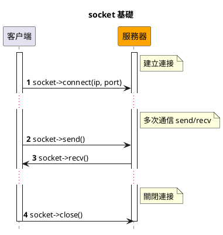
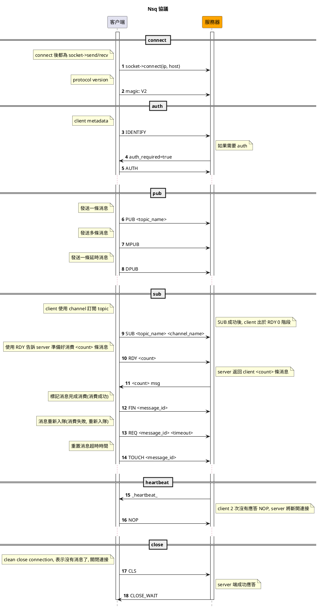

# Nsq

Nsq 是一個開源、輕量級、高性能的分佈式消息中間件, 使用 go 語言實現

## 使用

### 配置

```
return [
    'default' => [
        'host' => '127.0.0.1',
        'port' => 4150,
        'pool' => [
            'min_connections' => 1,
            'max_connections' => 10,
            'connect_timeout' => 10.0,
            'wait_timeout' => 3.0,
            'heartbeat' => -1,
            'max_idle_time' => 60.0,
        ],
    ],
];
```

### 創建消費者

```
$ php bin/hyperf.php gen:nsq-consumer DemoConsumer
```

使用 `\Hyperf\Nsq\Annotation\Consumer` 註解可以是設置 `topic / channel / name / nums`, 使用 `$pool` 屬性可以切換不同連接

```php
<?php

declare(strict_types=1);

namespace App\Nsq\Consumer;

use Hyperf\Nsq\AbstractConsumer;
use Hyperf\Nsq\Annotation\Consumer;
use Hyperf\Nsq\Message;
use Hyperf\Nsq\Result;

/**
 * @Consumer(
 *     topic="hyperf", 
 *     channel="hyperf", 
 *     name ="TestNsqConsumer", 
 *     nums=1
 *     )
 */
class TestNsqConsumer extends AbstractConsumer
{
    public function consume(Message $payload): string 
    {
        var_dump($payload->getBody());

        return Result::ACK;
    }
}
```

### 投遞消息

使用 `\Hyperf\Nsq\Nsq::publish()` 投遞消息, 同樣可以使用 `$pool` 屬性來切換不同連接

```php
<?php

declare(strict_types=1);

namespace App\Command;

use Hyperf\Command\Command as HyperfCommand;
use Hyperf\Command\Annotation\Command;
use Hyperf\Nsq\Nsq;

/**
 * @Command
 */
class NsqCommand extends HyperfCommand
{
    protected $name = 'nsq:pub';

    public function handle()
    {
        /** @var Nsq $nsq */
        $nsq = make(Nsq::class); // 可以設置 `$pool` 屬性
        $nsq->publish('hyperf', 'test'. time());

        $this->line('nsq pub success', 'info');
    }
}
```

## Nsq 協議
> https://nsq.io/clients/tcp_protocol_spec.html

- socket 基礎



- Nsq 協議流程

