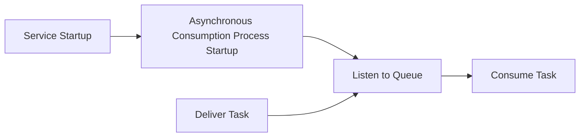
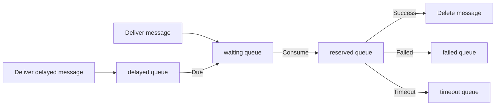

# Async Queue

The asynchronous queue is different from message queues like `RabbitMQ` or `Kafka`. It only provides the capability for `asynchronous processing` and `asynchronous delayed processing`. It **does not** strictly guarantee message persistence and **does not support** a complete ACK (acknowledgment) mechanism.

## Installation

```bash
composer require hyperf/async-queue
```

## Configuration

The configuration file is located at `config/autoload/async_queue.php`. If this file does not exist, you can publish it using the command: `php bin/hyperf.php vendor:publish hyperf/async-queue`.

> Currently, only the `Redis Driver` is supported.

| Configuration | Type | Default Value | Remark |
| :--- | :--- | :--- | :--- |
| driver | string | Hyperf\AsyncQueue\Driver\RedisDriver::class | None |
| channel | string | queue | Queue prefix |
| redis.pool | string | default | Redis connection pool |
| timeout | int | 2 | Timeout for popping messages |
| retry_seconds | int,array | 5 | Interval to retry after failure |
| handle_timeout | int | 10 | Timeout for message processing |
| processes | int | 1 | Number of consumer processes |
| concurrent.limit | int | 10 | Number of messages processed concurrently |
| max_messages | int | 0 | Max messages before process restart (0 means no restart) |

```php
<?php

return [
    'default' => [
        'driver' => Hyperf\AsyncQueue\Driver\RedisDriver::class,
        'redis' => [
            'pool' => 'default'
        ],
        'channel' => 'queue',
        'timeout' => 2,
        'retry_seconds' => 5,
        'handle_timeout' => 10,
        'processes' => 1,
        'concurrent' => [
            'limit' => 10,
        ],
        'max_messages' => 0,
    ],
];
```

`retry_seconds` can also be an array to modify the retry time based on the retry count, for example:

```php
<?php

return [
    'default' => [
        'driver' => Hyperf\AsyncQueue\Driver\RedisDriver::class,
        'channel' => 'queue',
        'retry_seconds' => [1, 5, 10, 20],
        'processes' => 1,
    ],
];
```

## How it Works

The `ConsumerProcess` is the asynchronous consumption process. It executes consumption logic based on the `Job` created by the user or the code block using `#[AsyncQueueMessage]`.
Both `Job` and `#[AsyncQueueMessage]` are tasks that need to be delivered and executed; that is, the data and consumption logic are defined within the task.

- The member variables in the `Job` class are the data to be consumed, and the `handle()` method contains the consumption logic.
- For methods annotated with `#[AsyncQueueMessage]`, the data passed to the constructor is the data to be consumed, and the method body contains the consumption logic.



## Usage

### Configuring Asynchronous Consumption Processes

The component provides a default `asynchronous consumption process`. You just need to configure it in `config/autoload/processes.php`.

```php
<?php

return [
    Hyperf\AsyncQueue\Process\ConsumerProcess::class,
];
```

Of course, you can also add the following `Process` to your own project.

> You only need to choose one between the configuration approach and the annotation approach.

```php
<?php

declare(strict_types=1);

namespace App\Process;

use Hyperf\AsyncQueue\Process\ConsumerProcess;
use Hyperf\Process\Annotation\Process;

#[Process(name: "async-queue")]
class AsyncQueueConsumer extends ConsumerProcess
{
}
```

### How to use multiple configurations

Some developers create multiple configurations for special scenarios. For example, some messages need to be processed with priority, so they are placed in a less busy queue. For example, the following configuration:

```php
<?php

return [
    'default' => [
        'driver' => Hyperf\AsyncQueue\Driver\RedisDriver::class,
        'redis' => [
            'pool' => 'default'
        ],
        'channel' => 'queue',
        'timeout' => 2,
        'retry_seconds' => 5,
        'handle_timeout' => 10,
        'processes' => 1,
        'concurrent' => [
            'limit' => 5,
        ],
    ],
    'fast' => [
        'driver' => Hyperf\AsyncQueue\Driver\RedisDriver::class,
        'redis' => [
            'pool' => 'default'
        ],
        'channel' => '{queue:fast}',
        'timeout' => 2,
        'retry_seconds' => 5,
        'handle_timeout' => 10,
        'processes' => 1,
        'concurrent' => [
            'limit' => 5,
        ],
    ],
];
```

However, our default `Hyperf\AsyncQueue\Process\ConsumerProcess` only processes the `default` configuration, so we need to create a new `Process`.

```php
<?php

declare(strict_types=1);

namespace App\Process;

use Hyperf\AsyncQueue\Process\ConsumerProcess;
use Hyperf\Process\Annotation\Process;

#[Process(name: "async-queue")]
class AsyncQueueConsumer extends ConsumerProcess
{
    protected string $queue = 'fast';
}
```

### Producing Messages

#### Traditional Approach

In this mode, the object is serialized directly and stored in a queue like `Redis`. Therefore, to ensure the size after serialization, try not to set `Container`, `Config`, etc., as member variables.

For example, the following `Job` definition is **undesirable**. The same applies to `#[Inject]`.

> Since the Job will be serialized, member variables should not contain contents that cannot be serialized, such as anonymous functions. If you are unsure what content cannot be serialized, try to use the annotation approach.

```php
<?php

declare(strict_types=1);

namespace App\Job;

use Hyperf\AsyncQueue\Job;
use Psr\Container\ContainerInterface;

class ExampleJob extends Job
{
    public $container;

    public $params;

    public function __construct(ContainerInterface $container, $params)
    {
        $this->container = $container;
        $this->params = $params;
    }

    public function handle()
    {
        // Process specific logic based on parameters
        var_dump($this->params);
    }
}

$job = make(ExampleJob::class);
```

The correct `Job` should only contain the data that needs to be processed. Other related data can be re-acquired in the `handle` method, as shown below.

```php
<?php

declare(strict_types=1);

namespace App\Job;

use Hyperf\AsyncQueue\Job;

class ExampleJob extends Job
{
    public $params;
    
    /**
     * Retry attempts after the task fails; the maximum number of executions is $maxAttempts+1
     */
    protected int $maxAttempts = 2;

    public function __construct($params)
    {
        // It is best to use plain data here, do not use objects carrying IO, such as PDO objects
        $this->params = $params;
    }

    public function handle()
    {
        // Process specific logic based on parameters
        // Obtain models, etc., through specific parameters
        // This logic will be executed in the ConsumerProcess process
        var_dump($this->params);
    }
}
```

After correctly defining the `Job`, we need to write a `Service` dedicated to delivering messages, as shown in the code below.

```php
<?php

declare(strict_types=1);

namespace App\Service;

use App\Job\ExampleJob;
use Hyperf\AsyncQueue\Driver\DriverFactory;
use Hyperf\AsyncQueue\Driver\DriverInterface;

class QueueService
{
    protected DriverInterface $driver;

    public function __construct(DriverFactory $driverFactory)
    {
        $this->driver = $driverFactory->get('default');
    }

    /**
     * Produce messages.
     * @param $params Data
     * @param int $delay Delay time in seconds
     */
    public function push($params, int $delay = 0): bool
    {
        // The `ExampleJob` here will be serialized and stored in Redis, so it is best to only pass plain data for internal variables.
        // Similarly, if the `@Value` annotation is used internally, the corresponding object will be serialized together, causing the message body to become larger.
        // Therefore, it is not recommended to use the `make` method to create `Job` objects here.
        return $this->driver->push(new ExampleJob($params), $delay);
    }
}
```

Deliver messages:

Next, simply call our `QueueService` to deliver the message.

```php
<?php

declare(strict_types=1);

namespace App\Controller;

use App\Service\QueueService;
use Hyperf\Di\Annotation\Inject;
use Hyperf\HttpServer\Annotation\AutoController;

#[AutoController]
class QueueController extends AbstractController
{
    #[Inject]
    protected QueueService $service;

    /**
     * Deliver messages in traditional mode
     */
    public function index()
    {
        $this->service->push([
            'group@hyperf.io',
            'https://doc.hyperf.io',
            'https://www.hyperf.io',
        ]);

        return 'success';
    }
}
```

#### Annotation Approach

In addition to the traditional way of delivering messages, the framework also provides an annotation approach.

> The annotation approach automatically delivers messages to the queue in a non-consumption environment. Therefore, if we use the annotation approach in the queue, it will not be delivered to the queue again, but will be executed directly in the current consumption process.
> If you still need to deliver messages in the queue, you can use the traditional mode to deliver in the queue.

Let's rewrite the `QueueService` above, move the logic of `ExampleJob` directly to the `example` method, and add the corresponding annotation `AsyncQueueMessage`. The specific code is as follows:

```php
<?php

declare(strict_types=1);

namespace App\Service;

use Hyperf\AsyncQueue\Annotation\AsyncQueueMessage;

class QueueService
{
    #[AsyncQueueMessage]
    public function example($params)
    {
        // Code logic that needs to be executed asynchronously
        // This logic will be executed in the ConsumerProcess process
        var_dump($params);
    }
}

```

Deliver messages:

Delivering messages in annotation mode is the same as calling methods normally. The code is as follows:

```php
<?php

declare(strict_types=1);

namespace App\Controller;

use App\Service\QueueService;
use Hyperf\Di\Annotation\Inject;
use Hyperf\HttpServer\Annotation\AutoController;

#[AutoController]
class QueueController extends AbstractController
{
    #[Inject]
    protected QueueService $service;

    /**
     * Deliver messages in annotation mode
     */
    public function example()
    {
        $this->service->example([
            'group@hyperf.io',
            'https://doc.hyperf.io',
            'https://www.hyperf.io',
        ]);

        return 'success';
    }
}
```

### Default Scripts

Arguments:
  - queue_name: Queue configuration name, default is default

Options:
  - channel_name: Queue name, such as failed queue `failed`, timeout queue `timeout`

#### Display the message status of the current queue

```shell
$ php bin/hyperf.php queue:info {queue_name}
```

#### Reload all failed/timed-out messages into the pending queue

```shell
php bin/hyperf.php queue:reload {queue_name} -Q {channel_name}
```

#### Destroy all failed/timed-out messages

```shell
php bin/hyperf.php queue:flush {queue_name} -Q {channel_name}
```

## Events

| Event Name | Trigger Time | Remark |
| :--- | :--- | :--- |
| BeforeHandle | Triggered before processing the message | |
| AfterHandle | Triggered after processing the message | |
| FailedHandle | Triggered after the message processing fails | |
| RetryHandle | Triggered before retrying to process the message | |
| QueueLength | Triggered every 500 messages processed | Users can listen to this event to determine if there is a backlog in the failed or timeout queue |

### QueueLengthListener

The framework comes with a listener to record the queue length, which is not enabled by default. If you need it, you can add it to the `listeners` configuration yourself.

```php
<?php

declare(strict_types=1);

return [
    Hyperf\AsyncQueue\Listener\QueueLengthListener::class
];
```

### ReloadChannelListener

When a message execution times out, or project restart causes message execution to be interrupted, it will eventually be moved to the `timeout` queue. As long as you can guarantee that message execution is idempotent (executing the same message once or multiple times produces the same result), you can enable the following listener. The framework will automatically move messages from the `timeout` queue to the `waiting` queue, waiting for the next consumption.

> The listener listens to the `QueueLength` event and is triggered once every 500 messages processed by default.

```php
<?php

declare(strict_types=1);

return [
    Hyperf\AsyncQueue\Listener\ReloadChannelListener::class
];
```

## Task Execution Flow

The task execution flow mainly includes the following queues:

| Queue Name | Remark |
| :--- | :--- |
| waiting | Queue waiting to be consumed |
| reserved | Queue currently being consumed |
| delayed | Queue for delayed consumption |
| failed | Queue for failed consumption |
| timeout | Queue for timed-out consumption (although timed out, it might have been executed successfully) |

The queue flow order is as follows:



## Configuring Multiple Asynchronous Queues

When you need to use multiple queues to distinguish between high-frequency and low-frequency consumption or other types of messages, you can configure multiple queues.

1. Add configuration

```php
<?php

return [
    'default' => [
        'driver' => Hyperf\AsyncQueue\Driver\RedisDriver::class,
        'channel' => '{queue}',
        'timeout' => 2,
        'retry_seconds' => 5,
        'handle_timeout' => 10,
        'processes' => 1,
        'concurrent' => [
            'limit' => 2,
        ],
    ],
    'other' => [
        'driver' => Hyperf\AsyncQueue\Driver\RedisDriver::class,
        'channel' => '{other.queue}',
        'timeout' => 2,
        'retry_seconds' => 5,
        'handle_timeout' => 10,
        'processes' => 1,
        'concurrent' => [
            'limit' => 2,
        ],
    ],
];
```

2. Add consumption process

```php
<?php

declare(strict_types=1);

namespace App\Process;

use Hyperf\AsyncQueue\Process\ConsumerProcess;
use Hyperf\Process\Annotation\Process;

#[Process]
class OtherConsumerProcess extends ConsumerProcess
{
    protected string $queue = 'other';
}
```

3. Call

```php
use Hyperf\AsyncQueue\Driver\DriverFactory;
use Hyperf\Context\ApplicationContext;

$driver = ApplicationContext::getContainer()->get(DriverFactory::class)->get('other');
return $driver->push(new ExampleJob());
```

## Safe Shutdown

When the asynchronous queue is terminated, if consumption logic is in progress, it may lead to errors. The framework provides `ProcessStopHandler`, which allows the asynchronous queue process to shut down safely.

> The current signal handler is not adapted to CoroutineServer. If necessary, please implement it yourself.

Install signal handler:

```shell
composer require hyperf/signal
composer require hyperf/process
```

Add configuration `autoload/signal.php`:

```php
<?php

declare(strict_types=1);

return [
    'handlers' => [
        Hyperf\Process\Handler\ProcessStopHandler::class,
    ],
    'timeout' => 5.0,
];
```

## Differences Between Asynchronous Drivers

- Hyperf\AsyncQueue\Driver\RedisDriver::class

This asynchronous driver will serialize the entire `JOB`. After delivering to the instant queue, it will `lpush` it to the `list` structure. After delivering to the delayed queue, it will `zadd` it to the `zset` structure.
Therefore, if the parameters of the `Job` are exactly the same, the message delivered later in the delayed queue will **overwrite** the message delivered earlier.
If you do not want the delayed message to be overwritten, just add a unique `uniqid` to the `Job`, or add a `uniqid` input parameter to the method using the `annotation`.
