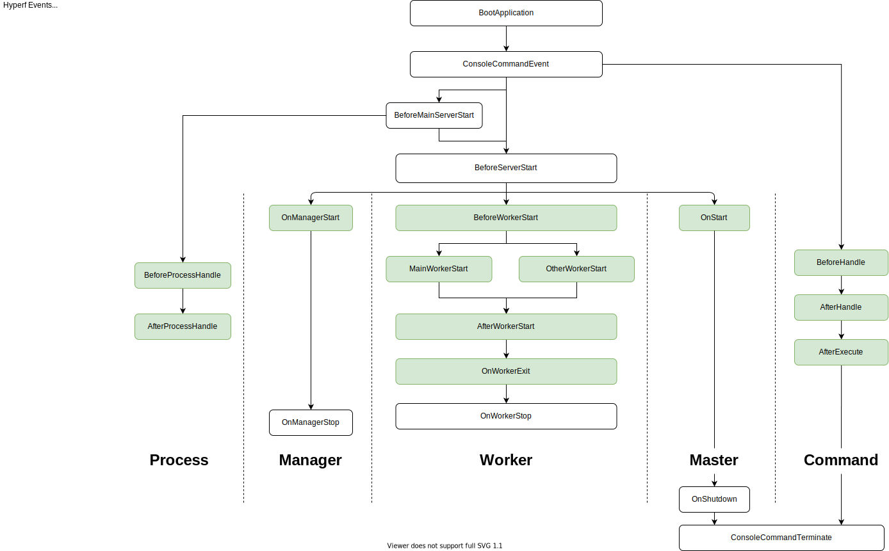

# Event

## Foreword

The event mode have to be implemented based on [PSR-14](https://github.com/php-fig/fig-standards/blob/master/accepted/PSR-14-event-dispatcher.md).
Hyperf's event manager is implemented by [hyperf/event](https://github.com/hyperf/event) by default. This component can also be used in other frameworks or applications, just by introducing it to Composer.

```bash
composer require hyperf/event
```

## Concept

The event pattern is a well-tested and reliable mechanism. It is a very suitable mechanism for decoupling. There are three roles:

- `Event` is the communication object passed between the application code and the `Listener`.
- `Listener` is a listener for listening to the occurrence of `Event>
- `Event Dispatcher` is the manager object used to trigger the `Event` and manage the relationship between `Listener` and `Event`.

Explain in an easy-to-understand example. Suppose we have a `UserService::register()` method for registering an account. After the account is successfully registered, we can trigger the `UserRegistered` event through the event dispatcher, which is listened by the listener. The occurrence of this event, when performing some operations, such as sending a user registration success message, we may want to do more things after the user is successfully registered, such as sending a mail waiting for the user to register successfully. We can then listen to the `UserRegistered` event by adding another listener, without adding code that is not related to the `UserService::register()` method.

## Usage of event manager

### Define an event

An event is actually a normal class for managing state data. When triggered, the application data is passed to the event. The listener then operates on the event class. An event can be listened to by multiple listeners.

```php
<?php
namespace App\Event;

class UserRegistered
{
    // It is recommended to define this as a public property so that the listener can use it directly, or you can provide Getter for that property.
    public $user;
    
    public function __construct($user)
    {
        $this->user = $user;    
    }
}
```

### Define a Listener

The listener needs to implement the constraint method of the `Hyperf\Event\Contract\ListenerInterface` interface. The example is as follows.

```php
<?php
namespace App\Listener;

use App\Event\UserRegistered;
use Hyperf\Event\Contract\ListenerInterface;

class UserRegisteredListener implements ListenerInterface
{
    public function listen(): array
    {
        // Returns an array of events to be listened to by this listener, can listen to multiple events at the same time
        return [
            UserRegistered::class,
        ];
    }

    /**
     * @param UserRegistered $event
     */
    public function process(object $event): void
    {
        // The code to be executed by the listener after the event is triggered is written here, such as sending a user registration success message, etc. in this example.
        // Directly access the user property of $event to get the parameter value passed when the event fires.
        // $event->user;
    }
}
```

#### Registering listeners through configuration files

After defining the listener, we need to make it discoverable by the `Dispatcher`, which can be added in the `config/autoload/listeners.php` configuration file* (if it doesn't exist, it can be created)* The trigger order of the listeners is based on the configuration order of the configuration file:

```php
<?php
return [
    \App\Listener\UserRegisteredListener::class,
];
```

### Registering listeners with annotation

Hyperf also provides an easier way to register listeners by registering with the `#[Listener]` annotation, as long as the annotation is defined on the listener class and the listener class is automatically completed in the `Hyperf annotation scan domain` Registration, code examples are as follows:

```php
<?php
namespace App\Listener;

use App\Event\UserRegistered;
use Hyperf\Event\Annotation\Listener;
use Hyperf\Event\Contract\ListenerInterface;

#[Listener]
class UserRegisteredListener implements ListenerInterface
{
    public function listen(): array
    {
        // Returns an array of events to be listened to by this listener, can listen to multiple events at the same time
        return [
            UserRegistered::class,
        ];
    }

    /**
     * @param UserRegistered $event
     */
    public function process(object $event): void
    {
        // The code to be executed by the listener after the event is triggered is written here, such as sending a user registration success message, etc. in this example.
        // Directly access the user property of $event to get the parameter value passed when the event fires.
        // $event->user;
    }
}
```

When registering the listener via annotations, we can define the order of the current listener by setting the `priority` attribute, such as `#[Listener(priority: 1)]`, the underlying uses the `SplPriorityQueue` structure to store, the `priority` number is the greater, the priority the higher.

> Use `#[Listener]` annotation need to `use Hyperf\Event\Annotation\Listener;` namespace；  

### Trigger Event

The event needs to be dispatched by the `EventDispatcher` to allow the `Listener` to listen. We use a piece of code to demonstrate how to trigger the event:

```php
<?php
namespace App\Service;

use Hyperf\Di\Annotation\Inject;
use Psr\EventDispatcher\EventDispatcherInterface;
use App\Event\UserRegistered; 

class UserService
{
    #[Inject]
    private EventDispatcherInterface $eventDispatcher;
    
    public function register()
    {
        // We assume that there is a User entity
        $user = new User();
        $result = $user->save();
        // Complete the logic of account registration
        // This dispatch(object $event) will run the listener one by one
        $this->eventDispatcher->dispatch(new UserRegistered($user));
        return $result;
    }
}
```

## Hyperf Lifecycle events



## Hyperf Coroutine Style Server Lifecycle events


