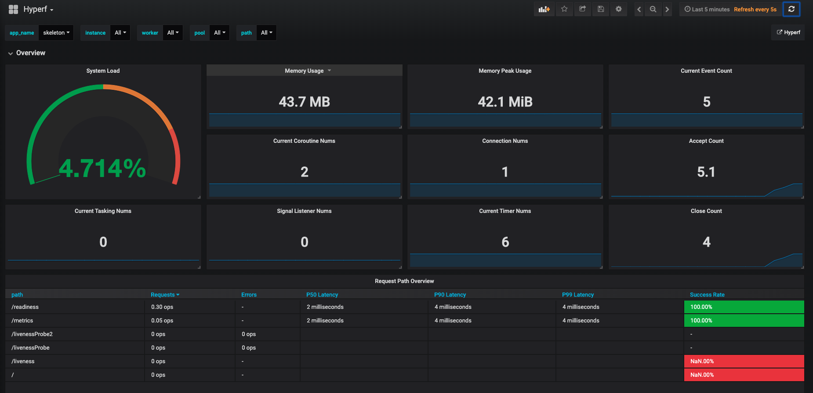

# Service monitoring

A core requirement of microservice governance is service observability. As a shepherd of microservices, it is not easy to keep track of the health status of various services. Many solutions have emerged in this field in the cloud-native era. This component abstracts telemetry and monitoring, the important pillars of observability, to allow users to quickly integrate with existing infrastructure while avoiding vendor lock-in.

## Install

### Install components via Composer

```bash
composer require hyperf/metric
```

The [hyperf/metric](https://github.com/hyperf/metric) component has [Prometheus](https://prometheus.io/) dependencies installed by default. If you want to use [StatsD](https://github.com/statsd/statsd) or [InfluxDB](http://influxdb.com), you also need to execute the following commands to install the corresponding dependencies:

```bash
# StatsD required dependencies
composer require domnikl/statsd
# InfluxDB required dependencies
composer require influxdb/influxdb-php 
```

### Add component configuration

If the file does not exist, execute the following command to add the `config/autoload/metric.php` configuration file:

```bash
php bin/hyperf.php vendor:publish hyperf/metric
```

## use

### Configuration

#### options

`default`: The value corresponding to `default` in the configuration file is the driver name used. The specific configuration of the driver is defined under `metric`, using the same driver as `key`.

```php
'default' => env('METRIC_DRIVER', 'prometheus'),
```

* `use_standalone_process`: Whether to use `standalone monitoring process`. It is recommended to enable. Metric collection and reporting will be handled in the `Worker process` after shutdown.

```php
'use_standalone_process' => env('TELEMETRY_USE_STANDALONE_PROCESS', true),
```

* `enable_default_metric`: Whether to count default metrics. Default metrics include memory usage, system CPU load, and Swoole Server and Swoole Coroutine metrics.

```php
'enable_default_metric' => env('TELEMETRY_ENABLE_DEFAULT_TELEMETRY', true),
```

`default_metric_interval`: The default metric push interval, in seconds, the same below.
```php
'default_metric_interval' => env('DEFAULT_METRIC_INTERVAL', 5),
```
#### Configuring Prometheus

When using Prometheus, add the specific configuration of Prometheus to the `metric` item in the configuration file.

```php
use Hyperf\Metric\Adapter\Prometheus\Constants;

return [
    'default' => env('METRIC_DRIVER', 'prometheus'),
    'use_standalone_process' => env('TELEMETRY_USE_STANDALONE_PROCESS', true),
    'enable_default_metric' => env('TELEMETRY_ENABLE_DEFAULT_TELEMETRY', true),
    'default_metric_interval' => env('DEFAULT_METRIC_INTERVAL', 5),
    'metric' => [
        'prometheus' => [
            'driver' => Hyperf\Metric\Adapter\Prometheus\MetricFactory::class,
            'mode' => Constants::SCRAPE_MODE,
            'namespace' => env('APP_NAME', 'skeleton'),
            'scrape_host' => env('PROMETHEUS_SCRAPE_HOST', '0.0.0.0'),
            'scrape_port' => env('PROMETHEUS_SCRAPE_PORT', '9502'),
            'scrape_path' => env('PROMETHEUS_SCRAPE_PATH', '/metrics'),
            'push_host' => env('PROMETHEUS_PUSH_HOST', '0.0.0.0'),
            'push_port' => env('PROMETHEUS_PUSH_PORT', '9091'),
            'push_interval' => env('PROMETHEUS_PUSH_INTERVAL', 5),
        ],
    ],
];
```

Prometheus has two working modes, crawl mode and push mode (via Prometheus Pushgateway ), which can be supported by this component.

When using the crawl mode (Prometheus official recommendation), you need to set:

```php
'mode' => Constants::SCRAPE_MODE
```

And configure the crawling address `scrape_host`, the crawling port `scrape_port`, and the crawling path `scrape_path`. Prometheus can pull all metrics in the form of HTTP access under the corresponding configuration.

> Note: In crawl mode, standalone process must be enabled, ie `use_standalone_process = true`.

When using push mode, you need to set:

```php
'mode' => Constants::PUSH_MODE
```

And configure the push address `push_host`, push port `push_port`, push interval `push_interval`. Push mode is only recommended for offline tasks.

Because of the differences in basic settings, the above modes may not meet the needs. This component also supports custom mode. In the custom mode, the component is only responsible for the collection of indicators, and the specific reporting needs to be handled by the user.

```php
'mode' => Constants::CUSTOM_MODE
```
For example, you may want to report metrics through custom routes, or store metrics in Redis, and other independent services are responsible for centralized reporting of metrics, etc. The [custom escalation](#custom escalation) section contains corresponding examples.

#### Configure StatsD

When using StatsD, add the specific configuration of StatsD to the `metric` item in the configuration file.

```php
return [
    'default' => env('METRIC_DRIVER', 'statd'),
    'use_standalone_process' => env('TELEMETRY_USE_STANDALONE_PROCESS', true),
    'enable_default_metric' => env('TELEMETRY_ENABLE_DEFAULT_TELEMETRY', true),
    'metric' => [
        'statsd' => [
            'driver' => Hyperf\Metric\Adapter\StatsD\MetricFactory::class,
            'namespace' => env('APP_NAME', 'skeleton'),
            'udp_host' => env('STATSD_UDP_HOST', '127.0.0.1'),
            'udp_port' => env('STATSD_UDP_PORT', '8125'),
            'enable_batch' => env('STATSD_ENABLE_BATCH', true),
            'push_interval' => env('STATSD_PUSH_INTERVAL', 5),
            'sample_rate' => env('STATSD_SAMPLE_RATE', 1.0),
        ],
    ],
];
```

StatsD currently only supports UDP mode, you need to configure UDP address `udp_host`, UDP port `udp_port`, whether to batch push `enable_batch` (reduce the number of requests), batch push interval `push_interval` and sample rate `sample_rate` .

#### Configuring InfluxDB

When using InfluxDB, add the specific configuration of InfluxDB to the `metric` item in the configuration file.

```php
return [
    'default' => env('METRIC_DRIVER', 'influxdb'),
    'use_standalone_process' => env('TELEMETRY_USE_STANDALONE_PROCESS', true),
    'enable_default_metric' => env('TELEMETRY_ENABLE_DEFAULT_TELEMETRY', true),
    'metric' => [
        'influxdb' => [
            'driver' => Hyperf\Metric\Adapter\InfluxDB\MetricFactory::class,
            'namespace' => env('APP_NAME', 'skeleton'),
            'host' => env('INFLUXDB_HOST', '127.0.0.1'),
            'port' => env('INFLUXDB_PORT', '8086'),
            'username' => env('INFLUXDB_USERNAME', ''),
            'password' => env('INFLUXDB_PASSWORD', ''),
            'dbname' => env('INFLUXDB_DBNAME', true),
            'push_interval' => env('INFLUXDB_PUSH_INTERVAL', 5),
        ],
    ],
];
```

InfluxDB uses the default HTTP mode, you need to configure the address `host`, UDP port `port`, username `username`, password `password`, `dbname` data table and batch push interval `push_interval`.

### Basic abstraction

The telemetry component abstracts three commonly used data types to ensure decoupling of concrete implementations.

The three types are:

Counter (Counter): An indicator used to describe one-way increments. Such as HTTP request count.

```php
interface CounterInterface
{
    public function with(string ...$labelValues): self;

    public function add(int $delta);
}
```

Gauge: An indicator used to describe an increase or decrease over time. Such as the number of available connections in the connection pool.

```php
interface GaugeInterface
{
    public function with(string ...$labelValues): self;

    public function set(float $value);

    public function add(float $delta);
}
```

* Histogram: used to describe the statistical distribution produced by continuous observation of an event, usually expressed as percentiles or buckets. Such as HTTP request delay.

```php
interface HistogramInterface
{
    public function with(string ...$labelValues): self;

    public function put(float $sample);
}
```

### Configure middleware

After configuring the driver, you only need to configure the middleware to enable the request Histogram statistics function.
Open the `config/autoload/middlewares.php` file, the example is to enable middleware in `http` Server.

```php
<?php

declare(strict_types=1);

return [
    'http' => [
        \Hyperf\Metric\Middleware\MetricMiddleware::class,
    ],
];
```
> The statistics dimension in this middleware includes `request_status`, `request_path`, `request_method`. If your `request_path` is too large, it is recommended to rewrite this middleware to remove the `request_path` dimension, otherwise the high cardinality will cause memory overflow.

### Custom use

Telemetry via HTTP middleware is just the tip of the iceberg of what this component can do. You can inject the `Hyperf\Metric\Contract\MetricFactoryInterface` class to telemetry business data yourself. For example: the number of orders created, the number of clicks on ads, etc.

```php
<?php

declare(strict_types=1);

namespace App\Controller;

use App\Model\Order;
use Hyperf\Di\Annotation\Inject;
use Hyperf\Metric\Contract\MetricFactoryInterface;

class IndexController extends AbstractController
{
    /**
     * @var MetricFactoryInterface
     */
    #[Inject]
    private $metricFactory;

    public function create(Order $order)
    {
        $counter = $this->metricFactory->makeCounter('order_created', ['order_type']);
        $counter->with($order->type)->add(1);
        // order logic...
    }

}
```

`MetricFactoryInterface` contains the following factory methods to generate the corresponding three basic statistic types.

```php
public function makeCounter($name, $labelNames): CounterInterface;

public function makeGauge($name, $labelNames): GaugeInterface;

public function makeHistogram($name, $labelNames): HistogramInterface;
```

The above example is the generated metrics within the scope of the statistical request. Sometimes the indicators we need to count are for the complete life cycle, such as counting the length of asynchronous queues or the number of items in stock. In this scenario, you can listen to the `MetricFactoryReady` event.

```php
<?php

declare(strict_types=1);

namespace App\Listener;

use Hyperf\Event\Contract\ListenerInterface;
use Hyperf\Metric\Event\MetricFactoryReady;
use Psr\Container\ContainerInterface;
use Redis;

class OnMetricFactoryReady implements ListenerInterface
{
    protected ContainerInterface $container;

    public function __construct(ContainerInterface $container)
    {
        $this->container = $container;
    }

    public function listen(): array
    {
        return [
            MetricFactoryReady::class,
        ];
    }

    public function process(object $event)
    {
        $redis = $this->container->get(Redis::class);
        $gauge = $event
                    ->factory
                    ->makeGauge('queue_length', ['driver'])
                    ->with('redis');
        while (true) {
            $length = $redis->llen('queue');
            $gauge->set($length);
            sleep(1);
        }
    }
}
```

> In terms of engineering, it is not suitable to query the queue length directly from Redis. The queue length should be obtained through the `info()` method under the `DriverInterface` interface of the queue driver. Just a simple demonstration here. You can find a complete example in the `src/Listener` folder of the component's source code.

### Notes

You can use `#[Counter(name="stat_name_here")]` and `#[Histogram(name="stat_name_here")]` to count the invocation and running time of the aspect.

For the use of annotations, please refer to the [Annotation Chapter](zh-cn/annotation).

### Custom Histogram Bucket

> This section only applies to Prometheus drivers

When you are using Prometheus's Histogram, sometimes there is a need for a custom Bucket. Before starting the service, you can inject the dependency into the Registry and register the Histogram by yourself, and set the required Bucket . When you use it later, `MetricFactory` will call you to register the Histogram of the same name. An example is as follows:

```php
<?php

namespace App\Listener;

use Hyperf\Config\Annotation\Value;
use Hyperf\Event\Contract\ListenerInterface;
use Hyperf\Framework\Event\BeforeMainServerStart;
use Prometheus\CollectorRegistry;

class OnMainServerStart implements ListenerInterface
{
    protected $registry;

    public function __construct(CollectorRegistry $registry)
    {
        $this->registry = $registry;
    }

    public function listen(): array
    {
        return [
            BeforeMainServerStart::class,
        ];
    }

    public function process(object $event)
    {
        $this->registry->registerHistogram(
            config("metric.metric.prometheus.namespace"), 
            'test',
            'help_message', 
            ['labelName'], 
            [0.1, 1, 2, 3.5]
        );
    }
}
```
After that, when you use `$metricFactory->makeHistogram('test')`, the returned Histogram is your pre-registered Histogram.

### Custom report

> This section only applies to Prometheus drivers

After setting the component's Promethues driver working mode to the custom mode ( `Constants::CUSTOM_MODE` ), you can freely handle indicator reporting. In this section, we show how to store metrics in Redis, then add a new HTTP route to the Worker that returns Prometheus-rendered metrics.

#### Storing metrics with Redis

The storage medium for metrics is defined by the `Prometheus\Storage\Adapter` interface. Memory storage is used by default. We can change to Redis storage in `config/autoload/dependencies.php`.

```php
<?php

return [
    Prometheus\Storage\Adapter::class => Hyperf\Metric\Adapter\Prometheus\RedisStorageFactory::class,
];
```

#### Add /metrics route to Worker

Add Prometheus routes in config/routes.php.

> Note that if you want to get metrics under Workers, you need to handle the state sharing between Workers yourself. One way is to store the state in Redis as described above.

```php
<?php

use Hyperf\HttpServer\Router\Router;

Router::get('/metrics', function(){
    $registry = Hyperf\Context\ApplicationContext::getContainer()->get(Prometheus\CollectorRegistry::class);
    $renderer = new Prometheus\RenderTextFormat();
    return $renderer->render($registry->getMetricFamilySamples());
});
```

## Create console in Grafana

> This section only applies to Prometheus drivers

If you have default metrics enabled, `Hyperf/Metric` prepares a Grafana console for you out of the box. Download the console [json file](https://cdn.jsdelivr.net/gh/hyperf/hyperf/src/metric/grafana.json), import it into Grafana and use it.



## Precautions

- To use this component to collect metrics in a `hyperf/command` custom command, you need to add the command line parameter: `--enable-event-dispatcher` when starting the command.

