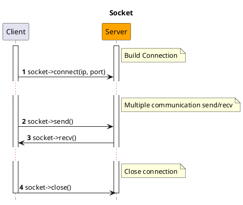
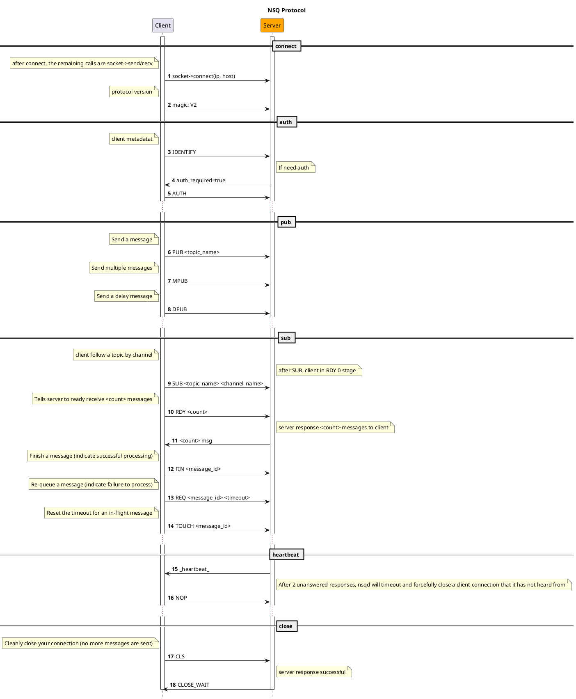

# NSQ

[NSQ](https://nsq.io) is a realtime distributed messaging platform, writting by Golang.

## Installation

```bash
composer require hyperf/nsq
```

## Usage

### Configuration

The configuration file of the NSQ component is located in `config/autoload/nsq.php` by default. If the file does not exist, you could use the `php bin/hyperf.php vendor:publish hyperf/nsq` command to publish the corresponding configuration file.

The default configuration file is as follows:

```php
<?php
return [
    'default' => [
        'host' => '127.0.0.1',
        'port' => 4150,
        'pool' => [
            'min_connections' => 1,
            'max_connections' => 10,
            'connect_timeout' => 10.0,
            'wait_timeout' => 3.0,
            'heartbeat' => -1,
            'max_idle_time' => 60.0,
        ],
    ],
];
```

### Craete Consumer

You can quickly generate a consumer to consume the message through the `gen:nsq-consumer` command, for example:

```bash
php bin/hyperf.php gen:nsq-consumer DemoConsumer
```

You could also use the `Hyperf\Nsq\Annotation\Consumer` annotation to declare a subclass of the `Hyperf/Nsq/AbstractConsumer` abstract class to complete the definition of a consumer, where the annotation and the abstract classes both are contain the following properties:
 
|   Property  |  Type  |  Default Value |       Comment       |
|:-------:|:------:|:------:|:----------------:|
|  topic  | string |   ''   |  The topic that you want to listening to   |
| channel | string |   ''   |  The channel that you want to listening to |
|   name  | string | NsqConsumer |  The name of the consumer     |
|   nums  |  int   |   1    |  The process numbers of the consumers   |
|   pool  | string |   default   |  The connection pool resource corresponding to the consumer, corresponding to the key of the configuration file |

These annotation properties are optional, because the `Hyperf/Nsq/AbstractConsumer` class also defines the corresponding member properties and getter and setter respectively. When the annotation properties are not defined, the default value of the abstract class will be used.

```php
<?php

declare(strict_types=1);

namespace App\Nsq\Consumer;

use Hyperf\Nsq\AbstractConsumer;
use Hyperf\Nsq\Annotation\Consumer;
use Hyperf\Nsq\Message;
use Hyperf\Nsq\Result;

#[Consumer(
    topic: "hyperf", 
    channel: "hyperf", 
    name: "DemoNsqConsumer", 
    nums: 1
)]
class DemoNsqConsumer extends AbstractConsumer
{
    public function consume(Message $payload): string 
    {
        var_dump($payload->getBody());

        return Result::ACK;
    }
}
```

### Disable self-starting of the comsumer process

By default, after using the `#[Consumer]` annotation definition, the framework will automatically create a child process to start the consumer at startup, and will automatically re-pull it after the child process exits abnormally. However, if some debugging work is carried out in the development stage, it may be inconvenient to debug due to the automatic consumption of consumers.

In this situation, you could control the self-start of the consumption process through two forms to disable the feature, global shutdown and partial shutdown.

#### Global shutdown

You could set the `enable` option of the corresponding connection to `false` in the default configuration file `config/autoload/nsq.php`, which means that all consumer processes under this connection will disable the self-start feature.

#### Partial shutdown

When you only need to disable the self-start feature of individual consumer processes, you only need to override the parent method `isEnable()` in the corresponding consumer class and return `false` to disable the consumer's self-start feature.

```php
<?php

declare(strict_types=1);

namespace App\Nsq\Consumer;

use Hyperf\Nsq\AbstractConsumer;
use Hyperf\Nsq\Annotation\Consumer;
use Hyperf\Nsq\Message;
use Hyperf\Nsq\Result;
use Psr\Container\ContainerInterface;

#[Consumer(
    topic: "demo_topic", 
    channel: "demo_channel", 
    name: "DemoConsumer", 
    nums: 1
)]
class DemoConsumer extends AbstractConsumer
{
    public function __construct(ContainerInterface $container)
    {
        parent::__construct($container);
    }

    public function isEnable(): bool 
    {
        return false;
    }

    public function consume(Message $payload): string
    {
        $body = json_decode($payload->getBody(), true);
        var_dump($body);
        return Result::ACK;
    }
}
```

### Publish message

You could publish a message to NSQ by calling the `Hyperf\Nsq\Nsq::publish(string $topic, $message, float $deferTime = 0.0)` method. The following is an example of publish message in Command:

```php
<?php

declare(strict_types=1);

namespace App\Command;

use Hyperf\Command\Command as HyperfCommand;
use Hyperf\Command\Annotation\Command;
use Hyperf\Nsq\Nsq;

#[Command]
class NsqCommand extends HyperfCommand
{
    protected $name = 'nsq:pub';

    public function handle()
    {
        /** @var Nsq $nsq */
        $nsq = make(Nsq::class);
        $topic = 'hyperf';
        $message = 'This is message at ' . time();
        $nsq->publish($topic, $message);

        $this->line('success', 'info');
    }
}
```

### Publish multiple messages at once

The second parameter of the `Hyperf\Nsq\Nsq::publish(string $topic, $message, float $deferTime = 0.0)` method can not just only pass a string value, but also an array of strings to achieve one-time publish multiple messages to a topic, an example is as follows:

```php
<?php

declare(strict_types=1);

namespace App\Command;

use Hyperf\Command\Command as HyperfCommand;
use Hyperf\Command\Annotation\Command;
use Hyperf\Nsq\Nsq;

#[Command]
class NsqCommand extends HyperfCommand
{
    protected $name = 'nsq:pub';

    public function handle()
    {
        /** @var Nsq $nsq */
        $nsq = make(Nsq::class);
        $topic = 'hyperf';
        $messages = [
            'This is message 1 at ' . time(),
            'This is message 2 at ' . time(),
            'This is message 3 at ' . time(),
        ];
        $nsq->publish($topic, $messages);

        $this->line('success', 'info');
    }
}
```

### Publish delay message

When you want the message you publish to be consumed after a specific time, you could also pass the third parameter of the `Hyperf\Nsq\Nsq::publish(string $topic, $message, float $deferTime = 0.0)` method the delay time corresponding to the publish message, in seconds, an example is as follows:

```php
<?php

declare(strict_types=1);

namespace App\Command;

use Hyperf\Command\Command as HyperfCommand;
use Hyperf\Command\Annotation\Command;
use Hyperf\Nsq\Nsq;

#[Command]
class NsqCommand extends HyperfCommand
{
    protected $name = 'nsq:pub';

    public function handle()
    {
        /** @var Nsq $nsq */
        $nsq = make(Nsq::class);
        $topic = 'hyperf';
        $message = 'This is message at ' . time();
        $deferTime = 5.0;
        $nsq->publish($topic, $message, $deferTime);

        $this->line('success', 'info');
    }
}
```

### NSQD HTTP API

> NSQD HTTP API Refer: https://nsq.io/components/nsqd.html

The component encapsulates the NSQD HTTP API, and you could easily call the NSQD HTTP API by this component.

For example, when you need to delete a `Topic`, you could execute the following code:

```php
<?php
use Hyperf\Context\ApplicationContext;
use Hyperf\Nsq\Nsqd\Topic;

$container = ApplicationContext::getContainer();

$client = $container->get(Topic::class);

$client->delete('hyperf.test');
```

- `Hyperf\Nsq\Api\Topic` class corresponds to `topic` related API;
- `Hyperf\Nsq\Api\Channle` class corresponds to `channel` related API；
- `Hyperf\Nsq\Api\Api` class corresponds to `ping`、`stats`、`config`、`debug` related API；

## NSQ Protocol

> https://nsq.io/clients/tcp_protocol_spec.html

- Socket



- NSQ Protocol


