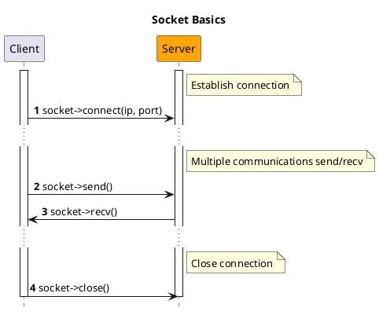
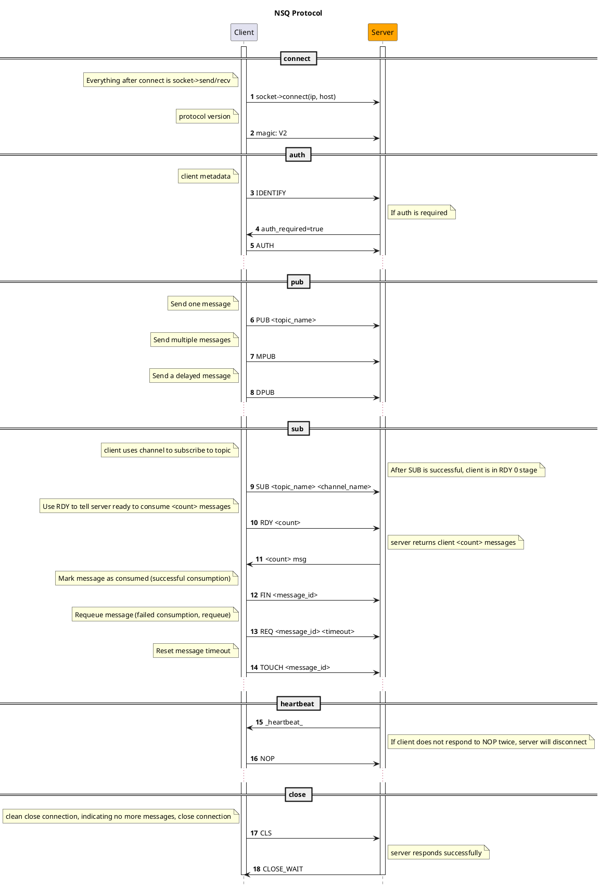

# NSQ

[NSQ](https://nsq.io) is an open-source, lightweight, and high-performance real-time distributed message middleware written in the Go language.

## Installation

```bash
composer require hyperf/nsq
```

## Usage

### Configuration

The configuration file for the NSQ component is located at `config/autoload/nsq.php` by default. If this file does not exist, you can publish it using the command `php bin/hyperf.php vendor:publish hyperf/nsq`.

The default configuration file is as follows:

```php
<?php
return [
    'default' => [
        'host' => '127.0.0.1',
        'port' => 4150,
        'pool' => [
            'min_connections' => 1,
            'max_connections' => 10,
            'connect_timeout' => 10.0,
            'wait_timeout' => 3.0,
            'heartbeat' => -1,
            // Since the default idle time of the Nsq service is 60s, the maximum idle time maintained by the framework should be less than 60s
            'max_idle_time' => 30.0,
        ],
    ],
];
```

### Creating Consumers

You can quickly generate a Consumer to consume messages using the `gen:nsq-consumer` command.

```bash
php bin/hyperf.php gen:nsq-consumer DemoConsumer
```

You can also use the `Hyperf\Nsq\Annotation\Consumer` annotation to declare a subclass of the `Hyperf/Nsq/AbstractConsumer` abstract class to define a Consumer. Both the `Hyperf\Nsq\Annotation\Consumer` annotation and the abstract class contain the following properties:

| Configuration | Type | Annotation or Abstract Class Default Value | Remark |
| :--- | :--- | :--- | :--- |
| topic | string | '' | Topic to listen to |
| channel | string | '' | Channel to listen to |
| name | string | NsqConsumer | Name of the consumer |
| nums | int | 1 | Number of consumer processes |
| pool | string | default | Connection used by the consumer, corresponds to the key in the configuration file |

These annotation properties are optional because the `Hyperf/Nsq/AbstractConsumer` abstract class also defines corresponding member attributes as well as getters and setters. When annotation properties are not defined, the default values of the abstract class's attributes will be used.

```php
<?php

declare(strict_types=1);

namespace App\Nsq\Consumer;

use Hyperf\Nsq\AbstractConsumer;
use Hyperf\Nsq\Annotation\Consumer;
use Hyperf\Nsq\Message;
use Hyperf\Nsq\Result;

#[Consumer(topic: "hyperf", channel: "hyperf", name: "DemoNsqConsumer", nums: 1)]
class DemoNsqConsumer extends AbstractConsumer
{
    public function consume(Message $payload): string 
    {
        var_dump($payload->getBody());

        return Result::ACK;
    }
}
```

### Prohibit Consumer Process from Automatically Starting

By default, after using the `#[Consumer]` annotation definition, the framework will automatically create sub-processes to start the consumer at startup, and will automatically restart them after the sub-processes exit abnormally. However, if you are doing some debugging work during the development stage, it may be inconvenient to debug due to the consumer's automatic consumption.

In this case, you can control the automatic startup of the consumer process through global shutdown and partial shutdown.

#### Global Shutdown

You can set the `enable` option for the corresponding connection to `false` in the default configuration file `config/autoload/nsq.php`, which means that all consumer processes under this connection will have the automatic startup function disabled.

#### Partial Shutdown

When you only need to close the automatic startup function of individual consumer processes, you only need to override the parent class method `isEnable()` in the corresponding consumer and return `false` to close the automatic startup function of this consumer.

```php
<?php

declare(strict_types=1);

namespace App\Nsq\Consumer;

use Hyperf\Nsq\AbstractConsumer;
use Hyperf\Nsq\Annotation\Consumer;
use Hyperf\Nsq\Message;
use Hyperf\Nsq\Result;
use Psr\Container\ContainerInterface;

#[Consumer(topic: "demo_topic", channel: "demo_channel", name: "DemoConsumer", nums: 1)]
class DemoConsumer extends AbstractConsumer
{
    public function __construct(ContainerInterface $container)
    {
        parent::__construct($container);
    }

    public function isEnable(): bool 
    {
        return false;
    }

    public function consume(Message $payload): string
    {
        $body = json_decode($payload->getBody(), true);
        var_dump($body);
        return Result::ACK;
    }
}
```

### Producing Messages

You can produce messages to NSQ by calling the `Hyperf\Nsq\Nsq::publish(string $topic, $message, float $deferTime = 0.0)` method. The following is an example of message production in Command:

```php
<?php

declare(strict_types=1);

namespace App\Command;

use Hyperf\Command\Command as HyperfCommand;
use Hyperf\Command\Annotation\Command;
use Hyperf\Nsq\Nsq;

#[Command]
class NsqCommand extends HyperfCommand
{
    protected $name = 'nsq:pub';

    public function handle()
    {
        /** @var Nsq $nsq */
        $nsq = make(Nsq::class);
        $topic = 'hyperf';
        $message = 'This is message at ' . time();
        $nsq->publish($topic, $message);

        $this->line('success', 'info');
    }
}
```

### Delivering Multiple Messages at Once

The second parameter of the `Hyperf\Nsq\Nsq::publish(string $topic, $message, float $deferTime = 0.0)` method can not only pass a string, but also an array of strings to achieve the function of delivering multiple messages to a Topic at once. An example is as follows:

```php
<?php

declare(strict_types=1);

namespace App\Command;

use Hyperf\Command\Command as HyperfCommand;
use Hyperf\Command\Annotation\Command;
use Hyperf\Nsq\Nsq;

#[Command]
class NsqCommand extends HyperfCommand
{
    protected $name = 'nsq:pub';

    public function handle()
    {
        /** @var Nsq $nsq */
        $nsq = make(Nsq::class);
        $topic = 'hyperf';
        $messages = [
            'This is message 1 at ' . time(),
            'This is message 2 at ' . time(),
            'This is message 3 at ' . time(),
        ];
        $nsq->publish($topic, $messages);

        $this->line('success', 'info');
    }
}
```

### Producing Delayed Messages

When you want your delivered messages to be consumed after a specific time, you can also pass the corresponding delay duration to the third parameter of the `Hyperf\Nsq\Nsq::publish(string $topic, $message, float $deferTime = 0.0)` method, in seconds. An example is as follows:

```php
<?php

declare(strict_types=1);

namespace App\Command;

use Hyperf\Command\Command as HyperfCommand;
use Hyperf\Command\Annotation\Command;
use Hyperf\Nsq\Nsq;

#[Command]
class NsqCommand extends HyperfCommand
{
    protected $name = 'nsq:pub';

    public function handle()
    {
        /** @var Nsq $nsq */
        $nsq = make(Nsq::class);
        $topic = 'hyperf';
        $message = 'This is message at ' . time();
        $deferTime = 5.0;
        $nsq->publish($topic, $message, $deferTime);

        $this->line('success', 'info');
    }
}
```

### NSQD HTTP API

> NSQD HTTP API Refer: https://nsq.io/components/nsqd.html

The component encapsulates the NSQD HTTP API, allowing you to easily call the NSQD HTTP API.

For example, when you need to delete a certain `Topic`, you can execute the following code:

```php
<?php
use Hyperf\Context\ApplicationContext;
use Hyperf\Nsq\Nsqd\Topic;

$container = ApplicationContext::getContainer();

$client = $container->get(Topic::class);

$client->delete('hyperf.test');
```

- `Hyperf\Nsq\Api\Topic` class corresponds to `topic` related APIs;
- `Hyperf\Nsq\Api\Channle` class corresponds to `channel` related APIs;
- `Hyperf\Nsq\Api\Api` class corresponds to APIs related to `ping`, `stats`, `config`, `debug`, etc.;

## NSQ Protocol

> https://nsq.io/clients/tcp_protocol_spec.html

- Socket Basics


```plantuml
@startuml

autonumber
hide footbox
title **Socket Basics**

participant "Client" as client
participant "Server" as server #orange

activate client
activate server

note right of server: Establish connection
client -> server: socket->connect(ip, port)

...
note right of server: Multiple communications send/recv
client -> server: socket->send()
server-> client: socket->recv()
...

note right of server: Close connection
client->server: socket->close()

deactivate client
deactivate server

@enduml
```

- NSQ Protocol Flow


```plantuml
@startuml

autonumber
hide footbox
title **NSQ Protocol**

participant "Client" as client
participant "Server" as server #orange

activate client
activate server

== connect ==
note left of client: Everything after connect is socket->send/recv
client -> server: socket->connect(ip, host)
note left of client: protocol version
client->server: magic: V2

== auth ==
note left of client: client metadata
client->server: IDENTIFY
note right of server: If auth is required
server->client: auth_required=true
client->server: AUTH
...

== pub ==
note left of client: Send one message
client -> server: PUB <topic_name>
note left of client: Send multiple messages
client -> server: MPUB
note left of client: Send a delayed message
client -> server: DPUB
...

== sub ==
note left of client: client uses channel to subscribe to topic
note right of server: After SUB is successful, client is in RDY 0 stage
client -> server: SUB <topic_name> <channel_name>
note left of client: Use RDY to tell server ready to consume <count> messages
client -> server: RDY <count>
note right of server: server returns client <count> messages
server -> client: <count> msg
note left of client: Mark message as consumed (successful consumption)
client -> server: FIN <message_id>
note left of client: Requeue message (failed consumption, requeue)
client -> server: REQ <message_id> <timeout>
note left of client: Reset message timeout
client -> server: TOUCH <message_id>
...

== heartbeat ==
server -> client: _heartbeat_
note right of server: If client does not respond to NOP twice, server will disconnect
client -> server: NOP
...

== close ==
note left of client: clean close connection, indicating no more messages, close connection
client -> server: CLS
note right of server: server responds successfully
server -> client: CLOSE_WAIT

deactivate client
deactivate server

@enduml
```
