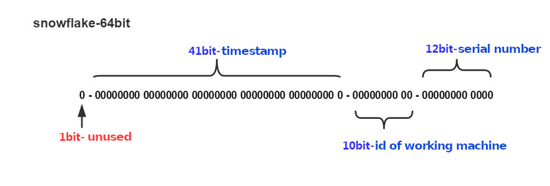

# Snowflake

## Algorithm Introduction

`Snowflake` is a distributed global unique ID generation algorithm proposed by twitter. The result of the algorithm generating `ID` is a long integer with the size of `64bit` . Under the standard algorithm, its structure is shown in the figure below:



-`One bit`, unused.
  - The highest bit in the binary system is the sign bit. The `ID` generated by us is generally a positive integer, so the highest bit is fixed to 0.
  
- `41 bits` to record the timestamp (MS).
  - `41 bits` can represent `2^41 - 1` numbers.
  - In other words, `41 bits` can represent the value of `2^41 - 1` milliseconds, and the unit year is `(2^41 - 1) / (1000 * 60 * 60 * 24 * 365)` about `69` years.
  
- `10 bits`, used to record the `ID` of the working machine.
  - It can be deployed in `2^10` nodes, including `5` bits `DatacenterId` and `5` bits `WorkerId`.
  
- `12 bits`, serial number, used to record different `id` generated in the same millisecond.
  - `12 bits` can represent the maximum number of positive integers `2^12 - 1` with a total of `4095` numbers, which represent the `4095` `ID` serial numbers generated by the same machine in the same time interval (MS).

`Snowflake` can guarantee that:

 - All generated `ID` increase with time trend.
   - No duplicate `ID` will be generated in the whole distributed system (Because there is a distinction between `DatacenterId (5 bits)` and `WorkerId (5 bits)`.
 
The [hyperf/snowflake](https://github.com/hyperf/snowflake) component provides good extensibility in design, allowing you to implement other variant algorithms based on snowflake with simple extension.

## Install

```
composer require hyperf/snowflake
```

## Use

The framework provides `MetaGeneratorInterface` and `IdGeneratorInterface`. `MetaGeneratorInterface` generates `Meta` files of `ID`, and `IdGeneratorInterface` generates `distributed ID` based on the corresponding `Meta` files.

The `MetaGeneratorInterface` used by the framework by default is a `millisecond level generator` based on `Redis`.
The configuration file is located in `config/autoload/snowflake.php` If the configuration file does not exist, you can execute `php bin/hyperf.php vendor:publish hyperf/snowflake` command to create a default configuration. The contents of the configuration file are as follows:

```php
<?php

declare(strict_types=1);

use Hyperf\Snowflake\MetaGenerator\RedisMilliSecondMetaGenerator;
use Hyperf\Snowflake\MetaGenerator\RedisSecondMetaGenerator;
use Hyperf\Snowflake\MetaGeneratorInterface;

return [
    'begin_second' => MetaGeneratorInterface::DEFAULT_BEGIN_SECOND,
    RedisMilliSecondMetaGenerator::class => [
        // Redis Pool
        'pool' => 'default',
        // To calculate the Key of WorkerId
        'key' => RedisMilliSecondMetaGenerator::DEFAULT_REDIS_KEY
    ],
    RedisSecondMetaGenerator::class => [
        // Redis Pool
        'pool' => 'default',
        // To calculate the Key of WorkerId
        'key' => RedisMilliSecondMetaGenerator::DEFAULT_REDIS_KEY
    ],
];

```

Using  `Snowflake` in the framework is very simple. You just need to take out the `IdGeneratorInterface` object from `DI`.

```php
<?php
use Hyperf\Snowflake\IdGeneratorInterface;
use Hyperf\Context\ApplicationContext;

$container = ApplicationContext::getContainer();
$generator = $container->get(IdGeneratorInterface::class);

$id = $generator->generate();
```

When you know that the `ID` needs to reverse the corresponding `Meta`, you just need to call `generate`.

```php
<?php
use Hyperf\Snowflake\IdGeneratorInterface;
use Hyperf\Context\ApplicationContext;

$container = ApplicationContext::getContainer();
$generator = $container->get(IdGeneratorInterface::class);

$meta = $generator->degenerate($id);
```

## Override 'Meta' generator


There are many ways to implement the `distributed global unique ID`, and there are also many variants based on the `Snowflake` algorithm. Although they are all `Snowflake` algorithms, they are not the same. For example, someone may generate a `Meta` based on `UserId` rather than `WorkerId`. Next, let's implement a simple `MetaGenerator`.

In short, the `UserId` will definitely exceed '10 bits'. Therefore, the default `DataCenterId` and `WorkerId` cannot be installed. Therefore, the `UserId` module needs to be taken.


```php
<?php

declare(strict_types=1);

use Hyperf\Snowflake\IdGenerator;

class UserDefinedIdGenerator
{
    /**
     * @var IdGenerator\SnowflakeIdGenerator
     */
    protected $idGenerator;

    public function __construct(IdGenerator\SnowflakeIdGenerator $idGenerator)
    {
        $this->idGenerator = $idGenerator;
    }

    public function generate(int $userId)
    {
        $meta = $this->idGenerator->getMetaGenerator()->generate();

        return $this->idGenerator->generate($meta->setWorkerId($userId % 31));
    }

    public function degenerate(int $id)
    {
        return $this->idGenerator->degenerate($id);
    }
}

use Hyperf\Context\ApplicationContext;

$container = ApplicationContext::getContainer();
$generator = $container->get(UserDefinedIdGenerator::class);
$userId = 20190620;

$id = $generator->generate($userId);

```

## Application in database modelon in database model

After configuring `Snowflake`, we can make the database model directly use `Snowflake` `ID` as the primary key.

```php
<?php

class User extends \Hyperf\Database\Model\Model {
    use \Hyperf\Snowflake\Concern\Snowflake;
}
```

When the user model is created, the `Snowflake` algorithm will be used to generate the primary key by default.
