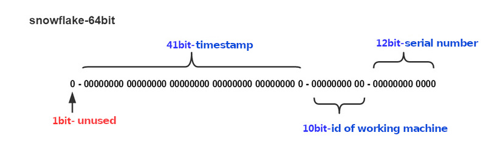

# Snowflake

## Introduction

`Snowflake` is a distributed global unique ID generation algorithm proposed by Twitter. The result generated by the algorithm is a `64bit` long integer. In the standard algorithm, its structure is as shown below:



- `1 bit`, unused.
  - The highest bit in binary is the sign bit. The `ID` we generate is generally a positive integer, so this highest bit is fixed to 0.

- `41 bits`, used to record the timestamp (milliseconds).
  - `41 bits` can represent `2^41 - 1` numbers.
  - That is to say, `41 bits` can represent `2^41 - 1` millisecond values. Converted into years, it is `(2^41 - 1) / (1000 * 60 * 60 * 24 * 365)` which is about `69` years.

- `10 bits`, used to record the machine `ID`.
  - Can be deployed on `2^10` total `1024` nodes, including `5 bits` of `DatacenterId` and `5 bits` of `WorkerId`.

- `12 bits`, serial number, used to record different `id`s generated in the same millisecond.
  - The maximum positive integer that `12 bits` can represent is `2^12 - 1`, a total of `4095` numbers, used to represent the `4095` `ID` serial numbers generated on the same machine at the same timestamp (millisecond).

`Snowflake` can guarantee:

 - All generated `ID`s are incremented by time trend.
 - No duplicate `ID`s will be generated within the entire distributed system (because `DatacenterId (5 bits)` and `WorkerId (5 bits)` are used for distinction).
 
The `Hyperf/snowflake` component has good scalability in design, allowing you to implement other variant algorithms based on Snowflake through simple extension.

## Installation

```bash
composer require hyperf/snowflake
```

## Usage

The framework provides `MetaGeneratorInterface` and `IdGeneratorInterface`. `MetaGeneratorInterface` will generate the `Meta` file for the `ID`, and `IdGeneratorInterface` will generate a `distributed ID` based on the corresponding `Meta` file.

The `MetaGeneratorInterface` used by the framework by default is a `millisecond-level generator` based on `Redis`.
The configuration file is located at `config/autoload/snowflake.php`. If the configuration file does not exist, you can create the default configuration by executing the `php bin/hyperf.php vendor:publish hyperf/snowflake` command. The content of the configuration file is as follows:

```php
<?php

declare(strict_types=1);

use Hyperf\Snowflake\MetaGenerator\RedisMilliSecondMetaGenerator;
use Hyperf\Snowflake\MetaGenerator\RedisSecondMetaGenerator;
use Hyperf\Snowflake\MetaGeneratorInterface;

return [
    'begin_second' => MetaGeneratorInterface::DEFAULT_BEGIN_SECOND,
    RedisMilliSecondMetaGenerator::class => [
        // Redis Pool
        'pool' => 'default',
        // Key used to calculate WorkerId
        'key' => RedisMilliSecondMetaGenerator::DEFAULT_REDIS_KEY
    ],
    RedisSecondMetaGenerator::class => [
        // Redis Pool
        'pool' => 'default',
        // Key used to calculate WorkerId
        'key' => RedisMilliSecondMetaGenerator::DEFAULT_REDIS_KEY
    ],
];
```

Using `Snowflake` in the framework is very simple, you just need to take out the `IdGeneratorInterface` object from `DI`.

```php
<?php
use Hyperf\Snowflake\IdGeneratorInterface;
use Hyperf\Context\ApplicationContext;

$container = ApplicationContext::getContainer();
$generator = $container->get(IdGeneratorInterface::class);

$id = $generator->generate();
```

When you need to reverse infer the corresponding `Meta` from the `ID`, you just need to call `degenerate`.

```php
<?php
use Hyperf\Snowflake\IdGeneratorInterface;
use Hyperf\Context\ApplicationContext;

$container = ApplicationContext::getContainer();
$generator = $container->get(IdGeneratorInterface::class);

$meta = $generator->degenerate($id);
```

## Rewrite `Meta` Generator

There are many ways to implement `distributed global unique ID`, and there are also many variant algorithms based on the `Snowflake` algorithm. Although they are all `Snowflake` algorithms, they are not all the same. For example, some people might generate `Meta` based on `UserId` instead of `WorkerId`. Next, let's implement a simple `MetaGenerator`.
Simply put, `UserId` will definitely exceed `10 bits`, so the default `DataCenterId` and `WorkerId` certainly cannot fit it, so it is necessary to take the modulo of `UserId`.

```php
<?php

declare(strict_types=1);

use Hyperf\Snowflake\IdGenerator\SnowflakeIdGenerator;

class UserDefinedIdGenerator
{
    protected SnowflakeIdGenerator $idGenerator;

    public function __construct(SnowflakeIdGenerator $idGenerator)
    {
        $this->idGenerator = $idGenerator;
    }

    public function generate(int $userId)
    {
        $meta = $this->idGenerator->getMetaGenerator()->generate();

        return $this->idGenerator->generate($meta->setWorkerId($userId % 31));
    }

    public function degenerate(int $id)
    {
        return $this->idGenerator->degenerate($id);
    }
}

use Hyperf\Context\ApplicationContext;

$container = ApplicationContext::getContainer();
$generator = $container->get(UserDefinedIdGenerator::class);
$userId = 20190620;

$id = $generator->generate($userId);
```

## Application in Database Model

After configuring Snowflake, we can make the database model use the snowflake id as the primary key directly.

```php
<?php
use Hyperf\Database\Model\Model;
use Hyperf\Snowflake\Concern\Snowflake;

class User extends Model {
    use Snowflake;
}
```

The above User model will default to using the Snowflake algorithm to generate the primary key when created.

Because Snowflake will overwrite the `creating` method, and users may need to set their own `creating` method, there will be an issue where the `ID` cannot be generated. Here, the user just needs to handle it by themselves as follows:

```php
<?php
use Hyperf\Database\Model\Model;
use Hyperf\Snowflake\Concern\Snowflake;

class User extends Model {
    use Snowflake {
        creating as create;
    }

    public function creating()
    {
        $this->create();
        // Do something ...
    }
}
```
