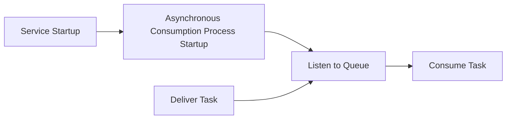
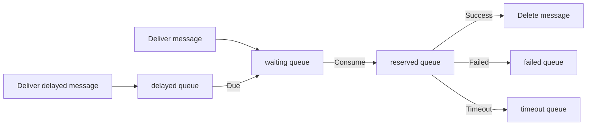

# Async Queue

Async Queue berbeda dari message queue seperti `RabbitMQ` atau `Kafka`. Komponen ini hanya menyediakan kemampuan untuk `pemrosesan asynchronous` dan `pemrosesan asynchronous tertunda`. Komponen ini **tidak** menjamin persistensi pesan secara ketat dan **tidak mendukung** mekanisme ACK (acknowledgment) yang lengkap.

## Instalasi

```bash
composer require hyperf/async-queue
```

## Konfigurasi

File konfigurasi terletak di `config/autoload/async_queue.php`. Jika file ini belum ada, Anda dapat menerbitkannya menggunakan perintah: `php bin/hyperf.php vendor:publish hyperf/async-queue`.

> Saat ini, hanya `Redis Driver` yang didukung.

| Konfigurasi | Tipe | Nilai Default | Keterangan |
| :--- | :--- | :--- | :--- |
| driver | string | Hyperf\AsyncQueue\Driver\RedisDriver::class | Tidak ada |
| channel | string | queue | Prefix queue |
| redis.pool | string | default | Koneksi pool Redis |
| timeout | int | 2 | Timeout untuk mengambil pesan |
| retry_seconds | int,array | 5 | Interval untuk mencoba ulang setelah gagal |
| handle_timeout | int | 10 | Timeout untuk pemrosesan pesan |
| processes | int | 1 | Jumlah proses consumer |
| concurrent.limit | int | 10 | Jumlah pesan yang diproses secara bersamaan |
| max_messages | int | 0 | Maksimal pesan sebelum proses restart (0 berarti tidak ada restart) |

```php
<?php

return [
    'default' => [
        'driver' => Hyperf\AsyncQueue\Driver\RedisDriver::class,
        'redis' => [
            'pool' => 'default'
        ],
        'channel' => 'queue',
        'timeout' => 2,
        'retry_seconds' => 5,
        'handle_timeout' => 10,
        'processes' => 1,
        'concurrent' => [
            'limit' => 10,
        ],
        'max_messages' => 0,
    ],
];
```

`retry_seconds` juga bisa berupa array untuk mengubah waktu retry berdasarkan jumlah percobaan, contohnya:

```php
<?php

return [
    'default' => [
        'driver' => Hyperf\AsyncQueue\Driver\RedisDriver::class,
        'channel' => 'queue',
        'retry_seconds' => [1, 5, 10, 20],
        'processes' => 1,
    ],
];
```

## Cara Kerja

`ConsumerProcess` adalah proses konsumsi asynchronous yang menjalankan logika konsumsi berdasarkan `Job` buatan pengguna atau blok kode yang memakai `#[AsyncQueueMessage]`.
Baik `Job` maupun `#[AsyncQueueMessage]` adalah task yang perlu dikirim dan dieksekusi; artinya, data dan logika konsumsi didefinisikan di dalam task tersebut.

- Member variable di dalam class `Job` adalah data yang akan dikonsumsi, dan method `handle()` berisi logika konsumsi.
- Untuk method yang dianotasi dengan `#[AsyncQueueMessage]`, data yang diteruskan ke constructor adalah data yang akan dikonsumsi, dan body method berisi logika konsumsi.



## Penggunaan

### Mengonfigurasi Proses Konsumsi Asynchronous

Komponen ini menyediakan `proses konsumsi asynchronous` bawaan. Anda hanya perlu mengonfigurasinya di `config/autoload/processes.php`.

```php
<?php

return [
    Hyperf\AsyncQueue\Process\ConsumerProcess::class,
];
```

Tentu saja, Anda juga bisa menambahkan `Process` berikut ke proyek Anda sendiri.

> Anda hanya perlu memilih salah satu antara pendekatan konfigurasi dan pendekatan annotation.

```php
<?php

declare(strict_types=1);

namespace App\Process;

use Hyperf\AsyncQueue\Process\ConsumerProcess;
use Hyperf\Process\Annotation\Process;

#[Process(name: "async-queue")]
class AsyncQueueConsumer extends ConsumerProcess
{
}
```

### Cara Menggunakan Banyak Konfigurasi

Beberapa developer membuat banyak konfigurasi untuk skenario khusus. Misalnya, pesan prioritas tinggi ditempatkan di queue yang tidak terlalu sibuk. Contoh konfigurasinya:

```php
<?php

return [
    'default' => [
        'driver' => Hyperf\AsyncQueue\Driver\RedisDriver::class,
        'redis' => [
            'pool' => 'default'
        ],
        'channel' => 'queue',
        'timeout' => 2,
        'retry_seconds' => 5,
        'handle_timeout' => 10,
        'processes' => 1,
        'concurrent' => [
            'limit' => 5,
        ],
    ],
    'fast' => [
        'driver' => Hyperf\AsyncQueue\Driver\RedisDriver::class,
        'redis' => [
            'pool' => 'default'
        ],
        'channel' => '{queue:fast}',
        'timeout' => 2,
        'retry_seconds' => 5,
        'handle_timeout' => 10,
        'processes' => 1,
        'concurrent' => [
            'limit' => 5,
        ],
    ],
];
```

Namun, `Hyperf\AsyncQueue\Process\ConsumerProcess` bawaan hanya memproses konfigurasi `default`, jadi kita perlu membuat `Process` baru.

```php
<?php

declare(strict_types=1);

namespace App\Process;

use Hyperf\AsyncQueue\Process\ConsumerProcess;
use Hyperf\Process\Annotation\Process;

#[Process(name: "async-queue")]
class AsyncQueueConsumer extends ConsumerProcess
{
    protected string $queue = 'fast';
}
```

### Producing Messages

#### Pendekatan Tradisional

Dalam mode ini, object akan diserialisasi langsung dan disimpan di queue seperti `Redis`. Oleh karena itu, untuk menjaga ukuran setelah serialisasi, usahakan untuk tidak menetapkan `Container`, `Config`, dll., sebagai member variable.

Contohnya, definisi `Job` berikut **tidak disarankan**. Hal yang sama berlaku untuk `#[Inject]`.

> Karena Job akan diserialisasi, member variable tidak boleh mengandung konten yang tidak bisa diserialisasi, seperti anonymous function. Jika Anda tidak yakin konten apa yang tidak bisa diserialisasi, coba gunakan pendekatan annotation.

```php
<?php

declare(strict_types=1);

namespace App\Job;

use Hyperf\AsyncQueue\Job;
use Psr\Container\ContainerInterface;

class ExampleJob extends Job
{
    public $container;

    public $params;

    public function __construct(ContainerInterface $container, $params)
    {
        $this->container = $container;
        $this->params = $params;
    }

    public function handle()
    {
        // Proses logika spesifik berdasarkan parameter
        var_dump($this->params);
    }
}

$job = make(ExampleJob::class);
```

`Job` yang benar seharusnya hanya berisi data yang perlu diproses. Data terkait lainnya bisa didapatkan ulang di method `handle`, seperti berikut.

```php
<?php

declare(strict_types=1);

namespace App\Job;

use Hyperf\AsyncQueue\Job;

class ExampleJob extends Job
{
    public $params;
    
    /**
     * Percobaan ulang setelah task gagal; jumlah maksimum eksekusi adalah $maxAttempts+1
     */
    protected int $maxAttempts = 2;

    public function __construct($params)
    {
        // Sebaiknya gunakan data biasa di sini, jangan menggunakan object yang membawa IO, seperti object PDO
        $this->params = $params;
    }

    public function handle()
    {
        // Proses logika spesifik berdasarkan parameter
        // Dapatkan model, dll., melalui parameter spesifik
        // Logika ini akan dieksekusi di proses ConsumerProcess
        var_dump($this->params);
    }
}
```

Setelah mendefinisikan `Job` dengan benar, kita perlu menulis `Service` khusus untuk mengirim pesan, seperti kode berikut.

```php
<?php

declare(strict_types=1);

namespace App\Service;

use App\Job\ExampleJob;
use Hyperf\AsyncQueue\Driver\DriverFactory;
use Hyperf\AsyncQueue\Driver\DriverInterface;

class QueueService
{
    protected DriverInterface $driver;

    public function __construct(DriverFactory $driverFactory)
    {
        $this->driver = $driverFactory->get('default');
    }

    /**
     * Mengirim pesan.
     * @param $params Data
     * @param int $delay Waktu tunda dalam detik
     */
    public function push($params, int $delay = 0): bool
    {
        // `ExampleJob` di sini akan diserialisasi dan disimpan di Redis, jadi sebaiknya hanya berisi data biasa untuk variable internal.
        // Demikian pula, jika annotation `@Value` digunakan di dalamnya, object terkait akan ikut terserialisasi, menyebabkan body pesan membesar.
        // Oleh karena itu, tidak disarankan menggunakan method `make` untuk membuat object `Job` di sini.
        return $this->driver->push(new ExampleJob($params), $delay);
    }
}
```

Mengirim pesan:

Selanjutnya, cukup panggil `QueueService` kita untuk mengirim pesan.

```php
<?php

declare(strict_types=1);

namespace App\Controller;

use App\Service\QueueService;
use Hyperf\Di\Annotation\Inject;
use Hyperf\HttpServer\Annotation\AutoController;

#[AutoController]
class QueueController extends AbstractController
{
    #[Inject]
    protected QueueService $service;

    /**
     * Mengirim pesan dalam mode tradisional
     */
    public function index()
    {
        $this->service->push([
            'group@hyperf.io',
            'https://doc.hyperf.io',
            'https://www.hyperf.io',
        ]);

        return 'success';
    }
}
```

#### Pendekatan Annotation

Selain cara tradisional mengirim pesan, framework juga menyediakan pendekatan annotation.

> Pendekatan annotation otomatis mengirim pesan ke queue di luar lingkungan konsumsi. Jadi, jika dipakai di dalam queue, pesan tidak dikirim ulang, melainkan langsung dieksekusi di proses konsumsi saat ini.
> Jika Anda tetap perlu mengirim pesan dari dalam queue, gunakan mode tradisional.

Mari kita tulis ulang `QueueService` di atas, pindahkan logika `ExampleJob` langsung ke method `example`, dan tambahkan annotation `AsyncQueueMessage`. Kodenya sebagai berikut:

```php
<?php

declare(strict_types=1);

namespace App\Service;

use Hyperf\AsyncQueue\Annotation\AsyncQueueMessage;

class QueueService
{
    #[AsyncQueueMessage]
    public function example($params)
    {
        // Logika kode yang perlu dieksekusi secara asynchronous
        // Logika ini akan dieksekusi di proses ConsumerProcess
        var_dump($params);
    }
}

```

Mengirim pesan:

Mengirim pesan dalam mode annotation sama seperti memanggil method biasa. Kodenya sebagai berikut:

```php
<?php

declare(strict_types=1);

namespace App\Controller;

use App\Service\QueueService;
use Hyperf\Di\Annotation\Inject;
use Hyperf\HttpServer\Annotation\AutoController;

#[AutoController]
class QueueController extends AbstractController
{
    #[Inject]
    protected QueueService $service;

    /**
     * Mengirim pesan dalam mode annotation
     */
    public function example()
    {
        $this->service->example([
            'group@hyperf.io',
            'https://doc.hyperf.io',
            'https://www.hyperf.io',
        ]);

        return 'success';
    }
}
```

### Script Bawaan

Argumen:
  - queue_name: Nama konfigurasi queue, default adalah default

Opsi:
  - channel_name: Nama queue, seperti failed queue `failed`, timeout queue `timeout`

#### Menampilkan status pesan dari queue saat ini

```shell
$ php bin/hyperf.php queue:info {queue_name}
```

#### Memuat ulang semua pesan yang gagal/timeout ke dalam pending queue

```shell
php bin/hyperf.php queue:reload {queue_name} -Q {channel_name}
```

#### Menghancurkan semua pesan yang gagal/timeout

```shell
php bin/hyperf.php queue:flush {queue_name} -Q {channel_name}
```

## Events

| Nama Event | Waktu Pemicu | Keterangan |
| :--- | :--- | :--- |
| BeforeHandle | Dipicu sebelum memproses pesan | |
| AfterHandle | Dipicu setelah memproses pesan | |
| FailedHandle | Dipicu setelah pemrosesan pesan gagal | |
| RetryHandle | Dipicu sebelum mencoba ulang pemrosesan pesan | |
| QueueLength | Dipicu setiap 500 pesan diproses | Pengguna dapat mendengarkan event ini untuk menentukan apakah ada penumpukan di failed atau timeout queue |

### QueueLengthListener

Framework sudah memiliki listener untuk mencatat panjang queue, yang tidak diaktifkan secara default. Jika diperlukan, Anda bisa menambahkannya sendiri ke konfigurasi `listeners`.

```php
<?php

declare(strict_types=1);

return [
    Hyperf\AsyncQueue\Listener\QueueLengthListener::class
];
```

### ReloadChannelListener

Ketika eksekusi pesan timeout, atau ketika proyek di-restart sehingga eksekusi pesan terhenti, pesan pada akhirnya akan dipindahkan ke `timeout` queue. Selama Anda bisa menjamin bahwa eksekusi pesan bersifat idempotent (menjalankan pesan yang sama sekali atau berkali-kali menghasilkan hasil yang sama), Anda bisa mengaktifkan listener berikut. Framework akan otomatis memindahkan pesan dari `timeout` queue ke `waiting` queue untuk dikonsumsi lagi.

> Listener ini mendengarkan event `QueueLength` dan dipicu setiap 500 pesan diproses secara default.

```php
<?php

declare(strict_types=1);

return [
    Hyperf\AsyncQueue\Listener\ReloadChannelListener::class
];
```

## Alur Eksekusi Task

Alur eksekusi task terutama mencakup queue berikut:

| Nama Queue | Keterangan |
| :--- | :--- |
| waiting | Queue yang menunggu untuk dikonsumsi |
| reserved | Queue yang sedang dikonsumsi |
| delayed | Queue untuk konsumsi tertunda |
| failed | Queue untuk konsumsi yang gagal |
| timeout | Queue untuk konsumsi yang timeout (meskipun timeout, mungkin sudah berhasil dieksekusi) |

Urutan alur queue adalah sebagai berikut:



## Mengonfigurasi Banyak Async Queue

Jika Anda perlu menggunakan banyak queue untuk memisahkan konsumsi frekuensi tinggi dan rendah, atau jenis pesan lainnya, Anda bisa mengonfigurasi beberapa queue sekaligus.

1. Tambahkan konfigurasi

```php
<?php

return [
    'default' => [
        'driver' => Hyperf\AsyncQueue\Driver\RedisDriver::class,
        'channel' => '{queue}',
        'timeout' => 2,
        'retry_seconds' => 5,
        'handle_timeout' => 10,
        'processes' => 1,
        'concurrent' => [
            'limit' => 2,
        ],
    ],
    'other' => [
        'driver' => Hyperf\AsyncQueue\Driver\RedisDriver::class,
        'channel' => '{other.queue}',
        'timeout' => 2,
        'retry_seconds' => 5,
        'handle_timeout' => 10,
        'processes' => 1,
        'concurrent' => [
            'limit' => 2,
        ],
    ],
];
```

2. Tambahkan proses konsumsi

```php
<?php

declare(strict_types=1);

namespace App\Process;

use Hyperf\AsyncQueue\Process\ConsumerProcess;
use Hyperf\Process\Annotation\Process;

#[Process]
class OtherConsumerProcess extends ConsumerProcess
{
    protected string $queue = 'other';
}
```

3. Pemanggilan

```php
use Hyperf\AsyncQueue\Driver\DriverFactory;
use Hyperf\Context\ApplicationContext;

$driver = ApplicationContext::getContainer()->get(DriverFactory::class)->get('other');
return $driver->push(new ExampleJob());
```

## Safe Shutdown

Ketika asynchronous queue dihentikan, jika masih ada logika konsumsi yang berjalan, bisa menyebabkan error. Framework menyediakan `ProcessStopHandler` untuk mematikan proses asynchronous queue dengan aman.

> Handler sinyal saat ini belum diadaptasi untuk CoroutineServer. Jika perlu, implementasikan sendiri.

Install signal handler:

```shell
composer require hyperf/signal
composer require hyperf/process
```

Tambahkan konfigurasi `autoload/signal.php`:

```php
<?php

declare(strict_types=1);

return [
    'handlers' => [
        Hyperf\Process\Handler\ProcessStopHandler::class,
    ],
    'timeout' => 5.0,
];
```

## Perbedaan Antara Asynchronous Driver

- Hyperf\AsyncQueue\Driver\RedisDriver::class

Asynchronous driver ini akan menserialisasi seluruh `JOB`. Setelah dikirim ke instant queue, akan di-`lpush` ke struktur `list`. Setelah dikirim ke delayed queue, akan di-`zadd` ke struktur `zset`.
Karena itu, jika parameter `Job` persis sama, pesan yang dikirim belakangan di delayed queue akan **menimpa** pesan yang dikirim sebelumnya.
Jika tidak ingin pesan tertunda ditimpa, tambahkan `uniqid` unik ke `Job`, atau tambahkan parameter input `uniqid` ke method yang menggunakan `annotation`.
