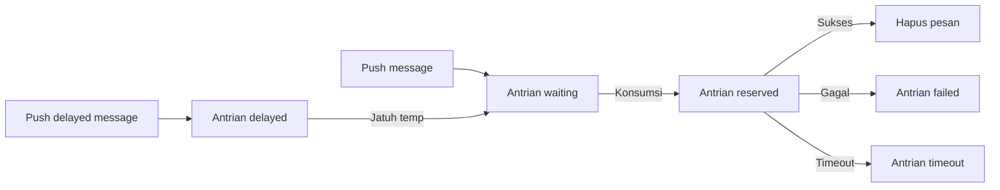

# Async Queue

Async queue dibedakan dari message queue seperti `RabbitMQ` dan `Kafka`.
Komponen ini hanya menyediakan kemampuan 'asynchronous processing' dan
'asynchronous delay processing', serta tidak secara ketat menjamin message
persistence atau mendukung `ACK response mechanism`.

## Instalasi

```bash
composer require hyperf/async-queue
```

## Konfigurasi

File konfigurasi terletak di `config/autoload/async_queue.php`, yang dapat
dibuat jika file tersebut belum ada.

> Hanya `Redis Driver` yang didukung saat ini.

| Konfigurasi | Tipe | Nilai Default | Catatan |
|:-------------:|:------:|:-------------------------------------------:|:------------------:|
| driver | string | Hyperf\AsyncQueue\Driver\RedisDriver::class | Tidak ada |
| channel | string | queue | Prefix dari queue |
| retry_seconds | int | 5 | Interval retry setelah kegagalan |
| processes | int | 1 | Jumlah consumer process |

```php
<?php

return [
    'default' => [
        'driver' => Hyperf\AsyncQueue\Driver\RedisDriver::class,
        'channel' => 'queue',
        'retry_seconds' => 5,
        'processes' => 1,
    ],
];

```

## Penggunaan

### Mengonsumsi message

Komponen ini telah menyediakan child process default, cukup konfigurasikan
child process tersebut ke dalam `config/autoload/processes.php`.

```php
<?php

return [
    Hyperf\AsyncQueue\Process\ConsumerProcess::class,
];
```

Tentu saja Anda juga dapat menambahkan `Process` di bawah ini ke dalam skeleton
aplikasi Anda.

```php
<?php

declare(strict_types=1);

namespace App\Process;

use Hyperf\AsyncQueue\Process\ConsumerProcess;
use Hyperf\Process\Annotation\Process;

#[Process(name: "async-queue")]
class AsyncQueueConsumer extends ConsumerProcess
{
}
```

### Memublikasikan message

Pertama, definisikan sebuah message job sebagai berikut:

```php
<?php

declare(strict_types=1);

namespace App\Job;

use Hyperf\AsyncQueue\Job;

class ExampleJob extends Job
{
    public $params;

    public function __construct($params)
    {
        // Sebaiknya gunakan data biasa di sini. Jangan mengirimkan objek yang membawa IO, seperti objek PDO.
        $this->params = $params;
    }

    public function handle()
    {
        // Proses logika spesifik berdasarkan parameter
        var_dump($this->params);
    }
}
```

Publikasikan message

```php
<?php

declare(strict_types=1);

namespace App\Service;

use App\Job\ExampleJob;
use Hyperf\AsyncQueue\Driver\DriverFactory;
use Hyperf\AsyncQueue\Driver\DriverInterface;

class QueueService
{
    /**
     * @var DriverInterface
     */
    protected $driver;

    public function __construct(DriverFactory $driverFactory)
    {
        $this->driver = $driverFactory->get('default');
    }

    /**
     * Publish the message.
     */
    public function push($params, int $delay = 0): bool
    {
        // ExampleJob di sini akan diserialisasi dan disimpan di Redis, sehingga variabel internal dari objek sebaiknya hanya dikirimi data biasa.
        // Demikian pula, jika annotation digunakan secara internal, @Value akan menserialisasikan objek yang sesuai, menyebabkan body message menjadi lebih besar.
        // Sehingga TIDAK disarankan menggunakan metode `make` untuk membuat objek `Job`.
        return $this->driver->push(new ExampleJob($params), $delay);
    }
}
```

Sesuai dengan skenario bisnis yang sebenarnya, untuk mengirimkan message
secara dinamis ke eksekusi async queue, kami mendemonstrasikan pengiriman
message secara dinamis di dalam controller sebagai berikut:

```php
<?php

declare(strict_types=1);

namespace App\Controller;

use App\Service\QueueService;
use Hyperf\Di\Annotation\Inject;
use Hyperf\HttpServer\Annotation\AutoController;

#[AutoController]
class QueueController extends Controller
{
    #[Inject]
    protected QueueService $service;

    public function index()
    {
        $this->service->push([
            'group@hyperf.io',
            'https://doc.hyperf.io',
            'https://www.hyperf.io',
        ]);

        return 'success';
    }
}
```

#### Mode Annotation

Selain cara tradisional dalam mem-push pesan, framework ini juga menyediakan mode annotation.

> Pada mode annotation, jika tidak berada dalam lingkungan konsumsi, pesan akan otomatis di-push ke antrian. Oleh karena itu, jika kita menggunakan mode annotation di dalam consumer antrian, pesan tidak akan di-push kembali ke antrian, melainkan langsung dieksekusi dalam proses konsumsi saat ini.
> Jika Anda tetap perlu mem-push pesan di dalam antrian, Anda dapat mem-pushnya menggunakan mode tradisional.

Mari kita menulis ulang `QueueService` di atas, pindahkan logika `ExampleJob` langsung ke dalam method `example`, dan tambahkan annotation `#[AsyncQueueMessage]`. Kodenya adalah sebagai berikut:

```php
<?php

declare(strict_types=1);

namespace App\Service;

use Hyperf\AsyncQueue\Annotation\AsyncQueueMessage;

class QueueService
{
    #[AsyncQueueMessage]
    public function example($params)
    {
        // Logika kode yang perlu dieksekusi secara asinkron
        // Logika di sini akan dieksekusi di dalam ConsumerProcess
        var_dump($params);
    }
}
```

Mem-push pesan

Mem-push pesan dalam mode annotation sama saja dengan memanggil method biasa, kodenya adalah sebagai berikut.

```php
<?php

declare(strict_types=1);

namespace App\Controller;

use App\Service\QueueService;
use Hyperf\Di\Annotation\Inject;
use Hyperf\HttpServer\Annotation\AutoController;

#[AutoController]
class QueueController extends AbstractController
{
    #[Inject]
    protected QueueService $service;

    /**
     * Mem-push pesan dengan mode annotation
     */
    public function example()
    {
        $this->service->example([
            'group@hyperf.io',
            'https://doc.hyperf.io',
            'https://www.hyperf.io',
        ]);

        return 'success';
    }
}
```

### Skrip Default

Arguments:
  - queue_name: Nama konfigurasi antrian, default adalah `default`

Options:
  - channel_name: Nama antrian, misalnya antrian gagal `failed`, antrian timeout `timeout`

#### Menampilkan status pesan antrian saat ini

```shell
$ php bin/hyperf.php queue:info {queue_name}
```

#### Memuat ulang (reload) semua pesan gagal/timeout ke dalam antrian tunggu (waiting queue)

```shell
php bin/hyperf.php queue:reload {queue_name} -Q {channel_name}
```

#### Menghancurkan (flush) semua pesan gagal/timeout

```shell
php bin/hyperf.php queue:flush {queue_name} -Q {channel_name}
```

## Event

| Nama Event | Waktu Pemicu (Trigger Timing) | Catatan |
| :----------: | :---------------------: | :--------------------------------------------------: |
| BeforeHandle | Dipicu sebelum pesan diproses | |
| AfterHandle | Dipicu setelah pesan diproses | |
| FailedHandle | Dipicu setelah pesan gagal diproses | |
| RetryHandle | Dipicu sebelum memproses ulang pesan (retry) | |
| QueueLength | Dipicu setiap 500 pesan yang diproses | Pengguna dapat me-listen event ini untuk memeriksa antrian gagal atau timeout jika ada pesan yang menumpuk |

### QueueLengthListener

Framework ini dilengkapi dengan listener bawaan untuk merekam panjang antrian, yang dinonaktifkan secara default. Jika Anda membutuhkannya, Anda dapat menambahkannya ke dalam konfigurasi `listeners`.

```php
<?php

declare(strict_types=1);

return [
    Hyperf\AsyncQueue\Listener\QueueLengthListener::class
];
```

### ReloadChannelListener

Saat eksekusi pesan mengalami timeout, atau jika proyek di-restart yang menyebabkan eksekusi pesan terganggu, pesan tersebut pada akhirnya akan dipindahkan ke antrian `timeout`. Selama Anda dapat memastikan bahwa eksekusi pesan bersifat idempoten (menjalankan pesan yang sama sekali, atau berkali-kali, akan menghasilkan efek akhir yang konsisten),
Anda dapat mengaktifkan listener berikut, dan framework akan secara otomatis memindahkan pesan dari antrian `timeout` kembali ke antrian `waiting`, untuk menunggu konsumsi berikutnya.

> Listener me-listen event `QueueLength`, secara default akan dipicu setelah mengeksekusi pesan sebanyak 500 kali.

```php
<?php

declare(strict_types=1);

return [
    Hyperf\AsyncQueue\Listener\ReloadChannelListener::class
];
```

## Alur Eksekusi Task

Alur eksekusi task terutama melibatkan antrian (queue) berikut:

| Nama Antrian | Catatan |
| :------: | :---------------------------------------: |
| waiting | Antrian pesan yang menunggu untuk dikonsumsi |
| reserved | Antrian pesan yang sedang dikonsumsi |
| delayed | Antrian pesan yang tertunda untuk dikonsumsi |
| failed | Antrian pesan yang gagal dikonsumsi |
| timeout | Antrian pesan yang mengalami timeout (meskipun timeout, eksekusinya mungkin berhasil) |

Urutan alur antrian adalah sebagai berikut:



## Mengonfigurasi Beberapa Antrian Asinkron

Ketika Anda perlu menggunakan beberapa antrian untuk memisahkan pesan dengan frekuensi konsumsi tinggi dan rendah atau pesan jenis lainnya, Anda dapat mengonfigurasi beberapa antrian.

1. Menambahkan konfigurasi

```php
<?php

return [
    'default' => [
        'driver' => Hyperf\AsyncQueue\Driver\RedisDriver::class,
        'channel' => '{queue}',
        'timeout' => 2,
        'retry_seconds' => 5,
        'handle_timeout' => 10,
        'processes' => 1,
        'concurrent' => [
            'limit' => 2,
        ],
    ],
    'other' => [
        'driver' => Hyperf\AsyncQueue\Driver\RedisDriver::class,
        'channel' => '{other.queue}',
        'timeout' => 2,
        'retry_seconds' => 5,
        'handle_timeout' => 10,
        'processes' => 1,
        'concurrent' => [
            'limit' => 2,
        ],
    ],
];
```

2. Menambahkan Consumer Process

```php
<?php

declare(strict_types=1);

namespace App\Process;

use Hyperf\AsyncQueue\Process\ConsumerProcess;
use Hyperf\Process\Annotation\Process;

#[Process]
class OtherConsumerProcess extends ConsumerProcess
{
    protected string $queue = 'other';
}
```

3. Memanggilnya

```php
use Hyperf\AsyncQueue\Driver\DriverFactory;
use Hyperf\Context\ApplicationContext;

$driver = ApplicationContext::getContainer()->get(DriverFactory::class)->get('other');
return $driver->push(new ExampleJob());
```

## Penutupan yang Aman (Safe Shutdown)

Saat antrian asinkron dihentikan, jika logika konsumsi masih berlangsung, hal itu mungkin menyebabkan kesalahan. Framework menyediakan `ProcessStopHandler`, yang memungkinkan proses antrian asinkron ditutup dengan aman.

> Signal handler saat ini tidak kompatibel dengan CoroutineServer, jika Anda membutuhkannya silakan implementasikan sendiri.

Menginstal Signal Handler

```shell
composer require hyperf/signal
composer require hyperf/process
```

Tambahkan konfigurasi `autoload/signal.php`

```php
<?php

declare(strict_types=1);

return [
    'handlers' => [
        Hyperf\Process\Handler\ProcessStopHandler::class,
    ],
    'timeout' => 5.0,
];
```

## Perbedaan Antara Driver Asinkron

- Hyperf\AsyncQueue\Driver\RedisDriver::class

Driver asinkron ini akan menserialisasi keseluruhan `JOB`. Ketika dipush ke antrian real-time, ia akan di-`lpush` ke dalam struktur `list`, sedangkan ketika dipush ke antrian tertunda (delayed), ia akan di-`zadd` ke dalam struktur `zset`.
Oleh karena itu, jika parameter `Job` benar-benar sama, pesan yang dipush belakangan ke antrian tertunda akan **menimpa** (override) pesan yang dipush sebelumnya.
Jika Anda tidak ingin pesan tertunda tersebut saling menimpa, cukup tambahkan `uniqid` unik di dalam `Job`, atau tambahkan argumen input `uniqid` pada method yang menggunakan `Annotation`.
