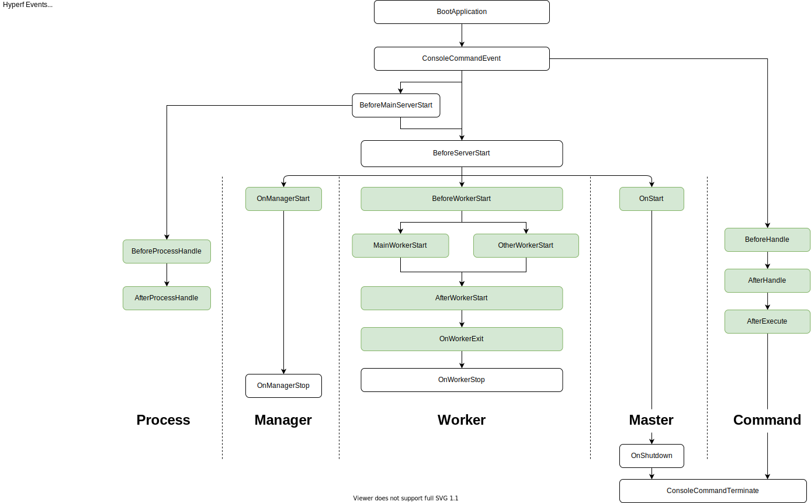

# Event

## Pendahuluan

Model event harus diimplementasikan berdasarkan
[PSR-14](https://github.com/php-fig/fig-standards/blob/master/accepted/PSR-14-event-dispatcher.md).
Secara default, event manager Hyperf diimplementasikan oleh
[hyperf/event](https://github.com/hyperf/event). Komponen ini juga dapat
digunakan di framework atau aplikasi lain, cukup dengan memasukkannya via
Composer.

```bash
composer require hyperf/event
```

## Konsep

Pola event adalah mekanisme yang teruji dengan baik dan andal. Mekanisme ini
sangat cocok untuk decoupling (pemisahan ketergantungan). Terdapat tiga peran:

- `Event` adalah objek komunikasi yang dilewatkan antara kode aplikasi dan
  `Listener`.
- `Listener` adalah pendengar untuk memantau terjadinya `Event`.
- `Event Dispatcher` adalah objek pengelola yang digunakan untuk memicu `Event`
  dan mengatur hubungan antara `Listener` dan `Event`.

Mari kita jelaskan dengan contoh yang mudah dipahami. Misalkan kita memiliki
metode `UserService::register()` untuk mendaftarkan akun. Setelah akun berhasil
didaftarkan, kita dapat memicu event `UserRegistered` melalui event dispatcher,
yang dipantau oleh listener. Ketika event ini terjadi, kita mungkin ingin
melakukan beberapa operasi, seperti mengirim pesan sukses registrasi pengguna,
atau mungkin mengirim email konfirmasi. Kita dapat memantau event
`UserRegistered` dengan menambahkan listener lain, tanpa menambahkan kode yang
tidak berkaitan ke dalam metode `UserService::register()`.

## Penggunaan Event Manager

### Mendefinisikan Event

Event sebenarnya adalah class biasa untuk mengelola data status. Saat dipicu,
data aplikasi akan dilewatkan ke event tersebut. Listener kemudian beroperasi
pada class event. Sebuah event dapat dipantau oleh beberapa listener.

```php
<?php
namespace App\Event;

class UserRegistered
{
    // It is recommended to define this as a public property so that the listener can use it directly, or you can provide Getter for that property.
    public $user;
    
    public function __construct($user)
    {
        $this->user = $user;    
    }
}
```

### Mendefinisikan Listener

Listener harus mengimplementasikan metode kontrak dari interface
`Hyperf\Event\Contract\ListenerInterface`. Contohnya adalah sebagai berikut.

```php
<?php
namespace App\Listener;

use App\Event\UserRegistered;
use Hyperf\Event\Contract\ListenerInterface;

class UserRegisteredListener implements ListenerInterface
{
    public function listen(): array
    {
        // Returns an array of events to be listened to by this listener, can listen to multiple events at the same time
        return [
            UserRegistered::class,
        ];
    }

    /**
     * @param UserRegistered $event
     */
    public function process(object $event): void
    {
        // The code to be executed by the listener after the event is triggered is written here, such as sending a user registration success message, etc. in this example.
        // Directly access the user property of $event to get the parameter value passed when the event fires.
        // $event->user;
    }
}
```

#### Mendaftarkan Listener Melalui File Konfigurasi

Setelah mendefinisikan listener, kita perlu membuatnya dapat ditemukan oleh
`Dispatcher`, yang dapat ditambahkan pada file konfigurasi
`config/autoload/listeners.php` *(jika belum ada, silakan dibuat)*. Urutan
pemicuan listener didasarkan pada urutan konfigurasi di file konfigurasi:

```php
<?php
return [
    \App\Listener\UserRegisteredListener::class,
];
```

### Mendaftarkan Listener Menggunakan Annotation

Hyperf juga menyediakan cara yang lebih mudah untuk mendaftarkan listener
dengan menggunakan annotation `#[Listener]`, selama annotation didefinisikan
pada class listener dan class listener tersebut secara otomatis diselesaikan
dalam registrasi domain pemindaian annotation Hyperf (Hyperf annotation scan
domain). Contoh kodenya adalah sebagai berikut:

```php
<?php
namespace App\Listener;

use App\Event\UserRegistered;
use Hyperf\Event\Annotation\Listener;
use Hyperf\Event\Contract\ListenerInterface;

#[Listener]
class UserRegisteredListener implements ListenerInterface
{
    public function listen(): array
    {
        // Returns an array of events to be listened to by this listener, can listen to multiple events at the same time
        return [
            UserRegistered::class,
        ];
    }

    /**
     * @param UserRegistered $event
     */
    public function process(object $event): void
    {
        // The code to be executed by the listener after the event is triggered is written here, such as sending a user registration success message, etc. in this example.
        // Directly access the user property of $event to get the parameter value passed when the event fires.
        // $event->user;
    }
}
```

Saat mendaftarkan listener via annotation, kita dapat menentukan urutan
listener saat ini dengan mengatur atribut `priority`, seperti
`#[Listener(priority: 1)]`. Di balik layar, Hyperf menggunakan struktur
`SplPriorityQueue` untuk menyimpannya, di mana semakin besar angka `priority`,
semakin tinggi prioritasnya.

> Penggunaan annotation `#[Listener]` membutuhkan namespace
> `use Hyperf\Event\Annotation\Listener;`.

### Memicu Event (Trigger Event)

Event harus di-dispatch oleh `EventDispatcher` agar `Listener` dapat
memantaunya. Kita akan menggunakan sepotong kode untuk mendemonstrasikan cara
memicu event:

```php
<?php
namespace App\Service;

use Hyperf\Di\Annotation\Inject;
use Psr\EventDispatcher\EventDispatcherInterface;
use App\Event\UserRegistered; 

class UserService
{
    #[Inject]
    private EventDispatcherInterface $eventDispatcher;
    
    public function register()
    {
        // We assume that there is a User entity
        $user = new User();
        $result = $user->save();
        // Complete the logic of account registration
        // This dispatch(object $event) will run the listener one by one
        $this->eventDispatcher->dispatch(new UserRegistered($user));
        return $result;
    }
}
```

## Lifecycle Events Hyperf



## Coroutine Style Server Lifecycle Events Hyperf


## Hal-hal yang Perlu Diperhatikan

### Jangan menginjeksi `EventDispatcherInterface` di dalam `Listener`

Karena `EventDispatcherInterface` bergantung pada `ListenerProviderInterface`,
dan `ListenerProviderInterface` akan mengumpulkan semua `Listener` saat
diinisialisasi.

Jika `Listener` bergantung pada `EventDispatcherInterface`, hal ini akan
menyebabkan circular dependency (ketergantungan melingkar) yang dapat
mengakibatkan memory overflow.

### Sebaiknya hanya injeksikan `ContainerInterface` di dalam `Listener`

Paling baik hanya menginjeksi `ContainerInterface` di dalam `Listener`,
sementara komponen lain diperoleh melalui `container` di dalam metode
`process`. Ketika framework dijalankan, `EventDispatcherInterface` akan
diinstansiasi. Pada saat ini, lingkungan tersebut bukanlah lingkungan
coroutine. Jika `Listener` diinjeksi dengan class yang dapat memicu peralihan
coroutine (coroutine switching), hal itu akan menyebabkan framework gagal
berjalan.
