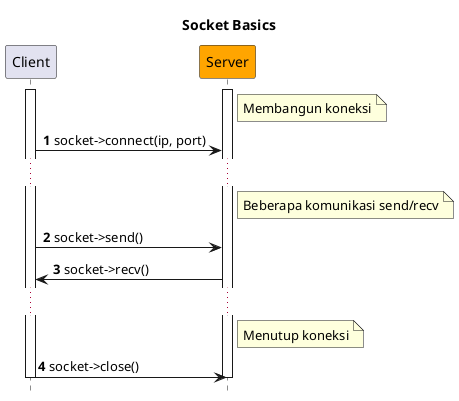
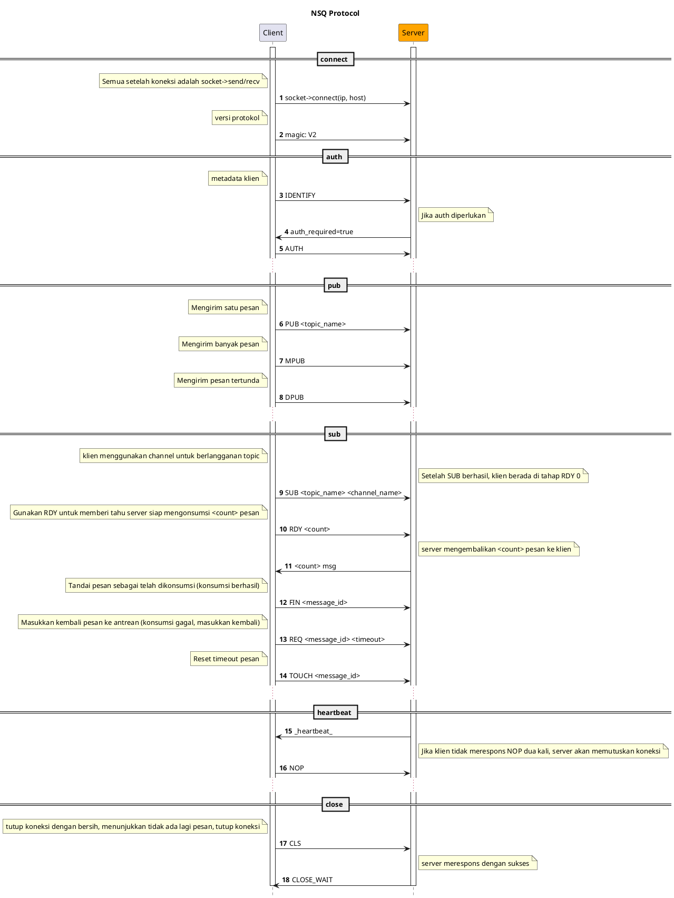

# NSQ

[NSQ](https://nsq.io) adalah message middleware terdistribusi real-time open-source, ringan, dan berkinerja tinggi yang ditulis dalam bahasa Go.

## Instalasi

```bash
composer require hyperf/nsq
```

## Penggunaan

### Konfigurasi

File konfigurasi untuk komponen NSQ berada di `config/autoload/nsq.php` secara default. Jika file ini belum ada, Anda dapat menerbitkannya menggunakan perintah `php bin/hyperf.php vendor:publish hyperf/nsq`.

File konfigurasi default adalah sebagai berikut:

```php
<?php
return [
    'default' => [
        'host' => '127.0.0.1',
        'port' => 4150,
        'pool' => [
            'min_connections' => 1,
            'max_connections' => 10,
            'connect_timeout' => 10.0,
            'wait_timeout' => 3.0,
            'heartbeat' => -1,
            // Karena waktu idle default dari service Nsq adalah 60 detik, waktu idle maksimum yang dipertahankan oleh framework harus kurang dari 60 detik
            'max_idle_time' => 30.0,
        ],
    ],
];
```

### Membuat Consumer

Anda dapat dengan cepat membuat Consumer untuk mengonsumsi pesan menggunakan perintah `gen:nsq-consumer`.

```bash
php bin/hyperf.php gen:nsq-consumer DemoConsumer
```

Anda juga dapat menggunakan annotation `Hyperf\Nsq\Annotation\Consumer` untuk mendeklarasikan subclass dari class abstrak `Hyperf/Nsq/AbstractConsumer` guna mendefinisikan Consumer. Baik annotation `Hyperf\Nsq\Annotation\Consumer` maupun class abstrak memiliki properti berikut:

| Konfigurasi | Tipe | Nilai Default Annotation atau Class Abstrak | Keterangan |
| :--- | :--- | :--- | :--- |
| topic | string | '' | Topic yang akan didengarkan |
| channel | string | '' | Channel yang akan didengarkan |
| name | string | NsqConsumer | Nama consumer |
| nums | int | 1 | Jumlah proses consumer |
| pool | string | default | Koneksi yang digunakan oleh consumer, sesuai dengan key di file konfigurasi |

Properti annotation ini bersifat opsional karena class abstrak `Hyperf/Nsq/AbstractConsumer` juga mendefinisikan atribut anggota yang sesuai serta getter dan setter. Ketika properti annotation tidak ditentukan, nilai default dari atribut class abstrak akan digunakan.

```php
<?php

declare(strict_types=1);

namespace App\Nsq\Consumer;

use Hyperf\Nsq\AbstractConsumer;
use Hyperf\Nsq\Annotation\Consumer;
use Hyperf\Nsq\Message;
use Hyperf\Nsq\Result;

#[Consumer(topic: "hyperf", channel: "hyperf", name: "DemoNsqConsumer", nums: 1)]
class DemoNsqConsumer extends AbstractConsumer
{
    public function consume(Message $payload): string 
    {
        var_dump($payload->getBody());

        return Result::ACK;
    }
}
```

### Menonaktifkan Proses Consumer agar Tidak Otomatis Menyala

Secara default, setelah mendefinisikan annotation `#[Consumer]`, framework akan otomatis membuat sub-proses untuk menjalankan consumer saat startup, dan akan merestartnya jika sub-proses keluar secara tidak normal. Namun, jika Anda sedang melakukan debugging di tahap pengembangan, konsumsi otomatis oleh consumer bisa mengganggu.

Dalam kasus ini, Anda dapat mengontrol startup otomatis proses consumer melalui shutdown global dan shutdown parsial.

#### Shutdown Global

Anda dapat mengatur opsi `enable` untuk koneksi yang sesuai menjadi `false` di file konfigurasi default `config/autoload/nsq.php`, yang berarti semua proses consumer di bawah koneksi ini akan menonaktifkan fungsi startup otomatis.

#### Shutdown Parsial

Ketika Anda hanya perlu menonaktifkan fungsi startup otomatis dari masing-masing proses consumer, Anda hanya perlu mengoverride method kelas induk `isEnable()` di consumer yang sesuai dan mengembalikan `false` untuk menonaktifkan fungsi startup otomatis consumer ini.

```php
<?php

declare(strict_types=1);

namespace App\Nsq\Consumer;

use Hyperf\Nsq\AbstractConsumer;
use Hyperf\Nsq\Annotation\Consumer;
use Hyperf\Nsq\Message;
use Hyperf\Nsq\Result;
use Psr\Container\ContainerInterface;

#[Consumer(topic: "demo_topic", channel: "demo_channel", name: "DemoConsumer", nums: 1)]
class DemoConsumer extends AbstractConsumer
{
    public function __construct(ContainerInterface $container)
    {
        parent::__construct($container);
    }

    public function isEnable(): bool 
    {
        return false;
    }

    public function consume(Message $payload): string
    {
        $body = json_decode($payload->getBody(), true);
        var_dump($body);
        return Result::ACK;
    }
}
```

### Producing Messages

Anda dapat mengirim pesan ke NSQ dengan memanggil method `Hyperf\Nsq\Nsq::publish(string $topic, $message, float $deferTime = 0.0)`. Berikut adalah contoh produksi pesan di Command:

```php
<?php

declare(strict_types=1);

namespace App\Command;

use Hyperf\Command\Command as HyperfCommand;
use Hyperf\Command\Annotation\Command;
use Hyperf\Nsq\Nsq;

#[Command]
class NsqCommand extends HyperfCommand
{
    protected $name = 'nsq:pub';

    public function handle()
    {
        /** @var Nsq $nsq */
        $nsq = make(Nsq::class);
        $topic = 'hyperf';
        $message = 'This is message at ' . time();
        $nsq->publish($topic, $message);

        $this->line('success', 'info');
    }
}
```

### Mengirim Banyak Pesan Sekaligus

Parameter kedua dari method `Hyperf\Nsq\Nsq::publish(string $topic, $message, float $deferTime = 0.0)` tidak hanya bisa menerima string, tapi juga array of strings untuk mengirim banyak pesan ke satu Topic sekaligus. Contohnya:

```php
<?php

declare(strict_types=1);

namespace App\Command;

use Hyperf\Command\Command as HyperfCommand;
use Hyperf\Command\Annotation\Command;
use Hyperf\Nsq\Nsq;

#[Command]
class NsqCommand extends HyperfCommand
{
    protected $name = 'nsq:pub';

    public function handle()
    {
        /** @var Nsq $nsq */
        $nsq = make(Nsq::class);
        $topic = 'hyperf';
        $messages = [
            'This is message 1 at ' . time(),
            'This is message 2 at ' . time(),
            'This is message 3 at ' . time(),
        ];
        $nsq->publish($topic, $messages);

        $this->line('success', 'info');
    }
}
```

### Menghasilkan Pesan Tertunda

Ketika Anda ingin pesan yang dikirim dikonsumsi setelah waktu tertentu, Anda juga dapat memberikan durasi tunda yang sesuai ke parameter ketiga dari method `Hyperf\Nsq\Nsq::publish(string $topic, $message, float $deferTime = 0.0)`, dalam satuan detik. Contohnya sebagai berikut:

```php
<?php

declare(strict_types=1);

namespace App\Command;

use Hyperf\Command\Command as HyperfCommand;
use Hyperf\Command\Annotation\Command;
use Hyperf\Nsq\Nsq;

#[Command]
class NsqCommand extends HyperfCommand
{
    protected $name = 'nsq:pub';

    public function handle()
    {
        /** @var Nsq $nsq */
        $nsq = make(Nsq::class);
        $topic = 'hyperf';
        $message = 'This is message at ' . time();
        $deferTime = 5.0;
        $nsq->publish($topic, $message, $deferTime);

        $this->line('success', 'info');
    }
}
```

### NSQD HTTP API

> Referensi NSQD HTTP API: https://nsq.io/components/nsqd.html

Komponen ini membungkus NSQD HTTP API, sehingga Anda dapat dengan mudah memanggil NSQD HTTP API.

Misalnya, ketika Anda perlu menghapus `Topic` tertentu, Anda dapat menjalankan kode berikut:

```php
<?php
use Hyperf\Context\ApplicationContext;
use Hyperf\Nsq\Nsqd\Topic;

$container = ApplicationContext::getContainer();

$client = $container->get(Topic::class);

$client->delete('hyperf.test');
```

- Class `Hyperf\Nsq\Api\Topic` terkait dengan API `topic`;
- Class `Hyperf\Nsq\Api\Channle` terkait dengan API `channel`;
- Class `Hyperf\Nsq\Api\Api` terkait dengan API `ping`, `stats`, `config`, `debug`, dll.;

## Protokol NSQ

> https://nsq.io/clients/tcp_protocol_spec.html

- Dasar Socket



- Alur Protokol NSQ


