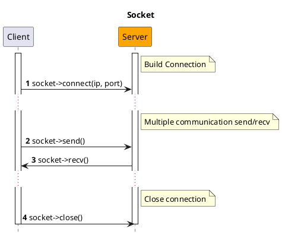
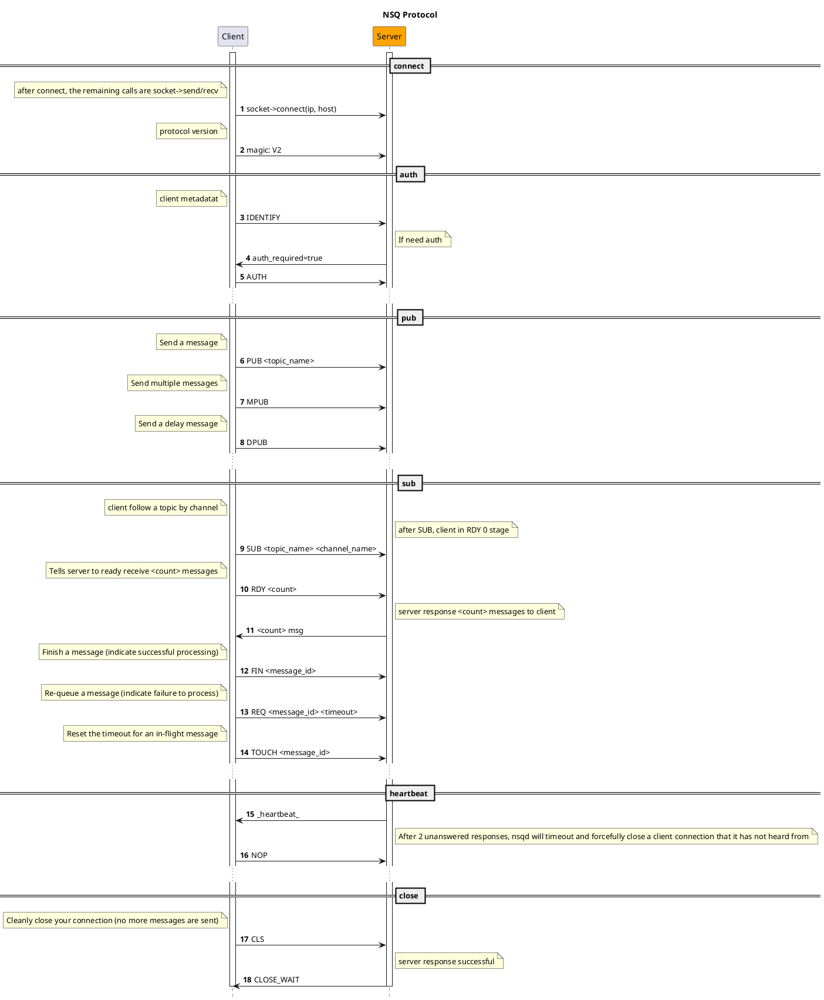

# NSQ

[NSQ](https://nsq.io) adalah platform realtime distributed messaging yang ditulis dalam Golang.

## Instalasi

```bash
composer require hyperf/nsq
```

## Penggunaan

### Konfigurasi

Secara default, file konfigurasi komponen NSQ berada di
`config/autoload/nsq.php`. Jika file tersebut tidak ada, Anda dapat
menggunakan perintah `php bin/hyperf.php vendor:publish hyperf/nsq` untuk
mempublikasikan file konfigurasi yang sesuai.

File konfigurasi default adalah sebagai berikut:

```php
<?php
return [
    'default' => [
        'host' => '127.0.0.1',
        'port' => 4150,
        'pool' => [
            'min_connections' => 1,
            'max_connections' => 10,
            'connect_timeout' => 10.0,
            'wait_timeout' => 3.0,
            'heartbeat' => -1,
            'max_idle_time' => 60.0,
        ],
    ],
];
```

### Membuat Consumer

Anda dapat membuat consumer dengan cepat untuk mengonsumsi pesan melalui
perintah `gen:nsq-consumer`, misalnya:

```bash
php bin/hyperf.php gen:nsq-consumer DemoConsumer
```

Anda juga dapat menggunakan anotasi `Hyperf\Nsq\Annotation\Consumer` untuk
mendeklarasikan subclass dari abstract class `Hyperf/Nsq/AbstractConsumer`
untuk menyelesaikan definisi consumer, di mana anotasi dan abstract class
tersebut berisi properti berikut:

| Properti | Tipe | Nilai Default | Keterangan |
|:-------:|:------:|:------:|:----------------:|
|  topic  | string |   ''   | Topic yang ingin didengarkan |
| channel | string |   ''   | Channel yang ingin didengarkan |
|   name  | string | NsqConsumer | Nama dari consumer |
|   nums  |  int   |   1    | Jumlah proses consumer |
|   pool  | string |   default   | Resource connection pool yang sesuai dengan consumer, sesuai dengan key pada file konfigurasi |

Properti anotasi ini bersifat opsional, karena class
`Hyperf/Nsq/AbstractConsumer` juga masing-masing mendefinisikan properti
anggota serta getter dan setter yang sesuai. Ketika properti anotasi tidak
didefinisikan, nilai default dari abstract class yang akan digunakan.

```php
<?php

declare(strict_types=1);

namespace App\Nsq\Consumer;

use Hyperf\Nsq\AbstractConsumer;
use Hyperf\Nsq\Annotation\Consumer;
use Hyperf\Nsq\Message;
use Hyperf\Nsq\Result;

#[Consumer(
    topic: "hyperf", 
    channel: "hyperf", 
    name: "DemoNsqConsumer", 
    nums: 1
)]
class DemoNsqConsumer extends AbstractConsumer
{
    public function consume(Message $payload): string 
    {
        var_dump($payload->getBody());

        return Result::ACK;
    }
}
```

### Menonaktifkan Fitur Auto-Start pada Proses Consumer

Secara default, setelah menggunakan definisi anotasi `#[Consumer]`,
framework akan secara otomatis membuat child process untuk menjalankan consumer
pada saat startup, dan akan secara otomatis menariknya kembali (re-pull)
setelah child process keluar secara tidak normal. Namun, jika beberapa
pekerjaan debugging dilakukan pada tahap pengembangan, mungkin akan tidak
nyaman untuk melakukan debug karena pesan dikonsumsi secara otomatis oleh
consumer.

Dalam situasi ini, Anda dapat mengontrol auto-start dari proses konsumsi
melalui dua cara untuk menonaktifkan fitur tersebut, yaitu penonaktifan
global dan penonaktifan sebagian.

#### Penonaktifan Global

Anda dapat mengatur opsi `enable` dari koneksi yang sesuai menjadi `false`
pada file konfigurasi default `config/autoload/nsq.php`, yang berarti semua
proses consumer di bawah koneksi ini akan dinonaktifkan fitur auto-start-nya.

#### Penonaktifan Sebagian

Ketika Anda hanya perlu menonaktifkan fitur auto-start pada proses consumer
tertentu saja, Anda hanya perlu meng-override method induk `isEnable()` pada
class consumer yang bersangkutan dan mengembalikan nilai `false` untuk
menonaktifkan fitur auto-start consumer tersebut.

```php
<?php

declare(strict_types=1);

namespace App\Nsq\Consumer;

use Hyperf\Nsq\AbstractConsumer;
use Hyperf\Nsq\Annotation\Consumer;
use Hyperf\Nsq\Message;
use Hyperf\Nsq\Result;
use Psr\Container\ContainerInterface;

#[Consumer(
    topic: "demo_topic", 
    channel: "demo_channel", 
    name: "DemoConsumer", 
    nums: 1
)]
class DemoConsumer extends AbstractConsumer
{
    public function __construct(ContainerInterface $container)
    {
        parent::__construct($container);
    }

    public function isEnable(): bool 
    {
        return false;
    }

    public function consume(Message $payload): string
    {
        $body = json_decode($payload->getBody(), true);
        var_dump($body);
        return Result::ACK;
    }
}
```

### Mempublikasikan Pesan

Anda dapat mempublikasikan pesan ke NSQ dengan memanggil method
`Hyperf\Nsq\Nsq::publish(string $topic, $message, float $deferTime = 0.0)`.
Berikut adalah contoh mempublikasikan pesan di Command:

```php
<?php

declare(strict_types=1);

namespace App\Command;

use Hyperf\Command\Command as HyperfCommand;
use Hyperf\Command\Annotation\Command;
use Hyperf\Nsq\Nsq;

#[Command]
class NsqCommand extends HyperfCommand
{
    protected $name = 'nsq:pub';

    public function handle()
    {
        /** @var Nsq $nsq */
        $nsq = make(Nsq::class);
        $topic = 'hyperf';
        $message = 'This is message at ' . time();
        $nsq->publish($topic, $message);

        $this->line('success', 'info');
    }
}
```

### Mempublikasikan Beberapa Pesan Sekaligus

Parameter kedua dari method
`Hyperf\Nsq\Nsq::publish(string $topic, $message, float $deferTime = 0.0)`
tidak hanya dapat menerima nilai string, tetapi juga array string untuk
mempublikasikan beberapa pesan sekaligus ke suatu topic. Contohnya adalah
sebagai berikut:

```php
<?php

declare(strict_types=1);

namespace App\Command;

use Hyperf\Command\Command as HyperfCommand;
use Hyperf\Command\Annotation\Command;
use Hyperf\Nsq\Nsq;

#[Command]
class NsqCommand extends HyperfCommand
{
    protected $name = 'nsq:pub';

    public function handle()
    {
        /** @var Nsq $nsq */
        $nsq = make(Nsq::class);
        $topic = 'hyperf';
        $messages = [
            'This is message 1 at ' . time(),
            'This is message 2 at ' . time(),
            'This is message 3 at ' . time(),
        ];
        $nsq->publish($topic, $messages);

        $this->line('success', 'info');
    }
}
```

### Mempublikasikan Pesan Tunda (Delay)

Ketika Anda ingin pesan yang Anda publikasikan dikonsumsi setelah waktu
tertentu, Anda juga dapat mengirimkan waktu tunda (delay) dalam satuan detik
pada parameter ketiga dari method
`Hyperf\Nsq\Nsq::publish(string $topic, $message, float $deferTime = 0.0)`.
Berikut adalah contohnya:

```php
<?php

declare(strict_types=1);

namespace App\Command;

use Hyperf\Command\Command as HyperfCommand;
use Hyperf\Command\Annotation\Command;
use Hyperf\Nsq\Nsq;

#[Command]
class NsqCommand extends HyperfCommand
{
    protected $name = 'nsq:pub';

    public function handle()
    {
        /** @var Nsq $nsq */
        $nsq = make(Nsq::class);
        $topic = 'hyperf';
        $message = 'This is message at ' . time();
        $deferTime = 5.0;
        $nsq->publish($topic, $message, $deferTime);

        $this->line('success', 'info');
    }
}
```

### NSQD HTTP API

> Referensi NSQD HTTP API: https://nsq.io/components/nsqd.html

Komponen ini mengemas NSQD HTTP API, sehingga Anda dapat dengan mudah
memanggil NSQD HTTP API melalui komponen ini.

Sebagai contoh, ketika Anda perlu menghapus `Topic`, Anda dapat
menjalankan kode berikut:

```php
<?php
use Hyperf\Context\ApplicationContext;
use Hyperf\Nsq\Nsqd\Topic;

$container = ApplicationContext::getContainer();

$client = $container->get(Topic::class);

$client->delete('hyperf.test');
```

- Class `Hyperf\Nsq\Api\Topic` berhubungan dengan API yang terkait `topic`;
- Class `Hyperf\Nsq\Api\Channle` berhubungan dengan API yang terkait `channel`;
- Class `Hyperf\Nsq\Api\Api` berhubungan dengan API yang terkait `ping`, `stats`, `config`, `debug`;

## Protokol NSQ

> https://nsq.io/clients/tcp_protocol_spec.html

- Socket



- NSQ Protocol


