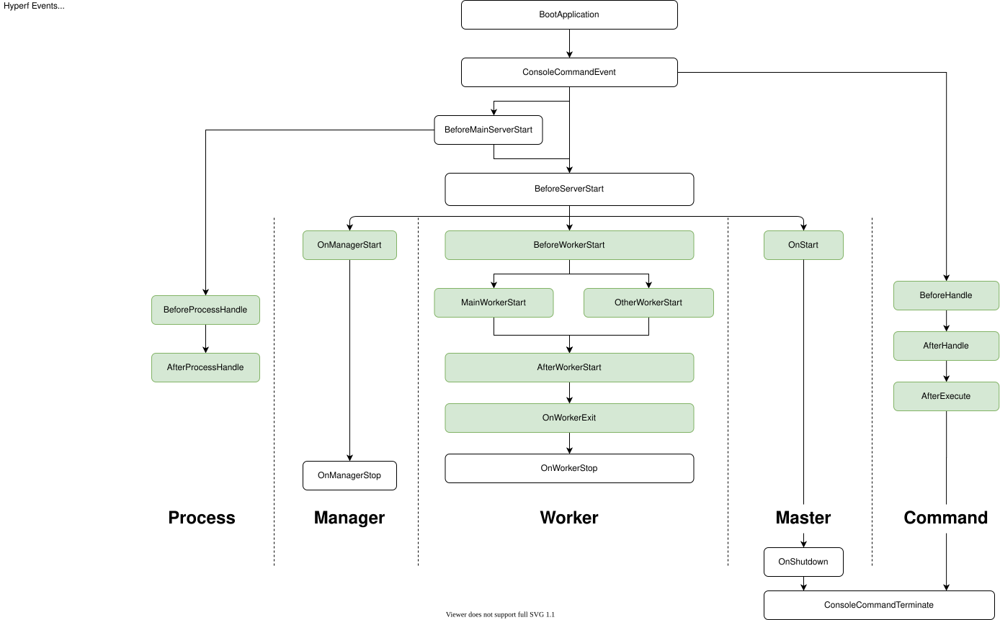

# Event

## Prefácio

O modo de Event precisa ser implementado com base na [PSR-14](https://github.com/php-fig/fig-standards/blob/master/accepted/PSR-14-event-dispatcher.md).
O gerenciador de Event do Hyperf é implementado por padrão pelo [hyperf/event](https://github.com/hyperf/event). Este componente também pode ser usado em outros frameworks ou aplicações, bastando incluí-lo via Composer.

```bash
composer require hyperf/event
```

## Conceito

O padrão de Event é um mecanismo bem testado e confiável. É um mecanismo muito adequado para desacoplamento. Existem três papéis:

- `Event` é o objeto de comunicação passado entre o código da aplicação e o `Listener`.
- `Listener` é um listener que escuta a ocorrência de um `Event`
- `Event Dispatcher` é o objeto gerenciador usado para disparar o `Event` e gerenciar a relação entre `Listener` e `Event`.

Vamos explicar com um exemplo fácil de entender. Suponha que tenhamos um method `UserService::register()` para registrar uma conta. Após a conta ser registrada com sucesso, podemos disparar o event `UserRegistered` através do event dispatcher, que é escutado pelo listener. A ocorrência desse event, ao executar algumas operações, como enviar uma mensagem de sucesso de registro do usuário, pode ser que queiramos fazer mais coisas depois que o usuário se registrar com sucesso, como enviar um e-mail assim que o registro do usuário for concluído. Podemos então escutar o event `UserRegistered` adicionando outro listener, sem adicionar código que não esteja relacionado ao method `UserService::register()`.

## Uso do gerenciador de Event

### Definir um Event

Um Event é, na verdade, uma class normal para gerenciar dados de estado. Quando disparado, os dados da aplicação são passados para o Event. O Listener então opera sobre a class do Event. Um Event pode ser escutado por múltiplos Listeners.

```php
<?php
namespace App\Event;

class UserRegistered
{
    // It is recommended to define this as a public property so that the listener can use it directly, or you can provide Getter for that property.
    public $user;
    
    public function __construct($user)
    {
        $this->user = $user;    
    }
}
```

### Definir um Listener

O Listener precisa implementar o method definido pela interface `Hyperf\Event\Contract\ListenerInterface`. O exemplo é o seguinte.

```php
<?php
namespace App\Listener;

use App\Event\UserRegistered;
use Hyperf\Event\Contract\ListenerInterface;

class UserRegisteredListener implements ListenerInterface
{
    public function listen(): array
    {
        // Returns an array of events to be listened to by this listener, can listen to multiple events at the same time
        return [
            UserRegistered::class,
        ];
    }

    /**
     * @param UserRegistered $event
     */
    public function process(object $event): void
    {
        // The code to be executed by the listener after the event is triggered is written here, such as sending a user registration success message, etc. in this example.
        // Directly access the user property of $event to get the parameter value passed when the event fires.
        // $event->user;
    }
}
```

#### Registrando Listeners através de arquivos de configuração

Após definir o Listener, precisamos torná-lo detectável pelo `Dispatcher`, o que pode ser adicionado no arquivo de configuração `config/autoload/listeners.php` *(se não existir, ele pode ser criado)*. A ordem de disparo dos Listeners é baseada na ordem de configuração do arquivo de configuração:

```php
<?php
return [
    \App\Listener\UserRegisteredListener::class,
];
```

### Registrando Listeners com annotation

O Hyperf também fornece uma forma mais fácil de registrar Listeners, registrando-os com a annotation `#[Listener]`; basta que a annotation seja definida na class do Listener e a class do Listener será automaticamente registrada dentro do `domínio de scan de annotation do Hyperf`. Exemplos de código a seguir:

```php
<?php
namespace App\Listener;

use App\Event\UserRegistered;
use Hyperf\Event\Annotation\Listener;
use Hyperf\Event\Contract\ListenerInterface;

#[Listener]
class UserRegisteredListener implements ListenerInterface
{
    public function listen(): array
    {
        // Returns an array of events to be listened to by this listener, can listen to multiple events at the same time
        return [
            UserRegistered::class,
        ];
    }

    /**
     * @param UserRegistered $event
     */
    public function process(object $event): void
    {
        // The code to be executed by the listener after the event is triggered is written here, such as sending a user registration success message, etc. in this example.
        // Directly access the user property of $event to get the parameter value passed when the event fires.
        // $event->user;
    }
}
```

Ao registrar o Listener via annotations, podemos definir a ordem do Listener atual configurando a attribute `priority`, como em `#[Listener(priority: 1)]`; internamente é usada a estrutura `SplPriorityQueue` para armazenamento, e quanto maior o número de `priority`, maior a prioridade.

> Para usar a annotation `#[Listener]` é necessário `use Hyperf\Event\Annotation\Listener;`  

### Disparar Event

O Event precisa ser dispatched pelo `EventDispatcher` para permitir que o `Listener` o escute. Vamos usar um trecho de código para demonstrar como disparar o event:

```php
<?php
namespace App\Service;

use Hyperf\Di\Annotation\Inject;
use Psr\EventDispatcher\EventDispatcherInterface;
use App\Event\UserRegistered; 

class UserService
{
    #[Inject]
    private EventDispatcherInterface $eventDispatcher;
    
    public function register()
    {
        // We assume that there is a User entity
        $user = new User();
        $result = $user->save();
        // Complete the logic of account registration
        // This dispatch(object $event) will run the listener one by one
        $this->eventDispatcher->dispatch(new UserRegistered($user));
        return $result;
    }
}
```

## Eventos do Life Cycle do Hyperf



## Eventos do Life Cycle do Servidor de Estilo Coroutine do Hyperf


## Precauções

### Não injete `EventDispatcherInterface` no `Listener`

Porque `EventDispatcherInterface` depende de `ListenerProviderInterface`, e `ListenerProviderInterface` coletará todos os `Listener` quando for inicializada.

E se o `Listener` depender de `EventDispatcherInterface`, isso levará a uma dependência circular, o que causará memory overflow.

### É melhor injetar apenas `ContainerInterface` no `Listener`.

É melhor injetar apenas `ContainerInterface` no `Listener`, enquanto os outros componentes são obtidos através do `container` dentro do `process`. Quando o framework inicia, `EventDispatcherInterface` será instanciada. Nesse momento, não é um ambiente de coroutine. Se o `Listener` for injetado com uma class que possa acionar a troca de coroutine, isso fará o framework falhar ao iniciar.
