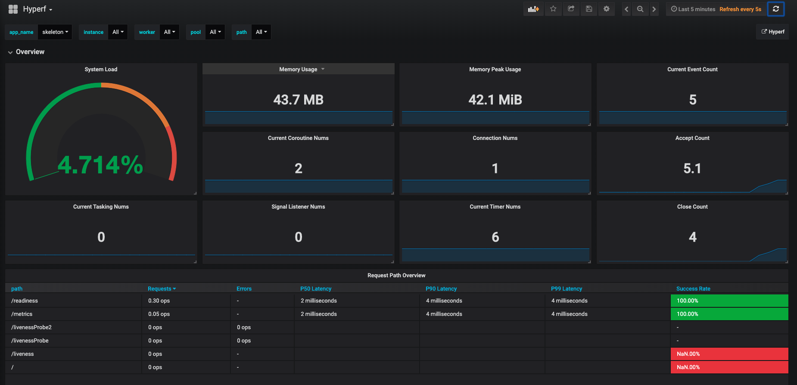

# Monitoramento de serviços

Um requisito central da governança de microsserviços é a observabilidade do serviço. Como “pastor” de microsserviços, não é fácil acompanhar o estado de saúde de vários serviços. Muitas soluções surgiram nesse campo na era cloud-native. Este componente abstrai telemetria e monitoramento — pilares importantes da observabilidade — para permitir que usuários integrem rapidamente com a infraestrutura existente, evitando vendor lock-in.

## Instalação

### Instalar componentes via Composer

```bash
composer require hyperf/metric
```

O componente [hyperf/metric](https://github.com/hyperf/metric) instala por padrão as dependências do [Prometheus](https://prometheus.io/). Se você quiser usar [StatsD](https://github.com/statsd/statsd) ou [InfluxDB](http://influxdb.com), também precisa executar os comandos a seguir para instalar as dependências correspondentes:

```bash
# Dependências necessárias do StatsD
composer require domnikl/statsd
# Dependências necessárias do InfluxDB
composer require influxdb/influxdb-php 
```

### Adicionar configuração do componente

Se o arquivo não existir, execute o comando abaixo para adicionar o arquivo de configuração `config/autoload/metric.php`:

```bash
php bin/hyperf.php vendor:publish hyperf/metric
```

## Uso

### Configuração

#### options

`default`: o valor correspondente a `default` no arquivo de configuração é o nome do driver utilizado. A configuração específica do driver é definida em `metric`, usando o mesmo driver como `key`.

```php
'default' => env('METRIC_DRIVER', 'prometheus'),
```

* `use_standalone_process`: se deve usar um `processo de monitoramento standalone`. Recomenda-se habilitar. A coleta e o reporte de métricas serão tratados no `Worker process` após o shutdown.

```php
'use_standalone_process' => env('TELEMETRY_USE_STANDALONE_PROCESS', true),
```

* `enable_default_metric`: se deve coletar métricas padrão. Métricas padrão incluem uso de memória, carga de CPU do sistema e métricas do Swoole Server e do Swoole Coroutine.

```php
'enable_default_metric' => env('TELEMETRY_ENABLE_DEFAULT_TELEMETRY', true),
```

`default_metric_interval`: intervalo padrão de push de métricas, em segundos (o mesmo para os itens abaixo).
```php
'default_metric_interval' => env('DEFAULT_METRIC_INTERVAL', 5),
```
#### Configurar Prometheus

Ao usar Prometheus, adicione a configuração específica do Prometheus no item `metric` do arquivo de configuração.

```php
use Hyperf\Metric\Adapter\Prometheus\Constants;

return [
    'default' => env('METRIC_DRIVER', 'prometheus'),
    'use_standalone_process' => env('TELEMETRY_USE_STANDALONE_PROCESS', true),
    'enable_default_metric' => env('TELEMETRY_ENABLE_DEFAULT_TELEMETRY', true),
    'default_metric_interval' => env('DEFAULT_METRIC_INTERVAL', 5),
    'metric' => [
        'prometheus' => [
            'driver' => Hyperf\Metric\Adapter\Prometheus\MetricFactory::class,
            'mode' => Constants::SCRAPE_MODE,
            'namespace' => env('APP_NAME', 'skeleton'),
            'scrape_host' => env('PROMETHEUS_SCRAPE_HOST', '0.0.0.0'),
            'scrape_port' => env('PROMETHEUS_SCRAPE_PORT', '9502'),
            'scrape_path' => env('PROMETHEUS_SCRAPE_PATH', '/metrics'),
            'push_host' => env('PROMETHEUS_PUSH_HOST', '0.0.0.0'),
            'push_port' => env('PROMETHEUS_PUSH_PORT', '9091'),
            'push_interval' => env('PROMETHEUS_PUSH_INTERVAL', 5),
        ],
    ],
];
```

O Prometheus tem dois modos de operação: modo de scrape e modo de push (via Prometheus Pushgateway), ambos suportados por este componente.

Ao usar o modo de scrape (recomendação oficial do Prometheus), você precisa definir:

```php
'mode' => Constants::SCRAPE_MODE
```

E configure o endereço de scrape `scrape_host`, a porta de scrape `scrape_port` e o caminho de scrape `scrape_path`. O Prometheus conseguirá coletar todas as métricas via acesso HTTP conforme essa configuração.

> Nota: no modo de scrape, o processo standalone deve estar habilitado, isto é, `use_standalone_process = true`.

Ao usar o modo de push, você precisa definir:

```php
'mode' => Constants::PUSH_MODE
```

E configure o endereço de push `push_host`, a porta de push `push_port` e o intervalo de push `push_interval`. O modo push é recomendado apenas para tarefas offline.

Devido às diferenças nas configurações básicas, os modos acima podem não atender à necessidade. Este componente também suporta o modo customizado. No modo customizado, o componente é responsável apenas pela coleta de métricas, e o reporte específico precisa ser tratado pelo usuário.

```php
'mode' => Constants::CUSTOM_MODE
```
Por exemplo, você pode querer reportar métricas por rotas customizadas, ou armazenar métricas no Redis, e deixar outros serviços independentes responsáveis por reportar métricas de forma centralizada etc. A seção [custom escalation](#custom escalation) contém exemplos correspondentes.

#### Configurar StatsD

Ao usar StatsD, adicione a configuração específica do StatsD no item `metric` do arquivo de configuração.

```php
return [
    'default' => env('METRIC_DRIVER', 'statd'),
    'use_standalone_process' => env('TELEMETRY_USE_STANDALONE_PROCESS', true),
    'enable_default_metric' => env('TELEMETRY_ENABLE_DEFAULT_TELEMETRY', true),
    'metric' => [
        'statsd' => [
            'driver' => Hyperf\Metric\Adapter\StatsD\MetricFactory::class,
            'namespace' => env('APP_NAME', 'skeleton'),
            'udp_host' => env('STATSD_UDP_HOST', '127.0.0.1'),
            'udp_port' => env('STATSD_UDP_PORT', '8125'),
            'enable_batch' => env('STATSD_ENABLE_BATCH', true),
            'push_interval' => env('STATSD_PUSH_INTERVAL', 5),
            'sample_rate' => env('STATSD_SAMPLE_RATE', 1.0),
        ],
    ],
];
```

Atualmente o StatsD suporta apenas modo UDP. Você precisa configurar o endereço UDP `udp_host`, a porta UDP `udp_port`, se deve fazer batch push `enable_batch` (reduz o número de requisições), o intervalo do batch push `push_interval` e a taxa de amostragem `sample_rate`.

#### Configurar InfluxDB

Ao usar InfluxDB, adicione a configuração específica do InfluxDB no item `metric` do arquivo de configuração.

```php
return [
    'default' => env('METRIC_DRIVER', 'influxdb'),
    'use_standalone_process' => env('TELEMETRY_USE_STANDALONE_PROCESS', true),
    'enable_default_metric' => env('TELEMETRY_ENABLE_DEFAULT_TELEMETRY', true),
    'metric' => [
        'influxdb' => [
            'driver' => Hyperf\Metric\Adapter\InfluxDB\MetricFactory::class,
            'namespace' => env('APP_NAME', 'skeleton'),
            'host' => env('INFLUXDB_HOST', '127.0.0.1'),
            'port' => env('INFLUXDB_PORT', '8086'),
            'username' => env('INFLUXDB_USERNAME', ''),
            'password' => env('INFLUXDB_PASSWORD', ''),
            'dbname' => env('INFLUXDB_DBNAME', true),
            'push_interval' => env('INFLUXDB_PUSH_INTERVAL', 5),
        ],
    ],
];
```

O InfluxDB usa o modo HTTP por padrão. Você precisa configurar o endereço `host`, a porta `port`, o usuário `username`, a senha `password`, a base `dbname` e o intervalo de batch push `push_interval`.

### Abstrações básicas

O componente de telemetria abstrai três tipos de dados comumente usados para garantir desacoplamento de implementações concretas.

Os três tipos são:

Counter (Contador): uma métrica usada para descrever incrementos em um sentido. Por exemplo, contagem de requisições HTTP.

```php
interface CounterInterface
{
    public function with(string ...$labelValues): self;

    public function add(int $delta);
}
```

Gauge: uma métrica usada para descrever aumento ou diminuição ao longo do tempo. Por exemplo, número de conexões disponíveis no pool de conexões.

```php
interface GaugeInterface
{
    public function with(string ...$labelValues): self;

    public function set(float $value);

    public function add(float $delta);
}
```

* Histogram: usado para descrever a distribuição estatística produzida pela observação contínua de um evento, geralmente expresso como percentis ou buckets. Por exemplo, latência de requisições HTTP.

```php
interface HistogramInterface
{
    public function with(string ...$labelValues): self;

    public function put(float $sample);
}
```

### Configurar middleware

Depois de configurar o driver, basta configurar o middleware para habilitar as estatísticas de Histogram por requisição.
Abra o arquivo `config/autoload/middlewares.php`. O exemplo a seguir habilita o middleware no servidor `http`.

```php
<?php

declare(strict_types=1);

return [
    'http' => [
        \Hyperf\Metric\Middleware\MetricMiddleware::class,
    ],
];
```
> As dimensões estatísticas nesse middleware incluem `request_status`, `request_path`, `request_method`. Se o seu `request_path` tiver cardinalidade muito alta, recomenda-se reescrever este middleware para remover a dimensão `request_path`, caso contrário a alta cardinalidade pode causar estouro de memória.

### Uso customizado

A telemetria via middleware HTTP é apenas a ponta do iceberg do que este componente pode fazer. Você pode injetar a classe `Hyperf\Metric\Contract\MetricFactoryInterface` para coletar métricas do próprio negócio. Por exemplo: número de pedidos criados, número de cliques em anúncios etc.

```php
<?php

declare(strict_types=1);

namespace App\Controller;

use App\Model\Order;
use Hyperf\Di\Annotation\Inject;
use Hyperf\Metric\Contract\MetricFactoryInterface;

class IndexController extends AbstractController
{
    #[Inject]
    private MetricFactoryInterface $metricFactory;

    public function create(Order $order)
    {
        $counter = $this->metricFactory->makeCounter('order_created', ['order_type']);
        $counter->with($order->type)->add(1);
        // lógica do pedido...
    }
}
```

`MetricFactoryInterface` contém os seguintes métodos de factory para gerar os três tipos básicos de métricas.

```php
public function makeCounter($name, $labelNames): CounterInterface;

public function makeGauge($name, $labelNames): GaugeInterface;

public function makeHistogram($name, $labelNames): HistogramInterface;
```

O exemplo acima gera métricas dentro do escopo da requisição. Às vezes, as métricas que precisamos coletar dizem respeito ao ciclo de vida completo, como o tamanho de filas assíncronas ou a quantidade de itens em estoque. Nesse cenário, você pode escutar o evento `MetricFactoryReady`.

```php
<?php

declare(strict_types=1);

namespace App\Listener;

use Hyperf\Event\Contract\ListenerInterface;
use Hyperf\Metric\Event\MetricFactoryReady;
use Psr\Container\ContainerInterface;
use Redis;

class OnMetricFactoryReady implements ListenerInterface
{
    protected ContainerInterface $container;

    public function __construct(ContainerInterface $container)
    {
        $this->container = $container;
    }

    public function listen(): array
    {
        return [
            MetricFactoryReady::class,
        ];
    }

    public function process(object $event)
    {
        $redis = $this->container->get(Redis::class);
        $gauge = $event
                    ->factory
                    ->makeGauge('queue_length', ['driver'])
                    ->with('redis');
        while (true) {
            $length = $redis->llen('queue');
            $gauge->set($length);
            sleep(1);
        }
    }
}
```

> Em termos de engenharia, não é adequado consultar o tamanho da fila diretamente no Redis. O tamanho da fila deve ser obtido por meio do método `info()` da interface `DriverInterface` do driver de fila. Aqui é apenas uma demonstração simples. Você pode encontrar um exemplo completo na pasta `src/Listener` do código-fonte do componente.

### Notas

Você pode usar `#[Counter(name="stat_name_here")]` e `#[Histogram(name="stat_name_here")]` para contar invocações e tempo de execução de aspects.

Para o uso de anotações, consulte o [capítulo de Anotações](pt-br/annotation).

### Bucket customizado de Histogram

> Esta seção se aplica apenas aos drivers do Prometheus

Quando você usa Histogram do Prometheus, às vezes há necessidade de um Bucket customizado. Antes de iniciar o serviço, você pode injetar a dependência no Registry e registrar o Histogram manualmente, definindo o Bucket necessário. Quando você usar depois, `MetricFactory` reutilizará o Histogram do mesmo nome. Exemplo:

```php
<?php

namespace App\Listener;

use Hyperf\Config\Annotation\Value;
use Hyperf\Event\Contract\ListenerInterface;
use Hyperf\Framework\Event\BeforeMainServerStart;
use Prometheus\CollectorRegistry;

class OnMainServerStart implements ListenerInterface
{
    protected $registry;

    public function __construct(CollectorRegistry $registry)
    {
        $this->registry = $registry;
    }

    public function listen(): array
    {
        return [
            BeforeMainServerStart::class,
        ];
    }

    public function process(object $event)
    {
        $this->registry->registerHistogram(
            config("metric.metric.prometheus.namespace"), 
            'test',
            'help_message', 
            ['labelName'], 
            [0.1, 1, 2, 3.5]
        );
    }
}
```
Depois disso, quando você usar `$metricFactory->makeHistogram('test')`, o Histogram retornado será o seu Histogram pré-registrado.

### Report customizado

> Esta seção se aplica apenas aos drivers do Prometheus

Após definir o modo de trabalho do driver de Prometheus para o modo customizado (`Constants::CUSTOM_MODE`), você pode tratar livremente o reporte de métricas. Nesta seção, mostramos como armazenar métricas no Redis e então adicionar uma rota HTTP no Worker que retorna as métricas renderizadas no formato do Prometheus.

#### Armazenar métricas com Redis

O meio de armazenamento das métricas é definido pela interface `Prometheus\Storage\Adapter`. Por padrão, é usado armazenamento em memória. Podemos trocar para armazenamento em Redis em `config/autoload/dependencies.php`.

```php
<?php

return [
    Prometheus\Storage\Adapter::class => Hyperf\Metric\Adapter\Prometheus\RedisStorageFactory::class,
];
```

#### Adicionar rota `/metrics` no Worker

Adicione rotas do Prometheus em `config/routes.php`.

> Nota: se você quiser obter métricas a partir dos Workers, você precisa tratar o compartilhamento de estado entre Workers por conta própria. Uma forma é armazenar o estado no Redis, como descrito acima.

```php
<?php

use Hyperf\HttpServer\Router\Router;

Router::get('/metrics', function(){
    $registry = Hyperf\Context\ApplicationContext::getContainer()->get(Prometheus\CollectorRegistry::class);
    $renderer = new Prometheus\RenderTextFormat();
    return $renderer->render($registry->getMetricFamilySamples());
});
```

## Importar dashboard no Grafana

> Esta seção se aplica apenas aos drivers do Prometheus

Se você tiver as métricas padrão habilitadas, o `Hyperf/Metric` já fornece um dashboard do Grafana pronto para uso. Baixe o [arquivo json](https://cdn.jsdelivr.net/gh/hyperf/hyperf/src/metric/grafana.json), importe no Grafana e use.



## Observações

- Para usar este componente para coletar métricas em um comando customizado `hyperf/command`, você precisa adicionar o parâmetro de linha de comando `--enable-event-dispatcher` ao iniciar o comando.

