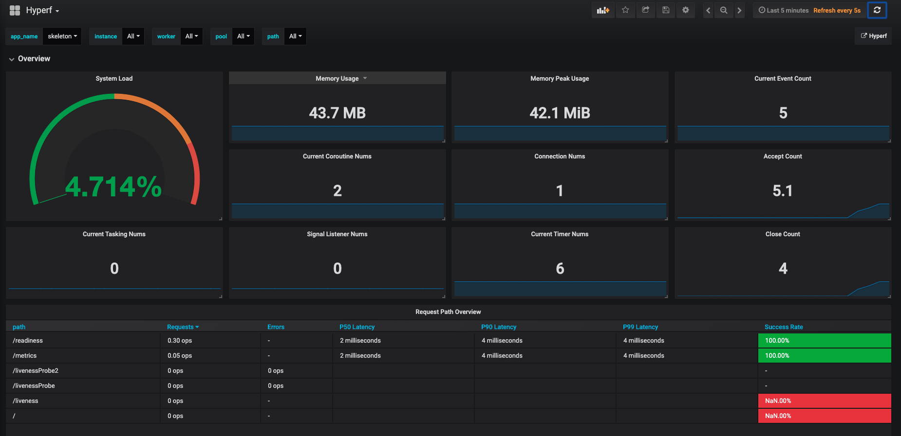

# Monitoramento de serviço

Um requisito central da governança de microsserviços é a observabilidade do serviço. Como pastor de microsserviços, não é fácil manter o controle sobre o status de saúde de vários serviços. Muitas soluções surgiram nesse campo na era cloud-native. Este componente abstrai telemetria e monitoramento, os importantes pilares da observabilidade, para permitir que os usuários se integrem rapidamente à infraestrutura existente, evitando ao mesmo tempo o vendor lock-in.

## Instalação

### Instalar componentes via Composer

```bash
composer require hyperf/metric
```

O componente [hyperf/metric](https://github.com/hyperf/metric) já instala as dependências do [Prometheus](https://prometheus.io/) por padrão. Se você quiser usar o [StatsD](https://github.com/statsd/statsd) ou o [InfluxDB](http://influxdb.com), você também precisa executar os seguintes comandos para instalar as dependências correspondentes:

```bash
# StatsD required dependencies
composer require domnikl/statsd
# InfluxDB required dependencies
composer require influxdb/influxdb-php 
```

### Adicionar configuração do componente

Se o arquivo não existir, execute o seguinte comando para adicionar o arquivo de configuração `config/autoload/metric.php`:

```bash
php bin/hyperf.php vendor:publish hyperf/metric
```

## Uso

### Configuração

#### Opções

`default`: O valor correspondente a `default` no arquivo de configuração é o nome do driver usado. A configuração específica do driver é definida em `metric`, usando o mesmo driver como `key`.

```php
'default' => env('METRIC_DRIVER', 'prometheus'),
```

* `use_standalone_process`: Se deve usar um `processo de monitoramento independente` (standalone). Recomenda-se habilitar. A coleta e o reporte de métricas serão tratados no `Worker` após o encerramento.

```php
'use_standalone_process' => env('TELEMETRY_USE_STANDALONE_PROCESS', true),
```

* `enable_default_metric`: Se deve contabilizar as métricas padrão. As métricas padrão incluem uso de memória, carga de CPU do sistema, e métricas do Swoole Server e da Swoole Coroutine.

```php
'enable_default_metric' => env('TELEMETRY_ENABLE_DEFAULT_TELEMETRY', true),
```

`default_metric_interval`: O intervalo de push da métrica padrão, em segundos, o mesmo abaixo.
```php
'default_metric_interval' => env('DEFAULT_METRIC_INTERVAL', 5),
```
#### Configurando o Prometheus

Ao usar o Prometheus, adicione a configuração específica do Prometheus ao item `metric` no arquivo de configuração.

```php
use Hyperf\Metric\Adapter\Prometheus\Constants;

return [
    'default' => env('METRIC_DRIVER', 'prometheus'),
    'use_standalone_process' => env('TELEMETRY_USE_STANDALONE_PROCESS', true),
    'enable_default_metric' => env('TELEMETRY_ENABLE_DEFAULT_TELEMETRY', true),
    'default_metric_interval' => env('DEFAULT_METRIC_INTERVAL', 5),
    'metric' => [
        'prometheus' => [
            'driver' => Hyperf\Metric\Adapter\Prometheus\MetricFactory::class,
            'mode' => Constants::SCRAPE_MODE,
            'namespace' => env('APP_NAME', 'skeleton'),
            'scrape_host' => env('PROMETHEUS_SCRAPE_HOST', '0.0.0.0'),
            'scrape_port' => env('PROMETHEUS_SCRAPE_PORT', '9502'),
            'scrape_path' => env('PROMETHEUS_SCRAPE_PATH', '/metrics'),
            'push_host' => env('PROMETHEUS_PUSH_HOST', '0.0.0.0'),
            'push_port' => env('PROMETHEUS_PUSH_PORT', '9091'),
            'push_interval' => env('PROMETHEUS_PUSH_INTERVAL', 5),
        ],
    ],
];
```

O Prometheus possui dois modos de funcionamento, modo de coleta (scrape) e modo de push (via Prometheus Pushgateway), ambos suportados por este componente.

Ao usar o modo de coleta (recomendação oficial do Prometheus), você precisa definir:

```php
'mode' => Constants::SCRAPE_MODE
```

E configurar o endereço de coleta `scrape_host`, a porta de coleta `scrape_port` e o caminho de coleta `scrape_path`. O Prometheus pode obter todas as métricas por meio de acesso HTTP sob a configuração correspondente.

> Nota: No modo de coleta, o processo standalone deve estar habilitado, ou seja, `use_standalone_process = true`.

Ao usar o modo push, você precisa definir:

```php
'mode' => Constants::PUSH_MODE
```

E configurar o endereço de push `push_host`, a porta de push `push_port` e o intervalo de push `push_interval`. O modo push é recomendado apenas para tarefas offline.

Devido às diferenças nas configurações básicas, os modos acima podem não atender às necessidades. Este componente também suporta um modo personalizado. No modo personalizado, o componente é responsável apenas pela coleta dos indicadores; o reporte específico precisa ser tratado pelo usuário.

```php
'mode' => Constants::CUSTOM_MODE
```
Por exemplo, você pode querer reportar métricas através de rotas personalizadas, ou armazenar métricas no Redis, com outros serviços independentes responsáveis pelo reporte centralizado de métricas etc. A seção [reporte personalizado](#reporte-personalizado) contém exemplos correspondentes.

#### Configurando o StatsD

Ao usar o StatsD, adicione a configuração específica do StatsD ao item `metric` no arquivo de configuração.

```php
return [
    'default' => env('METRIC_DRIVER', 'statd'),
    'use_standalone_process' => env('TELEMETRY_USE_STANDALONE_PROCESS', true),
    'enable_default_metric' => env('TELEMETRY_ENABLE_DEFAULT_TELEMETRY', true),
    'metric' => [
        'statsd' => [
            'driver' => Hyperf\Metric\Adapter\StatsD\MetricFactory::class,
            'namespace' => env('APP_NAME', 'skeleton'),
            'udp_host' => env('STATSD_UDP_HOST', '127.0.0.1'),
            'udp_port' => env('STATSD_UDP_PORT', '8125'),
            'enable_batch' => env('STATSD_ENABLE_BATCH', true),
            'push_interval' => env('STATSD_PUSH_INTERVAL', 5),
            'sample_rate' => env('STATSD_SAMPLE_RATE', 1.0),
        ],
    ],
];
```

O StatsD atualmente só suporta o modo UDP; você precisa configurar o endereço UDP `udp_host`, a porta UDP `udp_port`, se deve fazer push em lote `enable_batch` (reduz o número de requisições), o intervalo de push em lote `push_interval` e a taxa de amostragem `sample_rate`.

#### Configurando o InfluxDB

Ao usar o InfluxDB, adicione a configuração específica do InfluxDB ao item `metric` no arquivo de configuração.

```php
return [
    'default' => env('METRIC_DRIVER', 'influxdb'),
    'use_standalone_process' => env('TELEMETRY_USE_STANDALONE_PROCESS', true),
    'enable_default_metric' => env('TELEMETRY_ENABLE_DEFAULT_TELEMETRY', true),
    'metric' => [
        'influxdb' => [
            'driver' => Hyperf\Metric\Adapter\InfluxDB\MetricFactory::class,
            'namespace' => env('APP_NAME', 'skeleton'),
            'host' => env('INFLUXDB_HOST', '127.0.0.1'),
            'port' => env('INFLUXDB_PORT', '8086'),
            'username' => env('INFLUXDB_USERNAME', ''),
            'password' => env('INFLUXDB_PASSWORD', ''),
            'dbname' => env('INFLUXDB_DBNAME', true),
            'push_interval' => env('INFLUXDB_PUSH_INTERVAL', 5),
        ],
    ],
];
```

O InfluxDB usa o modo HTTP padrão; você precisa configurar o endereço `host`, a porta UDP `port`, o nome de usuário `username`, a senha `password`, a tabela de dados `dbname` e o intervalo de push em lote `push_interval`.

### Abstração básica

O componente de telemetria abstrai três tipos de dados comumente usados para garantir o desacoplamento das implementações concretas.

Os três tipos são:

Counter: Um indicador usado para descrever incrementos unidirecionais. Como a contagem de requisições HTTP.

```php
interface CounterInterface
{
    public function with(string ...$labelValues): self;

    public function add(int $delta);
}
```

Gauge: Um indicador usado para descrever um aumento ou diminuição ao longo do tempo. Como o número de conexões disponíveis no pool de conexões.

```php
interface GaugeInterface
{
    public function with(string ...$labelValues): self;

    public function set(float $value);

    public function add(float $delta);
}
```

* Histogram: usado para descrever a distribuição estatística produzida pela observação contínua de um evento, geralmente expressa em percentis ou buckets. Como a latência de requisições HTTP.

```php
interface HistogramInterface
{
    public function with(string ...$labelValues): self;

    public function put(float $sample);
}
```

### Configurar middleware

Após configurar o driver, você só precisa configurar o middleware para habilitar a função de estatísticas de Histogram das requisições.
Abra o arquivo `config/autoload/middlewares.php`; o exemplo é para habilitar o middleware no Server `http`.

```php
<?php

declare(strict_types=1);

return [
    'http' => [
        \Hyperf\Metric\Middleware\MetricMiddleware::class,
    ],
];
```
> A dimensão de estatísticas neste middleware inclui `request_status`, `request_path`, `request_method`. Se o seu `request_path` for muito grande, é recomendado reescrever esse middleware para remover a dimensão `request_path`, caso contrário a alta cardinalidade causará estouro de memória.

### Uso personalizado

A telemetria via middleware HTTP é apenas a ponta do iceberg do que este componente pode fazer. Você pode injetar a classe `Hyperf\Metric\Contract\MetricFactoryInterface` para telemetrar dados de negócio por conta própria. Por exemplo: o número de pedidos criados, o número de cliques em anúncios etc.

```php
<?php

declare(strict_types=1);

namespace App\Controller;

use App\Model\Order;
use Hyperf\Di\Annotation\Inject;
use Hyperf\Metric\Contract\MetricFactoryInterface;

class IndexController extends AbstractController
{
    #[Inject]
    private MetricFactoryInterface $metricFactory;

    public function create(Order $order)
    {
        $counter = $this->metricFactory->makeCounter('order_created', ['order_type']);
        $counter->with($order->type)->add(1);
        // order logic...
    }

}
```

`MetricFactoryInterface` contém os seguintes métodos de fábrica para gerar os três tipos básicos de estatística correspondentes.

```php
public function makeCounter($name, $labelNames): CounterInterface;

public function makeGauge($name, $labelNames): GaugeInterface;

public function makeHistogram($name, $labelNames): HistogramInterface;
```

O exemplo acima é a métrica gerada dentro do escopo da requisição estatística. Às vezes, os indicadores que precisamos contabilizar são para o ciclo de vida completo, como contar o tamanho de filas assíncronas ou a quantidade de itens em estoque. Nesse cenário, você pode escutar o evento `MetricFactoryReady`.

```php
<?php

declare(strict_types=1);

namespace App\Listener;

use Hyperf\Event\Contract\ListenerInterface;
use Hyperf\Metric\Event\MetricFactoryReady;
use Psr\Container\ContainerInterface;
use Redis;

class OnMetricFactoryReady implements ListenerInterface
{
    protected ContainerInterface $container;

    public function __construct(ContainerInterface $container)
    {
        $this->container = $container;
    }

    public function listen(): array
    {
        return [
            MetricFactoryReady::class,
        ];
    }

    public function process(object $event)
    {
        $redis = $this->container->get(Redis::class);
        $gauge = $event
                    ->factory
                    ->makeGauge('queue_length', ['driver'])
                    ->with('redis');
        while (true) {
            $length = $redis->llen('queue');
            $gauge->set($length);
            sleep(1);
        }
    }
}
```

> Do ponto de vista de engenharia, não é adequado consultar o tamanho da fila diretamente do Redis. O tamanho da fila deve ser obtido através do método `info()` sob a interface `DriverInterface` do driver de fila. Aqui é apenas uma demonstração simples. Você pode encontrar um exemplo completo na pasta `src/Listener` do código-fonte do componente.

### Observações

Você pode usar `#[Counter(name="stat_name_here")]` e `#[Histogram(name="stat_name_here")]` para contabilizar a invocação e o tempo de execução do aspecto.

Para o uso de annotations, consulte o [Capítulo de Annotation](pt-br/annotation).

### Bucket de Histogram personalizado

> Esta seção se aplica apenas aos drivers do Prometheus

Quando você está usando o Histogram do Prometheus, às vezes há a necessidade de um Bucket personalizado. Antes de iniciar o serviço, você pode injetar a dependência no Registry e registrar o Histogram por conta própria, definindo o Bucket necessário. Quando você o usar posteriormente, o `MetricFactory` vai chamar o Histogram de mesmo nome que você registrou. Um exemplo é o seguinte:

```php
<?php

namespace App\Listener;

use Hyperf\Config\Annotation\Value;
use Hyperf\Event\Contract\ListenerInterface;
use Hyperf\Framework\Event\BeforeMainServerStart;
use Prometheus\CollectorRegistry;

class OnMainServerStart implements ListenerInterface
{
    protected $registry;

    public function __construct(CollectorRegistry $registry)
    {
        $this->registry = $registry;
    }

    public function listen(): array
    {
        return [
            BeforeMainServerStart::class,
        ];
    }

    public function process(object $event)
    {
        $this->registry->registerHistogram(
            config("metric.metric.prometheus.namespace"), 
            'test',
            'help_message', 
            ['labelName'], 
            [0.1, 1, 2, 3.5]
        );
    }
}
```
Depois disso, quando você usar `$metricFactory->makeHistogram('test')`, o Histogram retornado será o seu Histogram pré-registrado.

### Reporte personalizado

> Esta seção se aplica apenas aos drivers do Prometheus

Depois de definir o modo de funcionamento do driver Prometheus do componente para o modo personalizado (`Constants::CUSTOM_MODE`), você pode tratar livremente o reporte de indicadores. Nesta seção, mostramos como armazenar métricas no Redis, e então adicionar uma nova rota HTTP ao Worker que retorna métricas renderizadas pelo Prometheus.

#### Armazenando métricas com Redis

O meio de armazenamento das métricas é definido pela interface `Prometheus\Storage\Adapter`. O armazenamento em memória é usado por padrão. Podemos mudar para armazenamento em Redis em `config/autoload/dependencies.php`.

```php
<?php

return [
    Prometheus\Storage\Adapter::class => Hyperf\Metric\Adapter\Prometheus\RedisStorageFactory::class,
];
```

#### Adicionar rota /metrics ao Worker

Adicione as rotas do Prometheus em config/routes.php.

> Note que, se você quiser obter métricas sob os Workers, você precisa tratar o compartilhamento de estado entre os Workers por conta própria. Uma forma é armazenar o estado no Redis, conforme descrito acima.

```php
<?php

use Hyperf\HttpServer\Router\Router;

Router::get('/metrics', function(){
    $registry = Hyperf\Context\ApplicationContext::getContainer()->get(Prometheus\CollectorRegistry::class);
    $renderer = new Prometheus\RenderTextFormat();
    return $renderer->render($registry->getMetricFamilySamples());
});
```

## Criar console no Grafana

> Esta seção se aplica apenas aos drivers do Prometheus

Se você tiver as métricas padrão habilitadas, o `Hyperf/Metric` prepara um console do Grafana pronto para uso. Baixe o arquivo [json](https://cdn.jsdelivr.net/gh/hyperf/hyperf/src/metric/grafana.json) do console, importe-o no Grafana e utilize-o.



## Precauções

- Para usar este componente para coletar métricas em um comando personalizado do `hyperf/command`, você precisa adicionar o parâmetro de linha de comando: `--enable-event-dispatcher` ao iniciar o comando.
