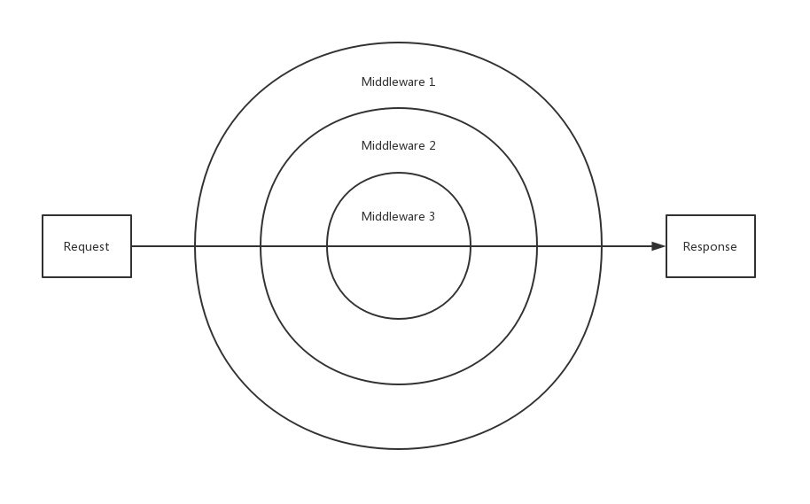

# Middleware

O middleware aqui se refere ao `middleware mode`, que é uma funcionalidade principal do componente [hyperf/http-server](https://github.com/hyperf/http-server). Ele é usado principalmente para encadear todo o fluxo de `Request` até `Response`. Implementado com base no [PSR-15](https://www.php-fig.org/psr/psr-15/).

## Princípio

*O middleware é usado principalmente para encadear todo o fluxo de `Request` até `Response`.* Ao organizar múltiplos middlewares, o fluxo de dados é executado na ordem definida. A essência do middleware é um `modelo de cebola` (Onion model). Vamos ilustrar com um diagrama:



No diagrama, a ordem é `Middleware 1 -> Middleware 2 -> Middleware 3`. Podemos notar que quando a linha horizontal do meio passa pelo `kernel` (isto é, `Middleware 3`), ela retorna para `Middleware 2`. Isso é um modelo aninhado; portanto, a ordem real é:
`Request -> Middleware 1 -> Middleware 2 -> Middleware 3 -> Middleware 2 -> Middleware 1 -> Response`
O foco está no `kernel`, isto é, `Middleware 3`, que é o ponto de divisão da cebola. A parte antes do ponto de demarcação é processada com base no `Request`; ao passar o ponto de demarcação, o `kernel` gera o objeto `Response` (que também é o principal alvo de código do `kernel`). Depois disso, o objeto `Response` é processado pelo restante dos middlewares. O `kernel` normalmente é implementado pelo framework; o restante fica por sua conta.

## Definir middleware global

O middleware global só pode ser configurado pelo arquivo de configuração. O arquivo fica em `config/autoload/middlewares.php` e a configuração é a seguinte:

```php
<?php
return [
    // `http` corresponde ao valor do atributo name de cada servidor em config/autoload/server.php. Esta configuração só se aplica ao servidor que você configurou.
    'http' => [
        // Configure seus middlewares globais em um array, em ordem de execução conforme a ordem do array
        YourMiddleware::class
    ],
];
```

Basta configurar seu middleware global no arquivo e o respectivo `Server Name`: isso significa que todas as requisições daquele `Server` aplicarão o middleware global configurado.

## Definir middleware local

Quando alguns dos nossos middlewares se aplicam apenas a determinadas requisições ou controllers, podemos defini-los como middlewares locais. Eles podem ser definidos via arquivo de configuração ou via anotação.

### Definido por arquivo de configuração

Ao definir uma rota usando um arquivo de configuração, recomenda-se definir o middleware correspondente também via arquivo de configuração. A configuração do middleware local será feita na configuração de rotas.
O último parâmetro `$options` de cada método que define rotas na classe `Hyperf\HttpServer\Router\Router` recebe um array; você pode passar a chave `middleware` com um valor de array para definir o middleware da rota. Demonstramos isso com algumas definições de rotas:

```php
<?php
use App\Middleware\FooMiddleware;
use Hyperf\HttpServer\Router\Router;

// Cada método de definição de rota pode aceitar um parâmetro $options
Router::get('/', [\App\Controller\IndexController::class, 'index'], ['middleware' => [ForMiddleware::class]]);
Router::post('/', [\App\Controller\IndexController::class, 'index'], ['middleware' => [ForMiddleware::class]]);
Router::put('/', [\App\Controller\IndexController::class, 'index'], ['middleware' => [ForMiddleware::class]]);
Router::patch('/', [\App\Controller\IndexController::class, 'index'], ['middleware' => [ForMiddleware::class]]);
Router::delete('/', [\App\Controller\IndexController::class, 'index'], ['middleware' => [ForMiddleware::class]]);
Router::head('/', [\App\Controller\IndexController::class, 'index'], ['middleware' => [ForMiddleware::class]]);
Router::addRoute(['GET', 'POST', 'HEAD'], '/index', [\App\Controller\IndexController::class, 'index'], ['middleware' => [ForMiddleware::class]]);

// Todas as rotas dentro do grupo aplicarão o middleware configurado
Router::addGroup(
    '/v2', function () {
        Router::get('/index', [\App\Controller\IndexController::class, 'index']);
    },
    ['middleware' => [ForMiddleware::class]]
);

```

### Definido por anotação

Ao definir rotas via anotações, recomendamos definir middleware por meio de anotações. Há duas anotações para definir middleware:

- `#[Middleware]` é usada ao definir um único middleware. Apenas uma anotação pode ser definida em um lugar e ela não pode ser repetida.
- `#[Middlewares]` é usada ao definir múltiplos middlewares. Apenas uma anotação pode ser definida em um lugar, e então é possível definir múltiplos middlewares declarando múltiplas anotações `#[Middleware]` dentro dela.

> Para usar `#[Middleware]`, faça `use Hyperf\HttpServer\Annotation\Middleware;`.
> Para usar `#[Middlewares]`, faça `use Hyperf\HttpServer\Annotation\Middlewares;`.

***Aviso: deve ser usado com `#[AutoController]` ou `#[Controller]`.***

Defina um único middleware:

```php
<?php

use App\Middleware\FooMiddleware;
use Hyperf\HttpServer\Annotation\AutoController;
use Hyperf\HttpServer\Annotation\Middleware;

 #[AutoController]
 #[Middleware(FooMiddleware::class)]
class IndexController
{
    public function index()
    {
        return 'Hello Hyperf.';
    }
}
```

Defina múltiplos middlewares:

```php
<?php

use App\Middleware\BarMiddleware;
use App\Middleware\FooMiddleware;
use Hyperf\HttpServer\Annotation\AutoController;
use Hyperf\HttpServer\Annotation\Middleware;
use Hyperf\HttpServer\Annotation\Middlewares;

#[AutoController]
#[Middlewares([FooMiddleware::class, BarMiddleware::class])]
class IndexController
{
    public function index()
    {
        return 'Hello Hyperf.';
    }
}
```

#### Definir middleware no nível do método

É bem simples definir middleware no nível do método ao configurá-lo por arquivo de configuração. E como fazer ao definir por anotações? Basta declarar a anotação diretamente no método.
O middleware no nível do método tem precedência sobre o middleware no nível da classe. Veja o código:

```php
<?php

use App\Middleware\BarMiddleware;
use App\Middleware\FooMiddleware;
use Hyperf\HttpServer\Annotation\AutoController;
use Hyperf\HttpServer\Annotation\Middleware;
use Hyperf\HttpServer\Annotation\Middlewares;

#[AutoController]
#[Middleware(FooMiddleware::class)]
class IndexController
{

    #[Middleware(BarMiddleware::class)]
    public function index()
    {
        return 'Hello Hyperf.';
    }
}
```

#### Relacionado

Gere um middleware via comando:

```
php ./bin/hyperf.php gen:middleware Auth/FooMiddleware
```

```php
<?php

declare(strict_types=1);

namespace App\Middleware\Auth;

use Hyperf\HttpServer\Contract\RequestInterface;
use Hyperf\HttpServer\Contract\ResponseInterface as HttpResponse;
use Psr\Container\ContainerInterface;
use Psr\Http\Message\ResponseInterface;
use Psr\Http\Message\ServerRequestInterface;
use Psr\Http\Server\MiddlewareInterface;
use Psr\Http\Server\RequestHandlerInterface;

class FooMiddleware implements MiddlewareInterface
{
    /**
     * @var ContainerInterface
     */
    protected $container;

    /**
     * @var RequestInterface
     */
    protected $request;

    /**
     * @var HttpResponse
     */
    protected $response;

    public function __construct(ContainerInterface $container, HttpResponse $response, RequestInterface $request)
    {
        $this->container = $container;
        $this->response = $response;
        $this->request = $request;
    }

    ```php
        public function process(ServerRequestInterface $request, RequestHandlerInterface $handler): ResponseInterface
        {
            // De acordo com a lógica de negócio específica, assumimos aqui que o token carregado pelo usuário é válido.
            $isValidToken = true;
            if ($isValidToken) {
                return $handler->handle($request);
            }

            return $this->response->json(
                [
                    'code' => -1,
                    'data' => [
                        'error' => 'O token é inválido, impedindo a execução posterior.',
                    ],
                ]
            );
        }
    ```

A ordem de execução do middleware é `FooMiddleware -> BarMiddleware`.

## A ordem de execução do Middleware

Podemos ver acima que há um total de 3 níveis de middleware: `global middleware`, `class level middleware`, `method level middleware`. Se esses middlewares forem definidos, a ordem de execução será: `Global Middleware -> Method Level Middleware -> Class Level Middleware`.

Na versão `>=3.0.34`, foi adicionada uma nova configuração de prioridade, que permite alterar a ordem de execução do middleware ao configurar middlewares de métodos e de rotas: quanto maior a prioridade, mais alta a precedência na execução.

```php
// middleware.php
return [
    'http' => [
        YourMiddleware::class,
        YourMiddlewareB::class => 3,
    ],
];
```

```php
Router::addGroup(
    '/v2', function () {
        Router::get('/index', [\App\Controller\IndexController::class, 'index']);
    },
    [
        'middleware' => [
            FooMiddleware::class,
            FooMiddlewareB::class => 3,
        ]
    ]
);
```

```php
#[AutoController]
#[Middleware(FooMiddleware::class)]
#[Middleware(FooMiddlewareB::class, 3)]
#[Middlewares([FooMiddlewareC::class => 1, BarMiddlewareD::class => 4])]
class IndexController
{

}
```

## Alterar objetos de request e response globalmente

Primeiro, existe um armazenamento do objeto PSR-7 mais primitivo — `request object` e `response object` — dentro do contexto da coroutine. O `immutable` exigido pelo PSR-7 significa que o `$response` que usamos ao chamar `$response = $response->with***()` não é uma reescrita do objeto original, mas sim um novo objeto via `Clone`. Isso quer dizer que o `request object` e o `response object` armazenados no contexto da coroutine não mudam; então, quando tivermos alguma lógica em um middleware que altere o `request object` ou o `response object` e quisermos que o código de acompanhamento *Non-transitive* obtenha o `request object` ou o `response object` alterado, podemos definir o novo objeto no contexto após a mudança, como no código a seguir:

```php
use Psr\Http\Message\ResponseInterface;
use Psr\Http\Message\ServerRequestInterface;

// $request e $response são os objetos modificados
$request = \Hyperf\Context\Context::set(ServerRequestInterface::class, $request);
$response = \Hyperf\Context\Context::set(ResponseInterface::class, $response);
```

## Personalizar o comportamento do CoreMiddleWare

Por padrão, quando o Hyperf lida com uma rota que não pode ser encontrada ou quando o método HTTP não é permitido — isto é, quando o status HTTP é `404` ou `405` — o `CoreMiddleware` trata isso diretamente e retorna o objeto response correspondente. Devido ao design da injeção de dependência do Hyperf, você pode apontar o `CoreMiddleware` para um `CoreMiddleware` implementado por você substituindo o objeto.

Por exemplo, queremos definir uma classe `App\Middleware\CoreMiddleware` para sobrescrever o comportamento padrão. Primeiro, podemos definir uma classe `App\Middleware\CoreMiddleware` como a seguir. Aqui usamos apenas HTTP Server como exemplo. Outros servidores também podem usar a mesma prática para atingir o mesmo objetivo.

```php
<?php
declare(strict_types=1);

namespace App\Middleware;

use Hyperf\Contract\Arrayable;
use Hyperf\HttpMessage\Stream\SwooleStream;
use Psr\Http\Message\ResponseInterface;
use Psr\Http\Message\ServerRequestInterface;

class CoreMiddleware extends \Hyperf\HttpServer\CoreMiddleware
{
    /**
     * Trata a resposta quando não encontra nenhuma rota.
     *
     * @return array|Arrayable|mixed|ResponseInterface|string
     */
    protected function handleNotFound(ServerRequestInterface $request)
    {
        // Reescreve a lógica de processamento para "rota não encontrada"
        return $this->response()->withStatus(404);
    }

    /**
     * Trata a resposta quando a rota é encontrada, mas não casa com nenhum método disponível.
     *
     * @return array|Arrayable|mixed|ResponseInterface|string
     */
    protected function handleMethodNotAllowed(array $methods, ServerRequestInterface $request)
    {
        // Reescreve a lógica de processamento para "método HTTP não permitido"
        return $this->response()->withStatus(405);
    }
}
```

Depois, defina o relacionamento de objetos em `config/autoload/dependencies.php` e reescreva o objeto CoreMiddleware:

```php
<?php
return [
    Hyperf\HttpServer\CoreMiddleware::class => App\Middleware\CoreMiddleware::class,
];
```

> O método de reescrever CoreMiddleware diretamente precisa funcionar na versão 1.1.0+. A versão 1.0.x ainda exige que você reescreva as chamadas de nível superior do CoreMiddleware via DI e então substitua o valor passado pelo CoreMiddleware pelo middleware que você definiu.

## Middlewares comumente usados

### Middleware de CORS

Se você precisar resolver cross-domain no framework, pode implementar o middleware a seguir conforme a sua necessidade.

```php
<?php

declare(strict_types=1);

namespace App\Middleware;

use Hyperf\Context\Context;
use Psr\Http\Message\ResponseInterface;
use Psr\Http\Message\ServerRequestInterface;
use Psr\Http\Server\MiddlewareInterface;
use Psr\Http\Server\RequestHandlerInterface;

class CorsMiddleware implements MiddlewareInterface
{
    public function process(ServerRequestInterface $request, RequestHandlerInterface $handler): ResponseInterface
    {
        $response = Context::get(ResponseInterface::class);
        $response = $response->withHeader('Access-Control-Allow-Origin', '*')
            ->withHeader('Access-Control-Allow-Credentials', 'true')
            // Os headers podem ser reescritos de acordo com a condição real.
            ->withHeader('Access-Control-Allow-Headers', 'DNT,Keep-Alive,User-Agent,Cache-Control,Content-Type,Authorization');

        Context::set(ResponseInterface::class, $response);

        if ($request->getMethod() == 'OPTIONS') {
            return $response;
        }

        return $handler->handle($request);
    }
}
```

Na prática, a configuração de cross-domain também pode ser colocada diretamente no `Nginx`.

```
location / {
    add_header Access-Control-Allow-Origin *;
    add_header Access-Control-Allow-Methods 'GET, POST, OPTIONS';
    add_header Access-Control-Allow-Headers 'DNT,Keep-Alive,User-Agent,Cache-Control,Content-Type,Authorization';

    if ($request_method = 'OPTIONS') {
        return 204;
    }
}
```

### Post-middleware

Normalmente, nós executamos por último:

```
return $handler->handle($request);
```

Portanto, é equivalente ao middleware de front-end. Se você quiser que a lógica do middleware seja pós (post-end), basta alterar a ordem de execução.

```php
<?php

declare(strict_types=1);

namespace App\Middleware;

use Hyperf\HttpServer\Contract\RequestInterface;
use Psr\Container\ContainerInterface;
use Psr\Http\Message\ResponseInterface;
use Psr\Http\Message\ServerRequestInterface;
use Psr\Http\Server\MiddlewareInterface;
use Psr\Http\Server\RequestHandlerInterface;

class OpenApiMiddleware implements MiddlewareInterface
{
    public function __construct(protected ContainerInterface $container)
    {
    }

    public function process(ServerRequestInterface $request, RequestHandlerInterface $handler): ResponseInterface
    {
        // TODO: pré-operação
        try{
            $result = $handler->handle($request);
        } finally {
            // TODO: pós-operação
        }
        return $result;
    }
}
```
