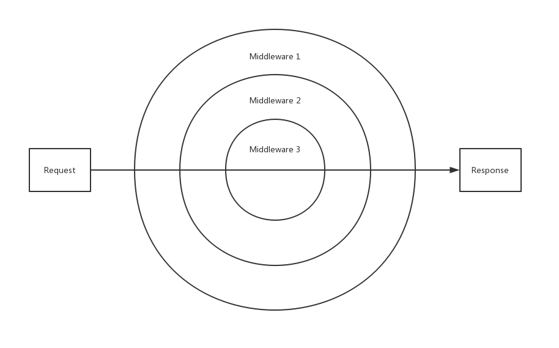

# Middleware

O Middleware aqui se refere ao `modo Middleware`, que é uma funcionalidade principal do componente [hyperf/http-server](https://github.com/hyperf/http-server). É usado principalmente para entrelaçar todo o processo de `Request` até `Response`. Baseado na implementação da [PSR-15](https://www.php-fig.org/psr/psr-15/).

## Princípio

*O Middleware é usado principalmente para entrelaçar todo o processo de `Request` até `Response`.* Através da organização de múltiplos Middlewares, o fluxo de dados é realizado na forma que ordenamos. A essência do Middleware é um `Onion model` (modelo de cebola). Vamos explicar através de um diagrama:



A ordem na figura é organizada na ordem `Middleware 1 -> Middleware 2 -> Middleware 3`. Podemos notar que quando a linha horizontal do meio passa pelo `kernel`, ou seja, o `Middleware 3`, ela retorna para o `Middleware 2`; esse é um modelo aninhado, então a ordem real é na verdade:
`Request -> Middleware 1 -> Middleware 2 -> Middleware 3 -> Middleware 2 -> Middleware 1 -> Response`
O foco está no `kernel`, ou seja, o `Middleware 3`, que é o ponto divisor da cebola. A parte antes do ponto de demarcação é, na verdade, processada com base na `Request`, e quando o ponto de demarcação é passado, o `kernel` gera o objeto `Response`; esse também é o principal objetivo do código do `kernel`. Depois disso, o objeto `Response` é tratado pelo restante dos Middlewares. O `kernel` geralmente é implementado pelo framework, e o restante depende de você.

## Definir Middleware global

O Middleware global só pode ser configurado através de arquivo de configuração. O arquivo de configuração está localizado em `config/autoload/middlewares.php` e a configuração é a seguinte:   
```php
<?php
return [
    // `http` corresponds to the value corresponding to the name attribute of each server in config/autoload/server.php. This configuration is only applied to the server you configured.
    'http' => [
        // Configure your global middleware in an array, in order according to the order of the array
        YourMiddleware::class
    ],
];
```
Basta configurar seu Middleware global no arquivo e o `Server Name` correspondente; isso significa que todas as requisições sob o `Server` aplicarão o Middleware global configurado.

## Definir Middleware local

Quando alguns dos nossos Middlewares se destinam apenas a determinadas requisições ou controllers, podemos defini-los como Middleware local, que pode ser definido por arquivo de configuração ou por annotation.

### Definido por arquivo de configuração

Ao definir uma rota usando um arquivo de configuração, é recomendável definir o Middleware correspondente através do arquivo de configuração. A configuração do Middleware local será concluída na configuração de routing.   
O último parâmetro `$options` de cada method que define a rota na class `Hyperf\HttpServer\Router\Router` receberá um array, que pode ser definido passando a chave `middleware` e um valor de array para definir o Middleware da rota. Vamos demonstrar isso através de algumas definições de rota:

```php
<?php
use App\Middleware\FooMiddleware;
use Hyperf\HttpServer\Router\Router;

// Each route definition method can accept a $options parameter
Router::get('/', [\App\Controller\IndexController::class, 'index'], ['middleware' => [ForMiddleware::class]]);
Router::post('/', [\App\Controller\IndexController::class, 'index'], ['middleware' => [ForMiddleware::class]]);
Router::put('/', [\App\Controller\IndexController::class, 'index'], ['middleware' => [ForMiddleware::class]]);
Router::patch('/', [\App\Controller\IndexController::class, 'index'], ['middleware' => [ForMiddleware::class]]);
Router::delete('/', [\App\Controller\IndexController::class, 'index'], ['middleware' => [ForMiddleware::class]]);
Router::head('/', [\App\Controller\IndexController::class, 'index'], ['middleware' => [ForMiddleware::class]]);
Router::addRoute(['GET', 'POST', 'HEAD'], '/index', [\App\Controller\IndexController::class, 'index'], ['middleware' => [ForMiddleware::class]]);

// All routings under the group will apply the configured middleware
Router::addGroup(
    '/v2', function () {
        Router::get('/index', [\App\Controller\IndexController::class, 'index']);
    },
    ['middleware' => [ForMiddleware::class]]
);

```

### Definido por annotation

Ao definir rotas através de annotations, recomendamos definir o Middleware por meio de annotations. Existem duas annotations para a definição de Middleware, a saber:
  - A annotation `#[Middleware]` é usada ao definir um único Middleware. Apenas uma annotation pode ser definida em um local, e não pode ser definida repetidamente.
  - A annotation `#[Middlewares]` é usada ao definir múltiplos Middlewares. Apenas uma annotation pode ser definida em um local, e então múltiplas definições de Middleware podem ser implementadas definindo múltiplas annotations `#[Middleware]` dentro da annotation.
  
> Para usar `#[Middleware]` é necessário `use Hyperf\HttpServer\Annotation\Middleware;`   
> Para usar `#[Middlewares]` é necessário `use Hyperf\HttpServer\Annotation\Middlewares;`

***Aviso: deve ser usado em conjunto com `#[AutoController]` ou `#[Controller]`.***

Definir um único Middleware:

```php
<?php

use App\Middleware\FooMiddleware;
use Hyperf\HttpServer\Annotation\AutoController;
use Hyperf\HttpServer\Annotation\Middleware;

 #[AutoController]
 #[Middleware(FooMiddleware::class)]
class IndexController
{
    public function index()
    {
        return 'Hello Hyperf.';
    }
}
```

Definir múltiplos Middlewares:

```php
<?php

use App\Middleware\BarMiddleware;
use App\Middleware\FooMiddleware;
use Hyperf\HttpServer\Annotation\AutoController;
use Hyperf\HttpServer\Annotation\Middleware;
use Hyperf\HttpServer\Annotation\Middlewares;

#[AutoController]
#[Middlewares([FooMiddleware::class, BarMiddleware::class])]
class IndexController
{
    public function index()
    {
        return 'Hello Hyperf.';
    }
}
```

#### Definir Middleware em nível de method

É muito simples definir o nível de method ao configurar o Middleware através de arquivo de configuração. E como fazer isso através de annotations? Você só precisa definir a annotation diretamente no method.
O Middleware em nível de method tem precedência sobre o Middleware em nível de class. Vamos ver o código:

```php
<?php

use App\Middleware\BarMiddleware;
use App\Middleware\FooMiddleware;
use Hyperf\HttpServer\Annotation\AutoController;
use Hyperf\HttpServer\Annotation\Middleware;
use Hyperf\HttpServer\Annotation\Middlewares;

#[AutoController]
#[Middleware(FooMiddleware::class)]
class IndexController
{
    
    #[Middleware(BarMiddleware::class)]
    public function index()
    {
        return 'Hello Hyperf.';
    }
}
```
#### Relacionado

Gerar um Middleware através de comando:

```
php ./bin/hyperf.php gen:middleware Auth/FooMiddleware
```

```php
<?php

declare(strict_types=1);

namespace App\Middleware\Auth;

use Hyperf\HttpServer\Contract\RequestInterface;
use Hyperf\HttpServer\Contract\ResponseInterface as HttpResponse;
use Psr\Container\ContainerInterface;
use Psr\Http\Message\ResponseInterface;
use Psr\Http\Message\ServerRequestInterface;
use Psr\Http\Server\MiddlewareInterface;
use Psr\Http\Server\RequestHandlerInterface;

class FooMiddleware implements MiddlewareInterface
{
    /**
     * @var ContainerInterface
     */
    protected $container;

    /**
     * @var RequestInterface
     */
    protected $request;

    /**
     * @var HttpResponse
     */
    protected $response;

    public function __construct(ContainerInterface $container, HttpResponse $response, RequestInterface $request)
    {
        $this->container = $container;
        $this->response = $response;
        $this->request = $request;
    }

    public function process(ServerRequestInterface $request, RequestHandlerInterface $handler): ResponseInterface
    {
        // According to the specific business judgment logic, it is assumed that the token carried by the user is valid here.
        $isValidToken = true;
        if ($isValidToken) {
            return $handler->handle($request);
        }

        return $this->response->json(
            [
                'code' => -1,
                'data' => [
                    'error' => 'The token is invalid, preventing further execution.',
                ],
            ]
        );
    }
}
```
A ordem de execução do Middleware é `FooMiddleware -> BarMiddleware`.

## Ordem de execução do Middleware

Podemos ver a partir do que foi dito acima que existem no total 3 níveis de Middleware, a saber `Middleware global`, `Middleware em nível de class`, `Middleware em nível de method`. Se esses Middlewares forem definidos, a ordem de execução é: `Middleware global -> Middleware em nível de method -> Middleware em nível de class`.

Na versão `>=3.0.34`, uma nova configuração de priority foi adicionada, que permite alterar a ordem de execução do Middleware ao configurar methods e Middleware de routing; quanto maior a priority, maior a ordem de execução.

```php
// middleware.php
return [
    'http' => [
        YourMiddleware::class,
        YourMiddlewareB::class => 3,
    ],
];
```
```php
Router::addGroup(
    '/v2', function () {
        Router::get('/index', [\App\Controller\IndexController::class, 'index']);
    },
    [
        'middleware' => [
            FooMiddleware::class,
            FooMiddlewareB::class => 3,
        ]
    ]
);
```
```php
#[AutoController]
#[Middleware(FooMiddleware::class)]
#[Middleware(FooMiddlewareB::class, 3)]
#[Middlewares([FooMiddlewareC::class => 1, BarMiddlewareD::class => 4])]
class IndexController
{
    
}
```

## Alterar os objetos de request e response globalmente

Primeiramente, existe um armazenamento do objeto `request object` e `response object` originais do PSR-7 dentro do contexto da coroutine, e a `imutabilidade` exigida pela PSR-7 para os objetos relacionados significa que o `$response` que chamamos ao chamar `$response = $response->with***()` não é uma reescrita do objeto original, mas sim um novo objeto clonado (`Clone`), o que significa que o `request object` e o `response object` armazenados no contexto da coroutine não mudarão. Então, quando temos alguma lógica no Middleware que altera o `request object` ou o `response object`, e esperamos que o código *não transitivo* subsequente obtenha o `request object` ou `response object` alterado, podemos definir o novo objeto no contexto após alterar o objeto, como mostrado no código:

```php
use Psr\Http\Message\ResponseInterface;
use Psr\Http\Message\ServerRequestInterface;

// $request and $response are the modified objects
$request = \Hyperf\Context\Context::set(ServerRequestInterface::class, $request);
$response = \Hyperf\Context\Context::set(ResponseInterface::class, $response);
```

## Customizar o comportamento do CoreMiddleWare

Por padrão, quando o Hyperf trata uma rota que não pode ser encontrada ou o HTTP method não é permitido, ou seja, quando o status code HTTP é `404` ou `405`, o `CoreMiddleware` trata isso diretamente e retorna o objeto response correspondente. Devido ao design de Dependency Injection do Hyperf, você pode apontar o `CoreMiddleware` para o `CoreMiddleware` implementado por você mesmo, substituindo o objeto.

Por exemplo, queremos definir uma class `App\Middleware\CoreMiddleware` para sobrescrever o comportamento padrão. Primeiro podemos definir uma class `App\Middleware\CoreMiddleware` da seguinte forma. Aqui usamos apenas o HTTP Server como exemplo. Outros servers também podem usar as mesmas práticas para alcançar o mesmo objetivo.

```php
<?php
declare(strict_types=1);

namespace App\Middleware;

use Hyperf\Contract\Arrayable;
use Hyperf\HttpMessage\Stream\SwooleStream;
use Psr\Http\Message\ResponseInterface;
use Psr\Http\Message\ServerRequestInterface;

class CoreMiddleware extends \Hyperf\HttpServer\CoreMiddleware
{
    /**
     * Handle the response when cannot found any routes.
     *
     * @return array|Arrayable|mixed|ResponseInterface|string
     */
    protected function handleNotFound(ServerRequestInterface $request)
    {
        // Rewrite the processing logic for route not found
        return $this->response()->withStatus(404);
    }

    /**
     * Handle the response when the routes found but doesn't match any available methods.
     *
     * @return array|Arrayable|mixed|ResponseInterface|string
     */
    protected function handleMethodNotAllowed(array $methods, ServerRequestInterface $request)
    {
        // Rewrite processing logic that is not allowed by HTTP methods
        return $this->response()->withStatus(405);
    }
}
```

Então defina a relação do objeto em `config/autoload/dependencies.php` e sobrescreva o objeto CoreMiddleware:

```php
<?php
return [
    Hyperf\HttpServer\CoreMiddleware::class => App\Middleware\CoreMiddleware::class,
];
```

> O método de sobrescrever diretamente o CoreMiddleware aqui precisa estar em vigor a partir da versão 1.1.0+. A versão 1.0.x ainda exige que você sobrescreva as chamadas de nível superior do CoreMiddleware através do DI, e então substitua o valor passado pelo CoreMiddleware pelo Middleware que você definir.

## Middlewares comumente usados

### Middleware de cross-domain

Se você precisar resolver cross-domain no framework, você pode implementar o Middleware a seguir de acordo com suas necessidades

```php
<?php

declare(strict_types=1);

namespace App\Middleware;

use Hyperf\Context\Context;
use Psr\Http\Message\ResponseInterface;
use Psr\Http\Message\ServerRequestInterface;
use Psr\Http\Server\MiddlewareInterface;
use Psr\Http\Server\RequestHandlerInterface;

class CorsMiddleware implements MiddlewareInterface
{
    public function process(ServerRequestInterface $request, RequestHandlerInterface $handler): ResponseInterface
    {
        $response = Context::get(ResponseInterface::class);
        $response = $response->withHeader('Access-Control-Allow-Origin', '*')
            ->withHeader('Access-Control-Allow-Credentials', 'true')
            // Headers can be rewritten according to actual conditions.
            ->withHeader('Access-Control-Allow-Headers', 'DNT,Keep-Alive,User-Agent,Cache-Control,Content-Type,Authorization');

        Context::set(ResponseInterface::class, $response);

        if ($request->getMethod() == 'OPTIONS') {
            return $response;
        }

        return $handler->handle($request);
    }
}
```

Na verdade, a configuração de cross-domain também pode ser feita diretamente no `Nginx`.

```
location / {
    add_header Access-Control-Allow-Origin *;
    add_header Access-Control-Allow-Methods 'GET, POST, OPTIONS';
    add_header Access-Control-Allow-Headers 'DNT,Keep-Alive,User-Agent,Cache-Control,Content-Type,Authorization';

    if ($request_method = 'OPTIONS') {
        return 204;
    }
}
```

### Post-middleware

Normalmente, executamos por último

```
return $handler->handle($request);
```

Portanto, é equivalente ao Middleware de front-end. Se você quiser fazer a lógica do Middleware ser pós-processada, basta alterar a ordem de execução.

```php
<?php

declare(strict_types=1);

namespace App\Middleware;

use Hyperf\HttpServer\Contract\RequestInterface;
use Psr\Container\ContainerInterface;
use Psr\Http\Message\ResponseInterface;
use Psr\Http\Message\ServerRequestInterface;
use Psr\Http\Server\MiddlewareInterface;
use Psr\Http\Server\RequestHandlerInterface;

class OpenApiMiddleware implements MiddlewareInterface
{
    public function __construct(protected ContainerInterface $container)
    {
    }

    public function process(ServerRequestInterface $request, RequestHandlerInterface $handler): ResponseInterface
    {
        // TODO: pre-operation
        try{
            $result = $handler->handle($request);
        } finally {
            // TODO: post operation
        }
        return $result;
    }
}
```
