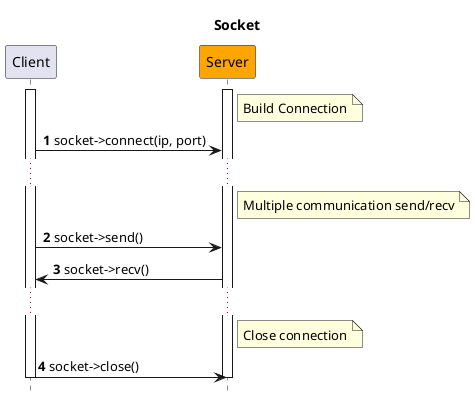
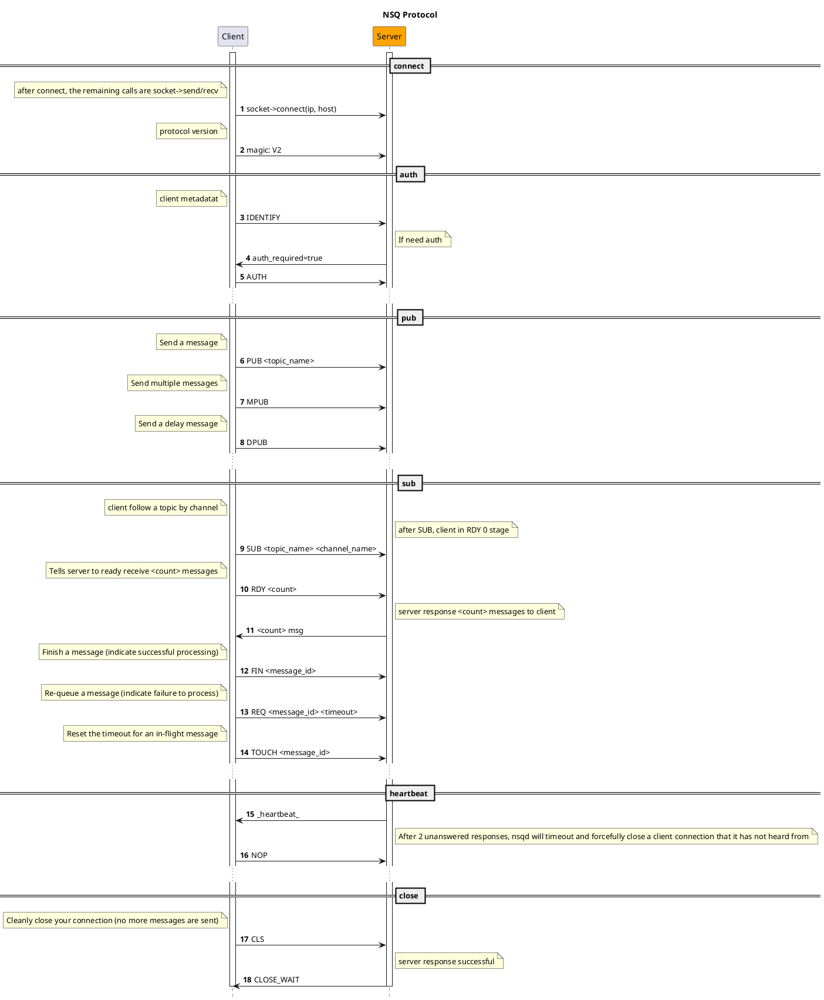

# NSQ

[NSQ](https://nsq.io) é uma plataforma de mensageria distribuída em tempo real, escrita em Golang.

## Instalação

```bash
composer require hyperf/nsq
```

## Uso

### Configuração

Por padrão, o arquivo de configuração do componente NSQ fica em `config/autoload/nsq.php`. Se o arquivo não existir, você pode usar o comando `php bin/hyperf.php vendor:publish hyperf/nsq` para publicar o arquivo de configuração correspondente.

O arquivo de configuração padrão é o seguinte:

```php
<?php
return [
    'default' => [
        'host' => '127.0.0.1',
        'port' => 4150,
        'pool' => [
            'min_connections' => 1,
            'max_connections' => 10,
            'connect_timeout' => 10.0,
            'wait_timeout' => 3.0,
            'heartbeat' => -1,
            'max_idle_time' => 60.0,
        ],
    ],
];
```

### Criar Consumer

Você pode gerar rapidamente um consumer para consumir mensagens por meio do comando `gen:nsq-consumer`, por exemplo:

```bash
php bin/hyperf.php gen:nsq-consumer DemoConsumer
```

Você também pode usar a anotação `Hyperf\Nsq\Annotation\Consumer` para declarar uma subclasse da classe abstrata `Hyperf/Nsq/AbstractConsumer` e concluir a definição de um consumer. Tanto a anotação quanto a classe abstrata contêm as seguintes propriedades:
 
|   Propriedade  |  Tipo  |  Valor padrão |       Comentário       |
|:-------:|:------:|:------:|:----------------:|
|  topic  | string |   ''   |  O topic que você quer ouvir   |
| channel | string |   ''   |  O channel que você quer ouvir |
|   name  | string | NsqConsumer |  O nome do consumer     |
|   nums  |  int   |   1    |  Quantidade de processos do consumer   |
|   pool  | string |   default   |  O recurso de pool de conexões correspondente ao consumer (key do arquivo de configuração) |

Essas propriedades da anotação são opcionais, porque a classe `Hyperf/Nsq/AbstractConsumer` também define as propriedades correspondentes e seus getters/setters. Quando as propriedades da anotação não forem definidas, o valor padrão da classe abstrata será usado.

```php
<?php

declare(strict_types=1);

namespace App\Nsq\Consumer;

use Hyperf\Nsq\AbstractConsumer;
use Hyperf\Nsq\Annotation\Consumer;
use Hyperf\Nsq\Message;
use Hyperf\Nsq\Result;

#[Consumer(
    topic: "hyperf", 
    channel: "hyperf", 
    name: "DemoNsqConsumer", 
    nums: 1
)]
class DemoNsqConsumer extends AbstractConsumer
{
    public function consume(Message $payload): string 
    {
        var_dump($payload->getBody());

        return Result::ACK;
    }
}
```

### Desabilitar auto-start do processo de consumer

Por padrão, após definir com a anotação `#[Consumer]`, o framework cria automaticamente um processo filho para iniciar o consumer na inicialização, e “puxa” novamente caso o processo filho saia de forma anormal. Porém, se algum trabalho de debug for realizado na fase de desenvolvimento, pode ser inconveniente depurar devido ao consumo automático pelos consumers.

Nessa situação, você pode controlar o auto-start do processo de consumo de duas formas para desabilitar o recurso: desligamento global e desligamento parcial.

#### Desligamento global

Você pode definir a opção `enable` da conexão correspondente como `false` no arquivo `config/autoload/nsq.php`. Isso significa que todos os processos de consumer sob essa conexão desabilitarão o recurso de auto-start.

#### Desligamento parcial

Quando você precisar desabilitar o auto-start apenas de alguns consumers, basta sobrescrever o método `isEnable()` na classe do consumer correspondente e retornar `false` para desabilitar o auto-start.

```php
<?php

declare(strict_types=1);

namespace App\Nsq\Consumer;

use Hyperf\Nsq\AbstractConsumer;
use Hyperf\Nsq\Annotation\Consumer;
use Hyperf\Nsq\Message;
use Hyperf\Nsq\Result;
use Psr\Container\ContainerInterface;

#[Consumer(
    topic: "demo_topic", 
    channel: "demo_channel", 
    name: "DemoConsumer", 
    nums: 1
)]
class DemoConsumer extends AbstractConsumer
{
    public function __construct(ContainerInterface $container)
    {
        parent::__construct($container);
    }

    public function isEnable(): bool 
    {
        return false;
    }

    public function consume(Message $payload): string
    {
        $body = json_decode($payload->getBody(), true);
        var_dump($body);
        return Result::ACK;
    }
}
```

### Publicar mensagem

Você pode publicar uma mensagem no NSQ chamando o método `Hyperf\Nsq\Nsq::publish(string $topic, $message, float $deferTime = 0.0)`. A seguir está um exemplo de publicação em um Command:

```php
<?php

declare(strict_types=1);

namespace App\Command;

use Hyperf\Command\Command as HyperfCommand;
use Hyperf\Command\Annotation\Command;
use Hyperf\Nsq\Nsq;

#[Command]
class NsqCommand extends HyperfCommand
{
    protected $name = 'nsq:pub';

    public function handle()
    {
        /** @var Nsq $nsq */
        $nsq = make(Nsq::class);
        $topic = 'hyperf';
        $message = 'This is message at ' . time();
        $nsq->publish($topic, $message);

        $this->line('success', 'info');
    }
}
```

### Publicar várias mensagens de uma vez

O segundo parâmetro do método `Hyperf\Nsq\Nsq::publish(string $topic, $message, float $deferTime = 0.0)` não precisa ser apenas uma string: ele também pode ser um array de strings para publicar várias mensagens de uma vez em um topic. Exemplo:

```php
<?php

declare(strict_types=1);

namespace App\Command;

use Hyperf\Command\Command as HyperfCommand;
use Hyperf\Command\Annotation\Command;
use Hyperf\Nsq\Nsq;

#[Command]
class NsqCommand extends HyperfCommand
{
    protected $name = 'nsq:pub';

    public function handle()
    {
        /** @var Nsq $nsq */
        $nsq = make(Nsq::class);
        $topic = 'hyperf';
        $messages = [
            'This is message 1 at ' . time(),
            'This is message 2 at ' . time(),
            'This is message 3 at ' . time(),
        ];
        $nsq->publish($topic, $messages);

        $this->line('success', 'info');
    }
}
```

### Publicar mensagem com atraso

Quando você quiser que a mensagem publicada seja consumida após um tempo específico, você pode passar no terceiro parâmetro do método `Hyperf\Nsq\Nsq::publish(string $topic, $message, float $deferTime = 0.0)` o tempo de atraso, em segundos. Exemplo:

```php
<?php

declare(strict_types=1);

namespace App\Command;

use Hyperf\Command\Command as HyperfCommand;
use Hyperf\Command\Annotation\Command;
use Hyperf\Nsq\Nsq;

#[Command]
class NsqCommand extends HyperfCommand
{
    protected $name = 'nsq:pub';

    public function handle()
    {
        /** @var Nsq $nsq */
        $nsq = make(Nsq::class);
        $topic = 'hyperf';
        $message = 'This is message at ' . time();
        $deferTime = 5.0;
        $nsq->publish($topic, $message, $deferTime);

        $this->line('success', 'info');
    }
}
```

### API HTTP do NSQD

> Referência da API HTTP do NSQD: https://nsq.io/components/nsqd.html

O componente encapsula a API HTTP do NSQD, e você pode chamá-la facilmente por este componente.

Por exemplo, quando você precisar excluir um `Topic`, você pode executar o código a seguir:

```php
<?php
use Hyperf\Context\ApplicationContext;
use Hyperf\Nsq\Nsqd\Topic;

$container = ApplicationContext::getContainer();

$client = $container->get(Topic::class);

$client->delete('hyperf.test');
```

- A classe `Hyperf\Nsq\Api\Topic` corresponde às APIs relacionadas a `topic`;
- A classe `Hyperf\Nsq\Api\Channle` corresponde às APIs relacionadas a `channel`;
- A classe `Hyperf\Nsq\Api\Api` corresponde às APIs relacionadas a `ping`、`stats`、`config`、`debug`;

## Protocolo NSQ

> https://nsq.io/clients/tcp_protocol_spec.html

- Socket



- NSQ Protocol


