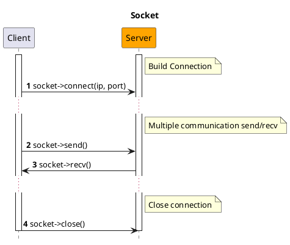
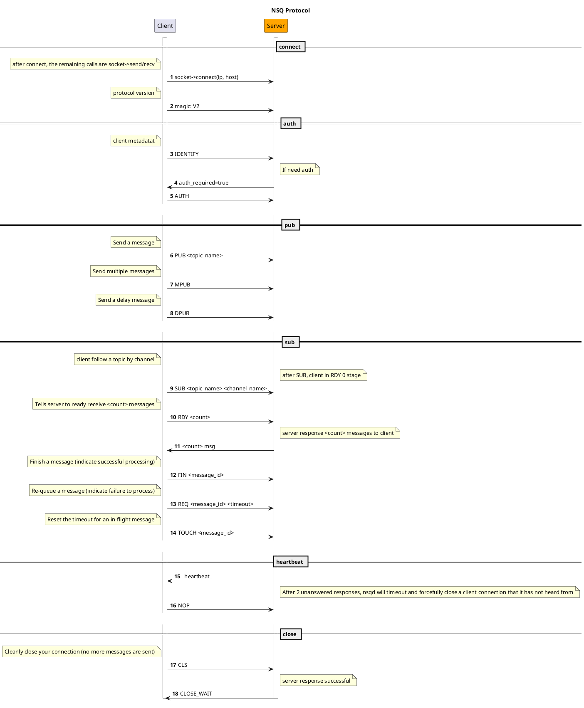

# NSQ

O [NSQ](https://nsq.io) é uma plataforma de mensagens distribuída em tempo real, escrita em Golang.

## Instalação

```bash
composer require hyperf/nsq
```

## Uso

### Configuração

O arquivo de configuração do componente NSQ está localizado, por padrão, em `config/autoload/nsq.php`. Se o arquivo não existir, você pode usar o comando `php bin/hyperf.php vendor:publish hyperf/nsq` para publicar o arquivo de configuração correspondente.

O arquivo de configuração padrão é o seguinte:

```php
<?php
return [
    'default' => [
        'host' => '127.0.0.1',
        'port' => 4150,
        'pool' => [
            'min_connections' => 1,
            'max_connections' => 10,
            'connect_timeout' => 10.0,
            'wait_timeout' => 3.0,
            'heartbeat' => -1,
            'max_idle_time' => 60.0,
        ],
    ],
];
```

### Criar Consumer

Você pode gerar rapidamente um consumer para consumir a mensagem através do comando `gen:nsq-consumer`, por exemplo:

```bash
php bin/hyperf.php gen:nsq-consumer DemoConsumer
```

Você também pode usar a annotation `Hyperf\Nsq\Annotation\Consumer` para declarar uma subclasse da classe abstrata `Hyperf/Nsq/AbstractConsumer` para completar a definição de um consumer, onde a annotation e a classe abstrata contêm as seguintes propriedades:
 
|   Propriedade  |  Tipo  |  Valor Padrão |       Comentário       |
|:-------:|:------:|:------:|:----------------:|
|  topic  | string |   ''   |  O topic que você quer escutar   |
| channel | string |   ''   |  O channel que você quer escutar |
|   name  | string | NsqConsumer |  O nome do consumer     |
|   nums  |  int   |   1    |  O número de processos dos consumers   |
|   pool  | string |   default   |  O recurso de pool de conexões correspondente ao consumer, correspondente à key do arquivo de configuração |

Essas propriedades da annotation são opcionais, porque a classe `Hyperf/Nsq/AbstractConsumer` também define as propriedades de membro correspondentes e os respectivos getters e setters. Quando as propriedades da annotation não são definidas, o valor padrão da classe abstrata será usado.

```php
<?php

declare(strict_types=1);

namespace App\Nsq\Consumer;

use Hyperf\Nsq\AbstractConsumer;
use Hyperf\Nsq\Annotation\Consumer;
use Hyperf\Nsq\Message;
use Hyperf\Nsq\Result;

#[Consumer(
    topic: "hyperf", 
    channel: "hyperf", 
    name: "DemoNsqConsumer", 
    nums: 1
)]
class DemoNsqConsumer extends AbstractConsumer
{
    public function consume(Message $payload): string 
    {
        var_dump($payload->getBody());

        return Result::ACK;
    }
}
```

### Desabilitar a auto-inicialização do processo consumer

Por padrão, após usar a definição da annotation `#[Consumer]`, o framework criará automaticamente um processo filho para iniciar o consumer na inicialização, e vai reiniciá-lo automaticamente após uma saída anormal do processo filho. No entanto, se algum trabalho de depuração for realizado na fase de desenvolvimento, pode ser inconveniente depurar devido ao consumo automático dos consumers.

Nessa situação, você pode controlar a auto-inicialização do processo de consumo através de duas formas para desabilitar a funcionalidade, desabilitação global e desabilitação parcial.

#### Desabilitação global

Você pode definir a opção `enable` da conexão correspondente para `false` no arquivo de configuração padrão `config/autoload/nsq.php`, o que significa que todos os processos consumidores sob essa conexão desabilitarão a funcionalidade de auto-inicialização.

#### Desabilitação parcial

Quando você só precisa desabilitar a funcionalidade de auto-inicialização de processos consumidores individuais, basta sobrescrever o método pai `isEnable()` na classe consumer correspondente e retornar `false` para desabilitar a funcionalidade de auto-inicialização do consumer.

```php
<?php

declare(strict_types=1);

namespace App\Nsq\Consumer;

use Hyperf\Nsq\AbstractConsumer;
use Hyperf\Nsq\Annotation\Consumer;
use Hyperf\Nsq\Message;
use Hyperf\Nsq\Result;
use Psr\Container\ContainerInterface;

#[Consumer(
    topic: "demo_topic", 
    channel: "demo_channel", 
    name: "DemoConsumer", 
    nums: 1
)]
class DemoConsumer extends AbstractConsumer
{
    public function __construct(ContainerInterface $container)
    {
        parent::__construct($container);
    }

    public function isEnable(): bool 
    {
        return false;
    }

    public function consume(Message $payload): string
    {
        $body = json_decode($payload->getBody(), true);
        var_dump($body);
        return Result::ACK;
    }
}
```

### Publicar mensagem

Você pode publicar uma mensagem no NSQ chamando o método `Hyperf\Nsq\Nsq::publish(string $topic, $message, float $deferTime = 0.0)`. A seguir, um exemplo de publicação de mensagem em um Command:

```php
<?php

declare(strict_types=1);

namespace App\Command;

use Hyperf\Command\Command as HyperfCommand;
use Hyperf\Command\Annotation\Command;
use Hyperf\Nsq\Nsq;

#[Command]
class NsqCommand extends HyperfCommand
{
    protected $name = 'nsq:pub';

    public function handle()
    {
        /** @var Nsq $nsq */
        $nsq = make(Nsq::class);
        $topic = 'hyperf';
        $message = 'This is message at ' . time();
        $nsq->publish($topic, $message);

        $this->line('success', 'info');
    }
}
```

### Publicar múltiplas mensagens de uma vez

O segundo parâmetro do método `Hyperf\Nsq\Nsq::publish(string $topic, $message, float $deferTime = 0.0)` não precisa ser apenas um valor string; também pode ser um array de strings para publicar múltiplas mensagens de uma vez em um topic; um exemplo é o seguinte:

```php
<?php

declare(strict_types=1);

namespace App\Command;

use Hyperf\Command\Command as HyperfCommand;
use Hyperf\Command\Annotation\Command;
use Hyperf\Nsq\Nsq;

#[Command]
class NsqCommand extends HyperfCommand
{
    protected $name = 'nsq:pub';

    public function handle()
    {
        /** @var Nsq $nsq */
        $nsq = make(Nsq::class);
        $topic = 'hyperf';
        $messages = [
            'This is message 1 at ' . time(),
            'This is message 2 at ' . time(),
            'This is message 3 at ' . time(),
        ];
        $nsq->publish($topic, $messages);

        $this->line('success', 'info');
    }
}
```

### Publicar mensagem com atraso

Quando você quiser que a mensagem publicada seja consumida após um tempo específico, você também pode passar no terceiro parâmetro do método `Hyperf\Nsq\Nsq::publish(string $topic, $message, float $deferTime = 0.0)` o tempo de atraso correspondente à mensagem publicada, em segundos; um exemplo é o seguinte:

```php
<?php

declare(strict_types=1);

namespace App\Command;

use Hyperf\Command\Command as HyperfCommand;
use Hyperf\Command\Annotation\Command;
use Hyperf\Nsq\Nsq;

#[Command]
class NsqCommand extends HyperfCommand
{
    protected $name = 'nsq:pub';

    public function handle()
    {
        /** @var Nsq $nsq */
        $nsq = make(Nsq::class);
        $topic = 'hyperf';
        $message = 'This is message at ' . time();
        $deferTime = 5.0;
        $nsq->publish($topic, $message, $deferTime);

        $this->line('success', 'info');
    }
}
```

### API HTTP do NSQD

> Referência da API HTTP do NSQD: https://nsq.io/components/nsqd.html

O componente encapsula a API HTTP do NSQD, e você pode facilmente chamar a API HTTP do NSQD através deste componente.

Por exemplo, quando você precisa deletar um `Topic`, você pode executar o seguinte código:

```php
<?php
use Hyperf\Context\ApplicationContext;
use Hyperf\Nsq\Nsqd\Topic;

$container = ApplicationContext::getContainer();

$client = $container->get(Topic::class);

$client->delete('hyperf.test');
```

- A classe `Hyperf\Nsq\Api\Topic` corresponde à API relacionada a `topic`;
- A classe `Hyperf\Nsq\Api\Channle` corresponde à API relacionada a `channel`;
- A classe `Hyperf\Nsq\Api\Api` corresponde à API relacionada a `ping`、`stats`、`config`、`debug`;

## Protocolo NSQ

> https://nsq.io/clients/tcp_protocol_spec.html

- Socket


```plantuml
@startuml

autonumber
hide footbox
title **Socket**

participant "Client" as client
participant "Server" as server #orange

activate client
activate server

note right of server: Build Connection
client -> server: socket->connect(ip, port)

...
note right of server: Multiple communication send/recv
client -> server: socket->send()
server-> client: socket->recv()
...

note right of server: Close connection
client->server: socket->close()

deactivate client
deactivate server

@enduml
```

- Protocolo NSQ


```plantuml
@startuml

autonumber
hide footbox
title **NSQ Protocol**

participant "Client" as client
participant "Server" as server #orange

activate client
activate server

== connect ==
note left of client: after connect, the remaining calls are socket->send/recv
client -> server: socket->connect(ip, host)
note left of client: protocol version
client->server: magic: V2

== auth ==
note left of client: client metadatat
client->server: IDENTIFY
note right of server: If need auth
server->client: auth_required=true
client->server: AUTH
...

== pub ==
note left of client: Send a message
client -> server: PUB <topic_name>
note left of client: Send multiple messages
client -> server: MPUB
note left of client: Send a delay message
client -> server: DPUB
...

== sub ==
note left of client: client follow a topic by channel
note right of server: after SUB, client in RDY 0 stage
client -> server: SUB <topic_name> <channel_name>
note left of client: Tells server to ready receive <count> messages
client -> server: RDY <count>
note right of server: server response <count> messages to client
server -> client: <count> msg
note left of client: Finish a message (indicate successful processing)
client -> server: FIN <message_id>
note left of client: Re-queue a message (indicate failure to process)
client -> server: REQ <message_id> <timeout>
note left of client: Reset the timeout for an in-flight message
client -> server: TOUCH <message_id>
...

== heartbeat ==
server -> client: _heartbeat_
note right of server: After 2 unanswered responses, nsqd will timeout and forcefully close a client connection that it has not heard from
client -> server: NOP
...

== close ==
note left of client: Cleanly close your connection (no more messages are sent)
client -> server: CLS
note right of server: server response successful
server -> client: CLOSE_WAIT

deactivate client
deactivate server

@enduml
```
