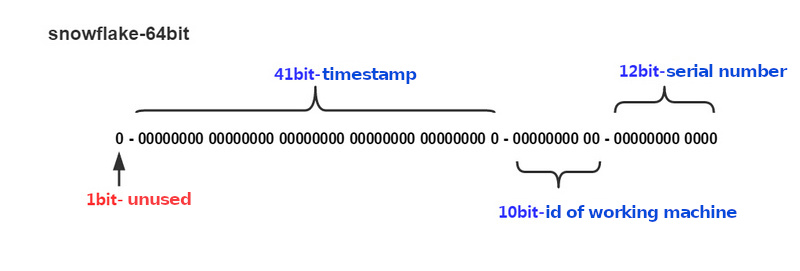

# Snowflake

## Introdução ao algoritmo

`Snowflake` é um algoritmo distribuído de geração de `ID` globalmente único, proposto pela twitter. O resultado do algoritmo, ao gerar um `ID`, é um inteiro longo com tamanho de `64bit`. Sob o algoritmo padrão, sua estrutura é mostrada na figura abaixo:



- `Um bit`, não utilizado.
  - O bit mais significativo no sistema binário é o bit de sinal. O `ID` gerado por nós geralmente é um inteiro positivo, então o bit mais significativo é fixado em 0.
  
- `41 bits` para registrar o timestamp (MS).
  - `41 bits` podem representar `2^41 - 1` números.
  - Em outras palavras, `41 bits` podem representar o valor de `2^41 - 1` milissegundos, e a unidade em anos é `(2^41 - 1) / (1000 * 60 * 60 * 24 * 365)`, aproximadamente `69` anos.
  
- `10 bits`, usados para registrar o `ID` da máquina de trabalho.
  - Pode ser implantado em `2^10` nós, incluindo `5` bits de `DatacenterId` e `5` bits de `WorkerId`.
  
- `12 bits`, número de série, usado para registrar diferentes `id`s gerados no mesmo milissegundo.
  - `12 bits` podem representar o número máximo de inteiros positivos `2^12 - 1`, com um total de `4095` números, que representam os `4095` números de série de `ID` gerados pela mesma máquina no mesmo intervalo de tempo (MS).

O `Snowflake` pode garantir que:

 - Todos os `ID`s gerados aumentam com a tendência de tempo.
   - Nenhum `ID` duplicado será gerado em todo o sistema distribuído (Porque há uma distinção entre `DatacenterId (5 bits)` e `WorkerId (5 bits)`).
 
O componente [hyperf/snowflake](https://github.com/hyperf/snowflake) oferece boa extensibilidade em seu design, permitindo que você implemente outros algoritmos variantes baseados no snowflake com extensão simples.

## Instalação

```
composer require hyperf/snowflake
```

## Uso

O framework fornece `MetaGeneratorInterface` e `IdGeneratorInterface`. `MetaGeneratorInterface` gera os arquivos `Meta` do `ID`, e `IdGeneratorInterface` gera o `ID distribuído` com base nos arquivos `Meta` correspondentes.

O `MetaGeneratorInterface` usado pelo framework por padrão é um `gerador de nível de milissegundo` baseado no `Redis`.
O arquivo de configuração está localizado em `config/autoload/snowflake.php`. Se o arquivo de configuração não existir, você pode executar o comando `php bin/hyperf.php vendor:publish hyperf/snowflake` para criar uma configuração padrão. O conteúdo do arquivo de configuração é o seguinte:

```php
<?php

declare(strict_types=1);

use Hyperf\Snowflake\MetaGenerator\RedisMilliSecondMetaGenerator;
use Hyperf\Snowflake\MetaGenerator\RedisSecondMetaGenerator;
use Hyperf\Snowflake\MetaGeneratorInterface;

return [
    'begin_second' => MetaGeneratorInterface::DEFAULT_BEGIN_SECOND,
    RedisMilliSecondMetaGenerator::class => [
        // Redis Pool
        'pool' => 'default',
        // To calculate the Key of WorkerId
        'key' => RedisMilliSecondMetaGenerator::DEFAULT_REDIS_KEY
    ],
    RedisSecondMetaGenerator::class => [
        // Redis Pool
        'pool' => 'default',
        // To calculate the Key of WorkerId
        'key' => RedisMilliSecondMetaGenerator::DEFAULT_REDIS_KEY
    ],
];

```

Usar o `Snowflake` no framework é muito simples. Você só precisa obter o objeto `IdGeneratorInterface` do `DI`.

```php
<?php
use Hyperf\Snowflake\IdGeneratorInterface;
use Hyperf\Context\ApplicationContext;

$container = ApplicationContext::getContainer();
$generator = $container->get(IdGeneratorInterface::class);

$id = $generator->generate();
```

Quando você sabe que o `ID` precisa reverter o `Meta` correspondente, basta chamar `generate`.

```php
<?php
use Hyperf\Snowflake\IdGeneratorInterface;
use Hyperf\Context\ApplicationContext;

$container = ApplicationContext::getContainer();
$generator = $container->get(IdGeneratorInterface::class);

$meta = $generator->degenerate($id);
```

## Sobrescrevendo o gerador de 'Meta'


Existem muitas formas de implementar o `ID globalmente único distribuído`, e também existem muitas variantes baseadas no algoritmo `Snowflake`. Embora todos sejam algoritmos `Snowflake`, eles não são iguais. Por exemplo, alguém pode gerar um `Meta` baseado em `UserId` em vez de `WorkerId`. A seguir, vamos implementar um `MetaGenerator` simples.

Em resumo, o `UserId` certamente excederá '10 bits'. Portanto, o `DataCenterId` e o `WorkerId` padrão não podem ser instalados. Assim, o módulo de `UserId` precisa ser considerado.


```php
<?php

declare(strict_types=1);

use Hyperf\Snowflake\IdGenerator;

class UserDefinedIdGenerator
{
    /**
     * @var IdGenerator\SnowflakeIdGenerator
     */
    protected $idGenerator;

    public function __construct(IdGenerator\SnowflakeIdGenerator $idGenerator)
    {
        $this->idGenerator = $idGenerator;
    }

    public function generate(int $userId)
    {
        $meta = $this->idGenerator->getMetaGenerator()->generate();

        return $this->idGenerator->generate($meta->setWorkerId($userId % 31));
    }

    public function degenerate(int $id)
    {
        return $this->idGenerator->degenerate($id);
    }
}

use Hyperf\Context\ApplicationContext;

$container = ApplicationContext::getContainer();
$generator = $container->get(UserDefinedIdGenerator::class);
$userId = 20190620;

$id = $generator->generate($userId);

```

## Aplicação no model do banco de dados

Depois de configurar o `Snowflake`, podemos fazer com que o model do banco de dados use diretamente o `ID` do `Snowflake` como chave primária.

```php
<?php

class User extends \Hyperf\Database\Model\Model {
    use \Hyperf\Snowflake\Concern\Snowflake;
}
```

Quando o model de usuário é criado, o algoritmo `Snowflake` será usado para gerar a chave primária por padrão.
