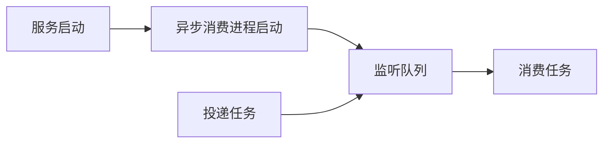
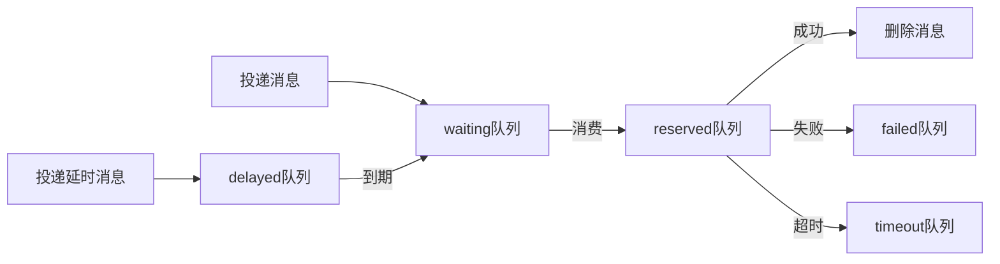

# 异步队列

异步队列区别于 `RabbitMQ` `Kafka` 等消息队列，它只提供一种 `异步处理` 和 `异步延时处理` 的能力，并 **不能** 严格地保证消息的持久化和 **不支持** 完备的 ACK 应答机制。

## 安装

```bash
composer require hyperf/async-queue
```

## 配置

配置文件位于 `config/autoload/async_queue.php`，如文件不存在可自行创建。

> 暂时只支持 `Redis Driver` 驱动。

|       配置       |   类型    |                   默认值                    |                  备注                   |
|:----------------:|:---------:|:-------------------------------------------:|:---------------------------------------:|
|      driver      |  string   | Hyperf\AsyncQueue\Driver\RedisDriver::class |                   无                    |
|     channel      |  string   |                    queue                    |                队列前缀                 |
|    redis.pool    |  string   |                    default                  |                redis 连接池              |
|     timeout      |    int    |                      2                      |           pop 消息的超时时间            |
|  retry_seconds   | int,array |                      5                      |           失败后重新尝试间隔            |
|  handle_timeout  |    int    |                     10                      |            消息处理超时时间             |
|    processes     |    int    |                      1                      |               消费进程数                |
| concurrent.limit |    int    |                      1                      |             同时处理消息数              |
|   max_messages   |    int    |                      0                      | 进程重启所需最大处理的消息数 默认不重启 |

```php
<?php

return [
    'default' => [
        'driver' => Hyperf\AsyncQueue\Driver\RedisDriver::class,
        'redis' => [
            'pool' => 'default'
        ],
        'channel' => 'queue',
        'timeout' => 2,
        'retry_seconds' => 5,
        'handle_timeout' => 10,
        'processes' => 1,
        'concurrent' => [
            'limit' => 5,
        ],
    ],
];

```

`retry_seconds` 也可以传入数组，根据重试次数相应修改重试时间，例如

```php
<?php

return [
    'default' => [
        'driver' => Hyperf\AsyncQueue\Driver\RedisDriver::class,
        'channel' => 'queue',
        'retry_seconds' => [1, 5, 10, 20],
        'processes' => 1,
    ],
];

```

## 工作原理

`ConsumerProcess` 是异步消费进程，会根据用户创建的 `Job` 或者使用 `#[AsyncQueueMessage]` 的代码块，执行消费逻辑。
`Job` 和 `#[AsyncQueueMessage]` 都是需要投递和执行的任务，即数据、消费逻辑都会在任务中定义。

- `Job` 类中成员变量即为待消费的数据，`handle()` 方法则为消费逻辑。
- `#[AsyncQueueMessage]` 注解的方法，构造函数传入的数据即为待消费的数据，方法体则为消费逻辑。



## 使用

### 配置异步消费进程

组件已经提供了默认 `异步消费进程`，只需要将它配置到 `config/autoload/processes.php` 中即可。

```php
<?php

return [
    Hyperf\AsyncQueue\Process\ConsumerProcess::class,
];

```

当然，您也可以将以下 `Process` 添加到自己的项目中。

> 配置方式和注解方式，二选一即可。

```php
<?php

declare(strict_types=1);

namespace App\Process;

use Hyperf\AsyncQueue\Process\ConsumerProcess;
use Hyperf\Process\Annotation\Process;

#[Process(name: "async-queue")]
class AsyncQueueConsumer extends ConsumerProcess
{
}
```

### 生产消息

#### 传统方式

这种模式会把对象直接序列化然后存到 `Redis` 等队列中，所以为了保证序列化后的体积，尽量不要将 `Container`，`Config` 等设置为成员变量。

比如以下 `Job` 的定义，是 **不可取** 的，同理 `#[Inject]` 也是如此。

> 因为 Job 会被序列化，所以成员变量不要包含 匿名函数 等 无法被序列化 的内容，如果不清楚哪些内容无法被序列化，尽量使用注解方式。

```php
<?php

declare(strict_types=1);

namespace App\Job;

use Hyperf\AsyncQueue\Job;
use Psr\Container\ContainerInterface;

class ExampleJob extends Job
{
    public $container;

    public $params;

    public function __construct(ContainerInterface $container, $params)
    {
        $this->container = $container;
        $this->params = $params;
    }

    public function handle()
    {
        // 根据参数处理具体逻辑
        var_dump($this->params);
    }
}

$job = make(ExampleJob::class);
```

正确的 `Job` 应该是只有需要处理的数据，其他相关数据，可以在 `handle` 方法中重新获取，如下。

```php
<?php

declare(strict_types=1);

namespace App\Job;

use Hyperf\AsyncQueue\Job;

class ExampleJob extends Job
{
    public $params;
    
    /**
     * 任务执行失败后的重试次数，即最大执行次数为 $maxAttempts+1 次
     */
    protected int $maxAttempts = 2;

    public function __construct($params)
    {
        // 这里最好是普通数据，不要使用携带 IO 的对象，比如 PDO 对象
        $this->params = $params;
    }

    public function handle()
    {
        // 根据参数处理具体逻辑
        // 通过具体参数获取模型等
        // 这里的逻辑会在 ConsumerProcess 进程中执行
        var_dump($this->params);
    }
}
```

正确定义完 `Job` 后，我们需要写一个专门投递消息的 `Service`，代码如下。

```php
<?php

declare(strict_types=1);

namespace App\Service;

use App\Job\ExampleJob;
use Hyperf\AsyncQueue\Driver\DriverFactory;
use Hyperf\AsyncQueue\Driver\DriverInterface;

class QueueService
{
    protected DriverInterface $driver;

    public function __construct(DriverFactory $driverFactory)
    {
        $this->driver = $driverFactory->get('default');
    }

    /**
     * 生产消息.
     * @param $params 数据
     * @param int $delay 延时时间 单位秒
     */
    public function push($params, int $delay = 0): bool
    {
        // 这里的 `ExampleJob` 会被序列化存到 Redis 中，所以内部变量最好只传入普通数据
        // 同理，如果内部使用了注解 @Value 会把对应对象一起序列化，导致消息体变大。
        // 所以这里也不推荐使用 `make` 方法来创建 `Job` 对象。
        return $this->driver->push(new ExampleJob($params), $delay);
    }
}
```

投递消息

接下来，调用我们的 `QueueService` 投递消息即可。

```php
<?php

declare(strict_types=1);

namespace App\Controller;

use App\Service\QueueService;
use Hyperf\Di\Annotation\Inject;
use Hyperf\HttpServer\Annotation\AutoController;

#[AutoController]
class QueueController extends AbstractController
{
    #[Inject]
    protected QueueService $service;

    /**
     * 传统模式投递消息
     */
    public function index()
    {
        $this->service->push([
            'group@hyperf.io',
            'https://doc.hyperf.io',
            'https://www.hyperf.io',
        ]);

        return 'success';
    }
}
```

#### 注解方式

框架除了传统方式投递消息，还提供了注解方式。

> 注解方式会在非消费环境下自动投递消息到队列，故，如果我们在队列中使用注解方式时，则不会再次投递到队列当中，而是直接在本消费进程中执行。
> 如果仍然需要在队列中投递消息，则可以在队列中使用传统模式投递。

让我们重写上述 `QueueService`，直接将 `ExampleJob` 的逻辑搬到 `example` 方法中，并加上对应注解 `AsyncQueueMessage`，具体代码如下。

```php
<?php

declare(strict_types=1);

namespace App\Service;

use Hyperf\AsyncQueue\Annotation\AsyncQueueMessage;

class QueueService
{
    #[AsyncQueueMessage]
    public function example($params)
    {
        // 需要异步执行的代码逻辑
        // 这里的逻辑会在 ConsumerProcess 进程中执行
        var_dump($params);
    }
}

```

投递消息

注解模式投递消息就跟平常调用方法一致，代码如下。

```php
<?php

declare(strict_types=1);

namespace App\Controller;

use App\Service\QueueService;
use Hyperf\Di\Annotation\Inject;
use Hyperf\HttpServer\Annotation\AutoController;

#[AutoController]
class QueueController extends AbstractController
{
    /**
     * @var QueueService
     */
    #[Inject]
    protected $service;

    /**
     * 注解模式投递消息
     */
    public function example()
    {
        $this->service->example([
            'group@hyperf.io',
            'https://doc.hyperf.io',
            'https://www.hyperf.io',
        ]);

        return 'success';
    }
}
```

## 事件

|   事件名称   |        触发时机         |                         备注                         |
|:------------:|:-----------------------:|:----------------------------------------------------:|
| BeforeHandle |     处理消息前触发      |                                                      |
| AfterHandle  |     处理消息后触发      |                                                      |
| FailedHandle |   处理消息失败后触发    |                                                      |
| RetryHandle  |   重试处理消息前触发    |                                                      |
| QueueLength  | 每处理 500 个消息后触发 | 用户可以监听此事件，判断失败或超时队列是否有消息积压 |

### QueueLengthListener

框架自带了一个记录队列长度的监听器，默认不开启，您如果需要，可以自行添加到 `listeners` 配置中。

```php
<?php

declare(strict_types=1);

return [
    Hyperf\AsyncQueue\Listener\QueueLengthListener::class
];
```

### ReloadChannelListener

当消息执行超时，或项目重启导致消息执行被中断，最终都会被移动到 `timeout` 队列中，只要您可以保证消息执行是幂等的（同一个消息执行一次，或执行多次，最终表现一致），
就可以开启以下监听器，框架会自动将 `timeout` 队列中消息移动到 `waiting` 队列中，等待下次消费。

> 监听器监听 `QueueLength` 事件，默认执行 500 次消息后触发一次。

```php
<?php

declare(strict_types=1);

return [
    Hyperf\AsyncQueue\Listener\ReloadChannelListener::class
];
```

## 任务执行流转流程

任务执行流转流程主要包括以下几个队列:

|  队列名  |                   备注                    |
|:--------:|:-----------------------------------------:|
| waiting  |              等待消费的队列               |
| reserved |              正在消费的队列               |
| delayed  |              延迟消费的队列               |
|  failed  |              消费失败的队列               |
| timeout  | 消费超时的队列 (虽然超时，但可能执行成功) |

队列流转顺序如下: 



## 配置多个异步队列

当您需要使用多个队列来区分消费高频和低频或其他种类的消息时，可以配置多个队列。

1. 添加配置

```php
<?php

return [
    'default' => [
        'driver' => Hyperf\AsyncQueue\Driver\RedisDriver::class,
        'channel' => '{queue}',
        'timeout' => 2,
        'retry_seconds' => 5,
        'handle_timeout' => 10,
        'processes' => 1,
        'concurrent' => [
            'limit' => 2,
        ],
    ],
    'other' => [
        'driver' => Hyperf\AsyncQueue\Driver\RedisDriver::class,
        'channel' => '{other.queue}',
        'timeout' => 2,
        'retry_seconds' => 5,
        'handle_timeout' => 10,
        'processes' => 1,
        'concurrent' => [
            'limit' => 2,
        ],
    ],
];

```

2. 添加消费进程

```php
<?php

declare(strict_types=1);

namespace App\Process;

use Hyperf\AsyncQueue\Process\ConsumerProcess;
use Hyperf\Process\Annotation\Process;

#[Process]
class OtherConsumerProcess extends ConsumerProcess
{
    protected string $queue = 'other';
}
```

3. 调用

```php
use Hyperf\AsyncQueue\Driver\DriverFactory;
use Hyperf\Context\ApplicationContext;

$driver = ApplicationContext::getContainer()->get(DriverFactory::class)->get('other');
return $driver->push(new ExampleJob());
```

## 安全关闭

异步队列在终止时，如果正在进行消费逻辑，可能会导致出现错误。框架提供了 `ProcessStopHandler` ，可以让异步队列进程安全关闭。

> 当前信号处理器并不适配于 CoroutineServer，如有需要请自行实现

安装信号处理器

```shell
composer require hyperf/signal
composer require hyperf/process
```

添加配置 `autoload/signal.php`

```php
<?php

declare(strict_types=1);

return [
    'handlers' => [
        Hyperf\Process\Handler\ProcessStopHandler::class,
    ],
    'timeout' => 5.0,
];

```


## 异步驱动之间的区别

- Hyperf\AsyncQueue\Driver\RedisDriver::class

此异步驱动会将整个 `JOB` 进行序列化，当投递即时队列后，会 `lpush` 到 `list` 结构中，投递延时队列，会 `zadd` 到 `zset` 结构中。
所以，如果 `Job` 的参数完全一致的情况，在延时队列中就会出现后投递的消息 **覆盖** 前面投递的消息的问题。
如果不想出现延时消息覆盖的情况，只需要在 `Job` 里增加一个唯一的 `uniqid`，或者在使用 `注解` 的方法上增加一个 `uniqid` 的入参即可。
