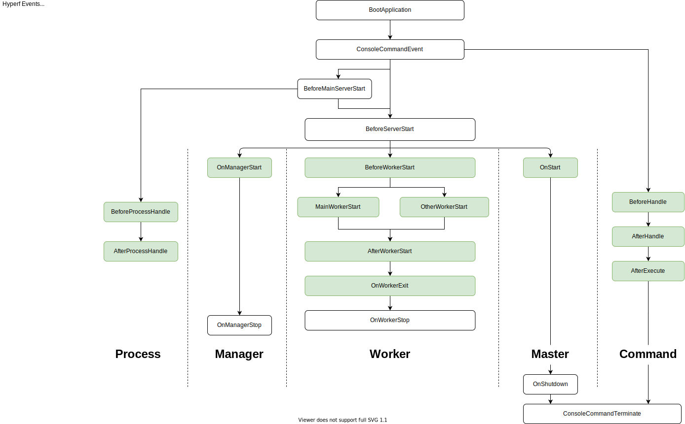

# 事件机制

## 前言

事件模式必须基于 [PSR-14](https://github.com/php-fig/fig-standards/blob/master/accepted/PSR-14-event-dispatcher.md) 去实现。   
Hyperf 的事件管理器默认由 [hyperf/event](https://github.com/hyperf/event) 实现，该组件亦可用于其它框架或应用，只需通过 Composer 将该组件引入即可。

```bash
composer require hyperf/event
```

## 概念

事件模式是一种经过了充分测试的可靠机制，是一种非常适用于解耦的机制，分别存在以下 3 种角色：

- `事件(Event)` 是传递于应用代码与 `监听器(Listener)` 之间的通讯对象
- `监听器(Listener)` 是用于监听 `事件(Event)` 的发生的监听对象
- `事件调度器(EventDispatcher)` 是用于触发 `事件(Event)` 和管理 `监听器(Listener)` 与 `事件(Event)` 之间的关系的管理者对象

用通俗易懂的例子来说明就是，假设我们存在一个 `UserService::register()` 方法用于注册一个账号，在账号注册成功后我们可以通过事件调度器触发 `UserRegistered` 事件，由监听器监听该事件的发生，在触发时进行某些操作，比如发送用户注册成功短信，在业务发展的同时我们可能会希望在用户注册成功之后做更多的事情，比如发送用户注册成功的邮件等待，此时我们就可以通过再增加一个监听器监听 `UserRegistered` 事件即可，无需在 `UserService::register()` 方法内部增加与之无关的代码。

## 使用事件管理器

> 接下来我们会通过配置和注解两种方式介绍监听器，实际使用时，二者只需使用其一即可，如果既有注解又有配置，则会造成监听器被多次触发。

### 定义一个事件

一个事件其实就是一个用于管理状态数据的普通类，触发时将应用数据传递到事件里，然后监听器对事件类进行操作，一个事件可被多个监听器监听。

```php
<?php
namespace App\Event;

class UserRegistered
{
    // 建议这里定义成 public 属性，以便监听器对该属性的直接使用，或者你提供该属性的 Getter
    public $user;
    
    public function __construct($user)
    {
        $this->user = $user;    
    }
}
```

### 定义一个监听器

监听器都需要实现一下 `Hyperf\Event\Contract\ListenerInterface` 接口的约束方法，示例如下。

```php
<?php
namespace App\Listener;

use App\Event\UserRegistered;
use Hyperf\Event\Contract\ListenerInterface;

class UserRegisteredListener implements ListenerInterface
{
    public function listen(): array
    {
        // 返回一个该监听器要监听的事件数组，可以同时监听多个事件
        return [
            UserRegistered::class,
        ];
    }

    /**
     * @param UserRegistered $event
     */
    public function process(object $event): void
    {
        // 事件触发后该监听器要执行的代码写在这里，比如该示例下的发送用户注册成功短信等
        // 直接访问 $event 的 user 属性获得事件触发时传递的参数值
        // $event->user;
        
    }
}
```

#### 通过配置文件注册监听器

在定义完监听器之后，我们需要让其能被 `事件调度器(Dispatcher)` 发现，可以在 `config/autoload/listeners.php` 配置文件 *（如不存在可自行创建）* 内添加该监听器即可，监听器的触发顺序根据该配置文件的配置顺序:

```php
<?php
return [
    \App\Listener\UserRegisteredListener::class,
];
```

### 通过注解注册监听器

Hyperf 还提供了一种更加简便的监听器注册方式，就是通过 `#[Listener]` 注解注册，只要将该注解定义在监听器类上，且监听器类处于 `Hyperf 注解扫描域` 内即可自动完成注册，代码示例如下：

```php
<?php
namespace App\Listener;

use App\Event\UserRegistered;
use Hyperf\Event\Annotation\Listener;
use Hyperf\Event\Contract\ListenerInterface;

#[Listener]
class UserRegisteredListener implements ListenerInterface
{
    public function listen(): array
    {
        // 返回一个该监听器要监听的事件数组，可以同时监听多个事件
        return [
            UserRegistered::class,
        ];
    }

    /**
     * @param UserRegistered $event
     */
    public function process(object $event): void
    {
        // 事件触发后该监听器要执行的代码写在这里，比如该示例下的发送用户注册成功短信等
        // 直接访问 $event 的 user 属性获得事件触发时传递的参数值
        // $event->user;
    }
}
```

在通过注解注册监听器时，我们可以通过设置 `priority` 属性定义当前监听器的顺序，如 `#[Listener(priority=1)]` ，底层使用 `SplPriorityQueue` 结构储存，`priority` 数字越大优先级越高。

> 使用 `#[Listener]` 注解时需 `use Hyperf\Event\Annotation\Listener;` 命名空间；  

### 触发事件

事件需要通过 `事件调度器(EventDispatcher)` 调度才能让 `监听器(Listener)` 监听到，我们通过一段代码来演示如何触发事件：

```php
<?php
namespace App\Service;

use Hyperf\Di\Annotation\Inject;
use Psr\EventDispatcher\EventDispatcherInterface;
use App\Event\UserRegistered; 

class UserService
{
    /**
     * @var EventDispatcherInterface
     */
    #[Inject]
    private $eventDispatcher;
    
    public function register()
    {
        // 我们假设存在 User 这个实体
        $user = new User();
        $result = $user->save();
        // 完成账号注册的逻辑
        // 这里 dispatch(object $event) 会逐个运行监听该事件的监听器
        $this->eventDispatcher->dispatch(new UserRegistered($user));
        return $result;
    }
}
```

## Hyperf 生命周期事件



## Hyperf 协程风格生命周期事件


## 注意事项

### 不要在 `Listener` 中注入 `EventDispatcherInterface`

因为 `EventDispatcherInterface` 依赖于 `ListenerProviderInterface`，而 `ListenerProviderInterface` 初始化的同时，会收集所有的 `Listener`。

而如果 `Listener` 又依赖了 `EventDispatcherInterface`，就会导致循坏依赖，进而导致内存溢出。

### 最好只在 `Listener` 中注入 `ContainerInterface`。

最好只在 `Listener` 中注入 `ContainerInterface`，而其他的组件在 `process` 中通过 `container` 获取。框架启动开始时，会实例化 `EventDispatcherInterface`，这个时候还不是协程环境，如果 `Listener` 中注入了可能会触发协程切换的类，就会导致框架启动失败。
