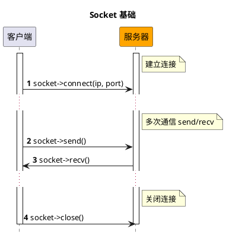
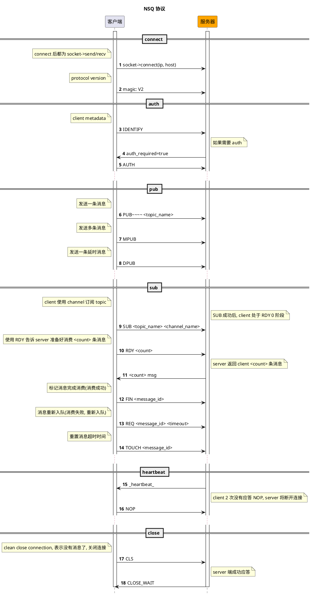

# NSQ

[NSQ](https://nsq.io) 是一个由 Go 语言编写的开源、轻量级、高性能的实时分布式消息中间件。

## 安装

```bash
composer require hyperf/nsq
```

## 使用

### 配置

NSQ 组件的配置文件默认位于 `config/autoload/nsq.php` 内，如该文件不存在，可通过 `php bin/hyperf.php vendor:publish hyperf/nsq` 命令来将发布对应的配置文件。

默认配置文件如下：

```php
<?php
return [
    'default' => [
        'host' => '127.0.0.1',
        'port' => 4150,
        'pool' => [
            'min_connections' => 1,
            'max_connections' => 10,
            'connect_timeout' => 10.0,
            'wait_timeout' => 3.0,
            'heartbeat' => -1,
            // 因为 Nsq 服务默认的闲置时间是 60s，故框架维护的最大闲置时间应小于 60s
            'max_idle_time' => 30.0,
        ],
    ],
];
```

### 创建消费者

通过 `gen:nsq-consumer` 命令可以快速的生成一个 消费者(Consumer) 对消息进行消费。

```bash
php bin/hyperf.php gen:nsq-consumer DemoConsumer
```

您也可以通过使用 `Hyperf\Nsq\Annotation\Consumer` 注解来对一个 `Hyperf/Nsq/AbstractConsumer` 抽象类的子类进行声明，来完成一个 消费者(Consumer) 的定义，其中`Hyperf\Nsq\Annotation\Consumer` 注解和抽象类均包含以下属性：
 
|   配置  |  类型  |  注解或抽象类默认值 |       备注       |
|:-------:|:------:|:------:|:----------------:|
|  topic  | string |   ''   |  要监听的 topic   |
| channel | string |   ''   |  要监听的 channel |
|   name  | string | NsqConsumer |  消费者的名称     |
|   nums  |  int   |   1    |  消费者的进程数   |
|   pool  | string |   default   |  消费者对应的连接，对应配置文件的 key |

这些注解属性是可选的，因为 `Hyperf/Nsq/AbstractConsumer` 抽象类中也分别定义了对应的成员属性以及 getter 和 setter，当不对注解属性进行定义时，会使用抽象类的属性默认值。

```php
<?php

declare(strict_types=1);

namespace App\Nsq\Consumer;

use Hyperf\Nsq\AbstractConsumer;
use Hyperf\Nsq\Annotation\Consumer;
use Hyperf\Nsq\Message;
use Hyperf\Nsq\Result;

#[Consumer(topic: "hyperf", channel: "hyperf", name: "DemoNsqConsumer", nums: 1)]
class DemoNsqConsumer extends AbstractConsumer
{
    public function consume(Message $payload): string 
    {
        var_dump($payload->getBody());

        return Result::ACK;
    }
}
```

### 禁止消费进程自启

默认情况下，使用了 `#[Consumer]` 注解定义后，框架会在启动时自动创建子进程来启动消费者，并且会在子进程异常退出后，自动重新拉起。但如果在处于开发阶段进行某些调试工作时，可能会因为消费者的自动消费导致调试的不便。

在这种情况下，您可通过全局关闭和局部关闭两种形式来控制消费进程的自启。

#### 全局关闭

您可以在默认配置文件 `config/autoload/nsq.php` 中，将对应连接的 `enable` 选项设置为 `false`，即代表该连接下的所有消费者进程都关闭自启功能。

#### 局部关闭

当您只需要关闭个别消费进程的自启功能，只需要在对应的消费者中重写父类方法 `isEnable()` 并返回 `false` 即可关闭此消费者的自启功能；

```php
<?php

declare(strict_types=1);

namespace App\Nsq\Consumer;

use Hyperf\Nsq\AbstractConsumer;
use Hyperf\Nsq\Annotation\Consumer;
use Hyperf\Nsq\Message;
use Hyperf\Nsq\Result;
use Psr\Container\ContainerInterface;

#[Consumer(topic: "demo_topic", channel: "demo_channel", name: "DemoConsumer", nums: 1)]
class DemoConsumer extends AbstractConsumer
{
    public function __construct(ContainerInterface $container)
    {
        parent::__construct($container);
    }

    public function isEnable(): bool 
    {
        return false;
    }

    public function consume(Message $payload): string
    {
        $body = json_decode($payload->getBody(), true);
        var_dump($body);
        return Result::ACK;
    }
}
```

### 投递消息

您可以通过调用 `Hyperf\Nsq\Nsq::publish(string $topic, $message, float $deferTime = 0.0)` 方法来向 NSQ 投递消息, 下面是在 Command 进行消息投递的一个示例：

```php
<?php

declare(strict_types=1);

namespace App\Command;

use Hyperf\Command\Command as HyperfCommand;
use Hyperf\Command\Annotation\Command;
use Hyperf\Nsq\Nsq;

#[Command]
class NsqCommand extends HyperfCommand
{
    protected $name = 'nsq:pub';

    public function handle()
    {
        /** @var Nsq $nsq */
        $nsq = make(Nsq::class);
        $topic = 'hyperf';
        $message = 'This is message at ' . time();
        $nsq->publish($topic, $message);

        $this->line('success', 'info');
    }
}
```

### 一次性投递多条消息

`Hyperf\Nsq\Nsq::publish(string $topic, $message, float $deferTime = 0.0)` 方法的第二个参数除了可以传递一个字符串外，还可以传递一个字符串数组，来实现一次性向一个 Topic 投递多条消息的功能，示例如下：

```php
<?php

declare(strict_types=1);

namespace App\Command;

use Hyperf\Command\Command as HyperfCommand;
use Hyperf\Command\Annotation\Command;
use Hyperf\Nsq\Nsq;

#[Command]
class NsqCommand extends HyperfCommand
{
    protected $name = 'nsq:pub';

    public function handle()
    {
        /** @var Nsq $nsq */
        $nsq = make(Nsq::class);
        $topic = 'hyperf';
        $messages = [
            'This is message 1 at ' . time(),
            'This is message 2 at ' . time(),
            'This is message 3 at ' . time(),
        ];
        $nsq->publish($topic, $messages);

        $this->line('success', 'info');
    }
}
```

### 投递延迟消息

当您希望您投递的消息在特定的时间后再去消费，也可通过对 `Hyperf\Nsq\Nsq::publish(string $topic, $message, float $deferTime = 0.0)` 方法的第三个参数传递对应的延迟时长，单位为秒，示例如下：

```php
<?php

declare(strict_types=1);

namespace App\Command;

use Hyperf\Command\Command as HyperfCommand;
use Hyperf\Command\Annotation\Command;
use Hyperf\Nsq\Nsq;

#[Command]
class NsqCommand extends HyperfCommand
{
    protected $name = 'nsq:pub';

    public function handle()
    {
        /** @var Nsq $nsq */
        $nsq = make(Nsq::class);
        $topic = 'hyperf';
        $message = 'This is message at ' . time();
        $deferTime = 5.0;
        $nsq->publish($topic, $message, $deferTime);

        $this->line('success', 'info');
    }
}
```

### NSQD HTTP API

> NSQD HTTP API Refer: https://nsq.io/components/nsqd.html

组件对 NSQD HTTP API 进行了封装，您可以很方便的实现对 NSQD HTTP API 的调用。 

比如，当您需要删除某个 `Topic` 时，可以执行以下代码：

```php
<?php
use Hyperf\Context\ApplicationContext;
use Hyperf\Nsq\Nsqd\Topic;

$container = ApplicationContext::getContainer();

$client = $container->get(Topic::class);

$client->delete('hyperf.test');
```

- `Hyperf\Nsq\Api\Topic` 类对应 `topic` 相关的 API；
- `Hyperf\Nsq\Api\Channle` 类对应 `channel` 相关的 API；
- `Hyperf\Nsq\Api\Api` 类对应 `ping`、`stats`、`config`、`debug` 等相关的 API；

## NSQ 协议

> https://nsq.io/clients/tcp_protocol_spec.html

- Socket 基础



- NSQ 协议流程


