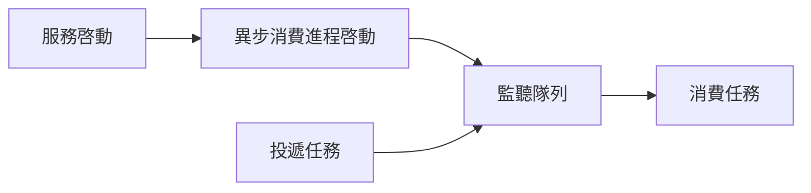
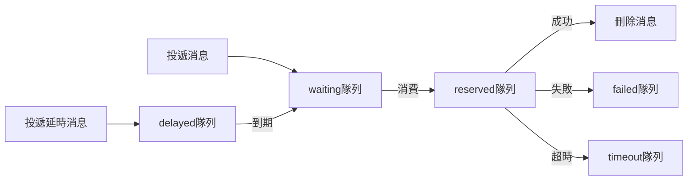

# 異步隊列

異步隊列區別於 `RabbitMQ` `Kafka` 等消息隊列，它只提供一種 `異步處理` 和 `異步延時處理` 的能力，並 **不能** 嚴格地保證消息的持久化和 **不支持** 完備的 ACK 應答機制。

## 安裝

```bash
composer require hyperf/async-queue
```

## 配置

配置文件位於 `config/autoload/async_queue.php`，如文件不存在可自行創建。

> 暫時只支持 `Redis Driver` 驅動。

|       配置       |   類型    |                   默認值                    |                  備註                   |
|:----------------:|:---------:|:-------------------------------------------:|:---------------------------------------:|
|      driver      |  string   | Hyperf\AsyncQueue\Driver\RedisDriver::class |                   無                    |
|     channel      |  string   |                    queue                    |                隊列前綴                 |
|    redis.pool    |  string   |                    default                  |                redis 連接池              |
|     timeout      |    int    |                      2                      |           pop 消息的超時時間            |
|  retry_seconds   | int,array |                      5                      |           失敗後重新嘗試間隔            |
|  handle_timeout  |    int    |                     10                      |            消息處理超時時間             |
|    processes     |    int    |                      1                      |               消費進程數                |
| concurrent.limit |    int    |                      1                      |             同時處理消息數              |
|   max_messages   |    int    |                      0                      | 進程重啓所需最大處理的消息數 默認不重啓 |

```php
<?php

return [
    'default' => [
        'driver' => Hyperf\AsyncQueue\Driver\RedisDriver::class,
        'redis' => [
            'pool' => 'default'
        ],
        'channel' => 'queue',
        'timeout' => 2,
        'retry_seconds' => 5,
        'handle_timeout' => 10,
        'processes' => 1,
        'concurrent' => [
            'limit' => 5,
        ],
    ],
];

```

`retry_seconds` 也可以傳入數組，根據重試次數相應修改重試時間，例如

```php
<?php

return [
    'default' => [
        'driver' => Hyperf\AsyncQueue\Driver\RedisDriver::class,
        'channel' => 'queue',
        'retry_seconds' => [1, 5, 10, 20],
        'processes' => 1,
    ],
];

```

## 工作原理

`ConsumerProcess` 是異步消費進程，會根據用户創建的 `Job` 或者使用 `#[AsyncQueueMessage]` 的代碼塊，執行消費邏輯。
`Job` 和 `#[AsyncQueueMessage]` 都是需要投遞和執行的任務，即數據、消費邏輯都會在任務中定義。

- `Job` 類中成員變量即為待消費的數據，`handle()` 方法則為消費邏輯。
- `#[AsyncQueueMessage]` 註解的方法，構造函數傳入的數據即為待消費的數據，方法體則為消費邏輯。



## 使用

### 配置異步消費進程

組件已經提供了默認 `異步消費進程`，只需要將它配置到 `config/autoload/processes.php` 中即可。

```php
<?php

return [
    Hyperf\AsyncQueue\Process\ConsumerProcess::class,
];

```

當然，您也可以將以下 `Process` 添加到自己的項目中。

> 配置方式和註解方式，二選一即可。

```php
<?php

declare(strict_types=1);

namespace App\Process;

use Hyperf\AsyncQueue\Process\ConsumerProcess;
use Hyperf\Process\Annotation\Process;

#[Process(name: "async-queue")]
class AsyncQueueConsumer extends ConsumerProcess
{
}
```

### 生產消息

#### 傳統方式

這種模式會把對象直接序列化然後存到 `Redis` 等隊列中，所以為了保證序列化後的體積，儘量不要將 `Container`，`Config` 等設置為成員變量。

比如以下 `Job` 的定義，是 **不可取** 的，同理 `#[Inject]` 也是如此。

> 因為 Job 會被序列化，所以成員變量不要包含 匿名函數 等 無法被序列化 的內容，如果不清楚哪些內容無法被序列化，儘量使用註解方式。

```php
<?php

declare(strict_types=1);

namespace App\Job;

use Hyperf\AsyncQueue\Job;
use Psr\Container\ContainerInterface;

class ExampleJob extends Job
{
    public $container;

    public $params;

    public function __construct(ContainerInterface $container, $params)
    {
        $this->container = $container;
        $this->params = $params;
    }

    public function handle()
    {
        // 根據參數處理具體邏輯
        var_dump($this->params);
    }
}

$job = make(ExampleJob::class);
```

正確的 `Job` 應該是隻有需要處理的數據，其他相關數據，可以在 `handle` 方法中重新獲取，如下。

```php
<?php

declare(strict_types=1);

namespace App\Job;

use Hyperf\AsyncQueue\Job;

class ExampleJob extends Job
{
    public $params;
    
    /**
     * 任務執行失敗後的重試次數，即最大執行次數為 $maxAttempts+1 次
     */
    protected int $maxAttempts = 2;

    public function __construct($params)
    {
        // 這裏最好是普通數據，不要使用攜帶 IO 的對象，比如 PDO 對象
        $this->params = $params;
    }

    public function handle()
    {
        // 根據參數處理具體邏輯
        // 通過具體參數獲取模型等
        // 這裏的邏輯會在 ConsumerProcess 進程中執行
        var_dump($this->params);
    }
}
```

正確定義完 `Job` 後，我們需要寫一個專門投遞消息的 `Service`，代碼如下。

```php
<?php

declare(strict_types=1);

namespace App\Service;

use App\Job\ExampleJob;
use Hyperf\AsyncQueue\Driver\DriverFactory;
use Hyperf\AsyncQueue\Driver\DriverInterface;

class QueueService
{
    protected DriverInterface $driver;

    public function __construct(DriverFactory $driverFactory)
    {
        $this->driver = $driverFactory->get('default');
    }

    /**
     * 生產消息.
     * @param $params 數據
     * @param int $delay 延時時間 單位秒
     */
    public function push($params, int $delay = 0): bool
    {
        // 這裏的 `ExampleJob` 會被序列化存到 Redis 中，所以內部變量最好只傳入普通數據
        // 同理，如果內部使用了註解 @Value 會把對應對象一起序列化，導致消息體變大。
        // 所以這裏也不推薦使用 `make` 方法來創建 `Job` 對象。
        return $this->driver->push(new ExampleJob($params), $delay);
    }
}
```

投遞消息

接下來，調用我們的 `QueueService` 投遞消息即可。

```php
<?php

declare(strict_types=1);

namespace App\Controller;

use App\Service\QueueService;
use Hyperf\Di\Annotation\Inject;
use Hyperf\HttpServer\Annotation\AutoController;

#[AutoController]
class QueueController extends AbstractController
{
    #[Inject]
    protected QueueService $service;

    /**
     * 傳統模式投遞消息
     */
    public function index()
    {
        $this->service->push([
            'group@hyperf.io',
            'https://doc.hyperf.io',
            'https://www.hyperf.io',
        ]);

        return 'success';
    }
}
```

#### 註解方式

框架除了傳統方式投遞消息，還提供了註解方式。

> 註解方式會在非消費環境下自動投遞消息到隊列，故，如果我們在隊列中使用註解方式時，則不會再次投遞到隊列當中，而是直接在本消費進程中執行。
> 如果仍然需要在隊列中投遞消息，則可以在隊列中使用傳統模式投遞。

讓我們重寫上述 `QueueService`，直接將 `ExampleJob` 的邏輯搬到 `example` 方法中，並加上對應註解 `AsyncQueueMessage`，具體代碼如下。

```php
<?php

declare(strict_types=1);

namespace App\Service;

use Hyperf\AsyncQueue\Annotation\AsyncQueueMessage;

class QueueService
{
    #[AsyncQueueMessage]
    public function example($params)
    {
        // 需要異步執行的代碼邏輯
        // 這裏的邏輯會在 ConsumerProcess 進程中執行
        var_dump($params);
    }
}

```

投遞消息

註解模式投遞消息就跟平常調用方法一致，代碼如下。

```php
<?php

declare(strict_types=1);

namespace App\Controller;

use App\Service\QueueService;
use Hyperf\Di\Annotation\Inject;
use Hyperf\HttpServer\Annotation\AutoController;

#[AutoController]
class QueueController extends AbstractController
{
    /**
     * @var QueueService
     */
    #[Inject]
    protected $service;

    /**
     * 註解模式投遞消息
     */
    public function example()
    {
        $this->service->example([
            'group@hyperf.io',
            'https://doc.hyperf.io',
            'https://www.hyperf.io',
        ]);

        return 'success';
    }
}
```

## 事件

|   事件名稱   |        觸發時機         |                         備註                         |
|:------------:|:-----------------------:|:----------------------------------------------------:|
| BeforeHandle |     處理消息前觸發      |                                                      |
| AfterHandle  |     處理消息後觸發      |                                                      |
| FailedHandle |   處理消息失敗後觸發    |                                                      |
| RetryHandle  |   重試處理消息前觸發    |                                                      |
| QueueLength  | 每處理 500 個消息後觸發 | 用户可以監聽此事件，判斷失敗或超時隊列是否有消息積壓 |

### QueueLengthListener

框架自帶了一個記錄隊列長度的監聽器，默認不開啓，您如果需要，可以自行添加到 `listeners` 配置中。

```php
<?php

declare(strict_types=1);

return [
    Hyperf\AsyncQueue\Listener\QueueLengthListener::class
];
```

### ReloadChannelListener

當消息執行超時，或項目重啓導致消息執行被中斷，最終都會被移動到 `timeout` 隊列中，只要您可以保證消息執行是冪等的（同一個消息執行一次，或執行多次，最終表現一致），
就可以開啓以下監聽器，框架會自動將 `timeout` 隊列中消息移動到 `waiting` 隊列中，等待下次消費。

> 監聽器監聽 `QueueLength` 事件，默認執行 500 次消息後觸發一次。

```php
<?php

declare(strict_types=1);

return [
    Hyperf\AsyncQueue\Listener\ReloadChannelListener::class
];
```

## 任務執行流轉流程

任務執行流轉流程主要包括以下幾個隊列:

|  隊列名  |                   備註                    |
|:--------:|:-----------------------------------------:|
| waiting  |              等待消費的隊列               |
| reserved |              正在消費的隊列               |
| delayed  |              延遲消費的隊列               |
|  failed  |              消費失敗的隊列               |
| timeout  | 消費超時的隊列 (雖然超時，但可能執行成功) |

隊列流轉順序如下: 



## 配置多個異步隊列

當您需要使用多個隊列來區分消費高頻和低頻或其他種類的消息時，可以配置多個隊列。

1. 添加配置

```php
<?php

return [
    'default' => [
        'driver' => Hyperf\AsyncQueue\Driver\RedisDriver::class,
        'channel' => '{queue}',
        'timeout' => 2,
        'retry_seconds' => 5,
        'handle_timeout' => 10,
        'processes' => 1,
        'concurrent' => [
            'limit' => 2,
        ],
    ],
    'other' => [
        'driver' => Hyperf\AsyncQueue\Driver\RedisDriver::class,
        'channel' => '{other.queue}',
        'timeout' => 2,
        'retry_seconds' => 5,
        'handle_timeout' => 10,
        'processes' => 1,
        'concurrent' => [
            'limit' => 2,
        ],
    ],
];

```

2. 添加消費進程

```php
<?php

declare(strict_types=1);

namespace App\Process;

use Hyperf\AsyncQueue\Process\ConsumerProcess;
use Hyperf\Process\Annotation\Process;

#[Process]
class OtherConsumerProcess extends ConsumerProcess
{
    protected string $queue = 'other';
}
```

3. 調用

```php
use Hyperf\AsyncQueue\Driver\DriverFactory;
use Hyperf\Context\ApplicationContext;

$driver = ApplicationContext::getContainer()->get(DriverFactory::class)->get('other');
return $driver->push(new ExampleJob());
```

## 安全關閉

異步隊列在終止時，如果正在進行消費邏輯，可能會導致出現錯誤。框架提供了 `ProcessStopHandler` ，可以讓異步隊列進程安全關閉。

> 當前信號處理器並不適配於 CoroutineServer，如有需要請自行實現

安裝信號處理器

```shell
composer require hyperf/signal
composer require hyperf/process
```

添加配置 `autoload/signal.php`

```php
<?php

declare(strict_types=1);

return [
    'handlers' => [
        Hyperf\Process\Handler\ProcessStopHandler::class,
    ],
    'timeout' => 5.0,
];

```


## 異步驅動之間的區別

- Hyperf\AsyncQueue\Driver\RedisDriver::class

此異步驅動會將整個 `JOB` 進行序列化，當投遞即時隊列後，會 `lpush` 到 `list` 結構中，投遞延時隊列，會 `zadd` 到 `zset` 結構中。
所以，如果 `Job` 的參數完全一致的情況，在延時隊列中就會出現後投遞的消息 **覆蓋** 前面投遞的消息的問題。
如果不想出現延時消息覆蓋的情況，只需要在 `Job` 裏增加一個唯一的 `uniqid`，或者在使用 `註解` 的方法上增加一個 `uniqid` 的入參即可。
