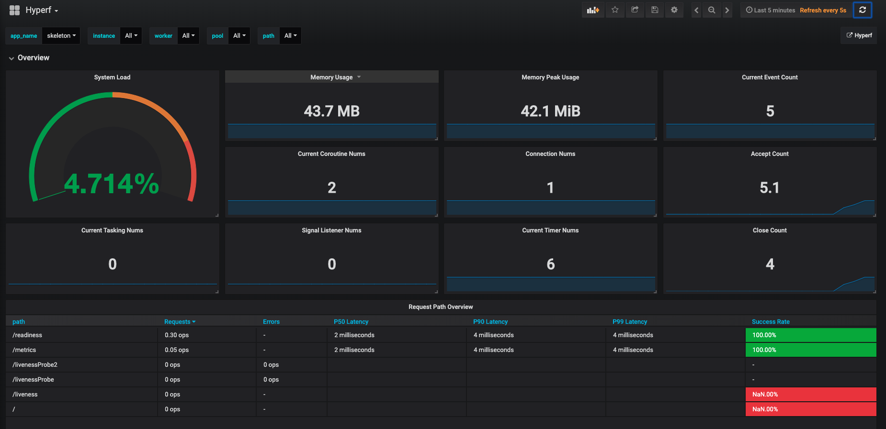

# 服務監控

微服務治理的一個核心需求便是服務可觀察性。作為微服務的牧羊人，要做到時刻掌握各項服務的健康狀態，並非易事。雲原生時代這一領域內湧現出了諸多解決方案。本組件對可觀察性當中的重要支柱遙測與監控進行了抽象，方便使用者與既有基礎設施快速結合，同時避免供應商鎖定。

## 安裝

### 通過 Composer 安裝組件

```bash
composer require hyperf/metric
```

Metric 支持 [Prometheus](https://prometheus.io/)、[StatsD](https://github.com/statsd/statsd) 和 [InfluxDB](http://influxdb.com)，可以執行下面的命令安裝對應的依賴：

```bash
# Prometheus
composer require promphp/prometheus_client_php
# StatsD 所需依賴
composer require domnikl/statsd
# InfluxDB 所需依賴 
composer require influxdb/influxdb-php 
```

### 增加組件配置

如文件不存在，可執行下面的命令增加 `config/autoload/metric.php` 配置文件：

```bash
php bin/hyperf.php vendor:publish hyperf/metric
```

## 使用

### 配置

#### 選項

`default`：配置文件內的 `default` 對應的值則為使用的驅動名稱。驅動的具體配置在 `metric` 項下定義，使用與 `key` 相同的驅動。

```php
'default' => env('METRIC_DRIVER', 'prometheus'),
```

* `use_standalone_process`: 是否使用 `獨立監控進程`。推薦開啓。關閉後將在 `Worker 進程` 中處理指標收集與上報。

```php
'use_standalone_process' => env('TELEMETRY_USE_STANDALONE_PROCESS', true),
```

* `enable_default_metric`: 是否統計默認指標。默認指標包括內存佔用、系統 CPU 負載以及 Swoole Server 指標和 Swoole Coroutine 指標。

```php
'enable_default_metric' => env('TELEMETRY_ENABLE_DEFAULT_TELEMETRY', true),
```

`default_metric_interval`: 默認指標推送週期，單位為秒，下同。
```php
'default_metric_interval' => env('DEFAULT_METRIC_INTERVAL', 5),
```
#### 配置 Prometheus

使用 Prometheus 時，在配置文件中的 `metric` 項增加 Prometheus 的具體配置。

```php
use Hyperf\Metric\Adapter\Prometheus\Constants;

return [
    'default' => env('METRIC_DRIVER', 'prometheus'),
    'use_standalone_process' => env('TELEMETRY_USE_STANDALONE_PROCESS', true),
    'enable_default_metric' => env('TELEMETRY_ENABLE_DEFAULT_TELEMETRY', true),
    'default_metric_interval' => env('DEFAULT_METRIC_INTERVAL', 5),
    'metric' => [
        'prometheus' => [
            'driver' => Hyperf\Metric\Adapter\Prometheus\MetricFactory::class,
            'mode' => Constants::SCRAPE_MODE,
            'namespace' => env('APP_NAME', 'skeleton'),
            'scrape_host' => env('PROMETHEUS_SCRAPE_HOST', '0.0.0.0'),
            'scrape_port' => env('PROMETHEUS_SCRAPE_PORT', '9502'),
            'scrape_path' => env('PROMETHEUS_SCRAPE_PATH', '/metrics'),
            'push_host' => env('PROMETHEUS_PUSH_HOST', '0.0.0.0'),
            'push_port' => env('PROMETHEUS_PUSH_PORT', '9091'),
            'push_interval' => env('PROMETHEUS_PUSH_INTERVAL', 5),
        ],
    ],
];
```

Prometheus 有兩種工作模式，爬模式與推模式（通過 Prometheus Pushgateway ），本組件均可支持。

使用爬模式（Prometheus 官方推薦）時需設置：

```php
'mode' => Constants::SCRAPE_MODE
```

並配置爬取地址 `scrape_host`、爬取端口 `scrape_port`、爬取路徑 `scrape_path`。Prometheus 可以在對應配置下以 HTTP 訪問形式拉取全部指標。

> 注意：異步風格下，爬模式必須啓用獨立進程，即 `use_standalone_process = true`。

使用推模式時需設置：

```php
'mode' => Constants::PUSH_MODE
```

並配置推送地址 `push_host`、推送端口 `push_port`、推送間隔 `push_interval`。只建議離線任務使用推模式。

因為基礎設置的差異性，可能以上模式都無法滿足需求。本組件還支持自定義模式。在自定義模式下，組件只負責指標的收集，具體的上報需要使用者自行處理。

```php
'mode' => Constants::CUSTOM_MODE
```
例如，您可能希望通過自定義的路由上報指標，或希望將指標存入 Redis 中，由其他獨立服務負責指標的集中上報等。[自定義上報](#自定義上報)一節包含了相應的示例。

#### 配置 StatsD

使用 StatsD 時，在配置文件中的 `metric` 項增加 StatsD 的具體配置。

```php
return [
    'default' => env('METRIC_DRIVER', 'statd'),
    'use_standalone_process' => env('TELEMETRY_USE_STANDALONE_PROCESS', true),
    'enable_default_metric' => env('TELEMETRY_ENABLE_DEFAULT_TELEMETRY', true),
    'metric' => [
        'statsd' => [
            'driver' => Hyperf\Metric\Adapter\StatsD\MetricFactory::class,
            'namespace' => env('APP_NAME', 'skeleton'),
            'udp_host' => env('STATSD_UDP_HOST', '127.0.0.1'),
            'udp_port' => env('STATSD_UDP_PORT', '8125'),
            'enable_batch' => env('STATSD_ENABLE_BATCH', true),
            'push_interval' => env('STATSD_PUSH_INTERVAL', 5),
            'sample_rate' => env('STATSD_SAMPLE_RATE', 1.0),
        ],
    ],
];
```

StatsD 目前只支持 UDP 模式，需要配置 UDP 地址 `udp_host`，UDP 端口 `udp_port`、是否批量推送 `enable_batch`（減少請求次數）、批量推送間隔 `push_interval` 以及採樣率 `sample_rate` 。

#### 配置 InfluxDB

使用 InfluxDB 時，在配置文件中的 `metric` 項增加 InfluxDB 的具體配置。

```php
return [
    'default' => env('METRIC_DRIVER', 'influxdb'),
    'use_standalone_process' => env('TELEMETRY_USE_STANDALONE_PROCESS', true),
    'enable_default_metric' => env('TELEMETRY_ENABLE_DEFAULT_TELEMETRY', true),
    'metric' => [
        'influxdb' => [
            'driver' => Hyperf\Metric\Adapter\InfluxDB\MetricFactory::class,
            'namespace' => env('APP_NAME', 'skeleton'),
            'host' => env('INFLUXDB_HOST', '127.0.0.1'),
            'port' => env('INFLUXDB_PORT', '8086'),
            'username' => env('INFLUXDB_USERNAME', ''),
            'password' => env('INFLUXDB_PASSWORD', ''),
            'dbname' => env('INFLUXDB_DBNAME', true),
            'push_interval' => env('INFLUXDB_PUSH_INTERVAL', 5),
        ],
    ],
];
```

InfluxDB 使用默認的 HTTP 模式，需要配置地址 `host`，UDP 端口 `port`、用户名  `username`、密碼 `password`、`dbname` 數據表以及批量推送間隔 `push_interval`。

### 基本抽象

遙測組件對常用的三種數據類型進行了抽象，以確保解耦具體實現。

三種類型分別為：

計數器(Counter): 用於描述單向遞增的某種指標。如 HTTP 請求計數。

```php
interface CounterInterface
{
    public function with(string ...$labelValues): self;

    public function add(int $delta);
}
```

測量器(Gauge)：用於描述某種隨時間發生增減變化的指標。如連接池內的可用連接數。

```php
interface GaugeInterface
{
    public function with(string ...$labelValues): self;

    public function set(float $value);

    public function add(float $delta);
}
```

* 直方圖(Histogram)：用於描述對某一事件的持續觀測後產生的統計學分佈，通常表示為百分位數或分桶。如 HTTP 請求延遲。

```php
interface HistogramInterface
{
    public function with(string ...$labelValues): self;

    public function put(float $sample);
}
```

### 配置中間件

配置完驅動之後，只需配置一下中間件就能啓用請求 Histogram 統計功能。
打開 `config/autoload/middlewares.php` 文件，示例為在 `http` Server 中啓用中間件。

```php
<?php

declare(strict_types=1);

return [
    'http' => [
        \Hyperf\Metric\Middleware\MetricMiddleware::class,
    ],
];
```
> 本中間件中統計維度包含 `request_status`、`request_path`、`request_method`。如果您的 `request_path` 過多，則建議重寫本中間件，去掉 `request_path` 維度，否則過高的基數會導致內存溢出。

### 自定義使用

通過 HTTP 中間件遙測僅僅是本組件用途的冰山一角，您可以注入 `Hyperf\Metric\Contract\MetricFactoryInterface` 類來自行遙測業務數據。比如：創建的訂單數量、廣告的點擊數量等。

```php
<?php

declare(strict_types=1);

namespace App\Controller;

use App\Model\Order;
use Hyperf\Di\Annotation\Inject;
use Hyperf\Metric\Contract\MetricFactoryInterface;

class IndexController extends AbstractController
{
    #[Inject]
    private MetricFactoryInterface $metricFactory;

    public function create(Order $order)
    {
        $counter = $this->metricFactory->makeCounter('order_created', ['order_type']);
        $counter->with($order->type)->add(1);
        // 訂單邏輯...
    }

}
```

`MetricFactoryInterface` 中包含如下工廠方法來生成對應的三種基本統計類型。

```php
public function makeCounter($name, $labelNames): CounterInterface;

public function makeGauge($name, $labelNames): GaugeInterface;

public function makeHistogram($name, $labelNames): HistogramInterface;
```

上述例子是統計請求範圍內的產生的指標。有時候我們需要統計的指標是面向完整生命週期的，比如統計異步隊列長度或庫存商品數量。此種場景下可以監聽 `MetricFactoryReady` 事件。

```php
<?php

declare(strict_types=1);

namespace App\Listener;

use Hyperf\Event\Contract\ListenerInterface;
use Hyperf\Metric\Event\MetricFactoryReady;
use Psr\Container\ContainerInterface;
use Redis;

class OnMetricFactoryReady implements ListenerInterface
{
    protected ContainerInterface $container;

    public function __construct(ContainerInterface $container)
    {
        $this->container = $container;
    }

    public function listen(): array
    {
        return [
            MetricFactoryReady::class,
        ];
    }

    public function process(object $event)
    {
        $redis = $this->container->get(Redis::class);
        $gauge = $event
                    ->factory
                    ->makeGauge('queue_length', ['driver'])
                    ->with('redis');
        while (true) {
            $length = $redis->llen('queue');
            $gauge->set($length);
            sleep(1);
        }
    }
}
```

> 工程上講，直接從 Redis 查詢隊列長度不太合適，應該通過隊列驅動 `DriverInterface` 接口下的 `info()` 方法來獲取隊列長度。這裏只做簡易演示。您可以在本組件源碼的`src/Listener` 文件夾下找到完整例子。

### 註解

您可以使用 `#[Counter(name="stat_name_here")]` 和 `#[Histogram(name="stat_name_here")]` 來統計切面的調用次數和運行時間。

關於註解的使用請參閲[註解章節](zh-hk/annotation)。

### 自定義 Histogram Bucket

> 本節只適用於 Prometheus 驅動

當您在使用 Prometheus 的 Histogram 時，有時會有自定義 Bucket 的需求。您可以在服務啓動前，依賴注入 Registry 並自行註冊 Histogram ，設置所需 Bucket 。稍後使用時 `MetricFactory` 就會調用您註冊好同名 Histogram 。示例如下：

```php
<?php

namespace App\Listener;

use Hyperf\Config\Annotation\Value;
use Hyperf\Event\Contract\ListenerInterface;
use Hyperf\Framework\Event\BeforeMainServerStart;
use Prometheus\CollectorRegistry;

class OnMainServerStart implements ListenerInterface
{
    protected $registry;

    public function __construct(CollectorRegistry $registry)
    {
        $this->registry = $registry;
    }

    public function listen(): array
    {
        return [
            BeforeMainServerStart::class,
        ];
    }

    public function process(object $event)
    {
        $this->registry->registerHistogram(
            config("metric.metric.prometheus.namespace"), 
            'test',
            'help_message', 
            ['labelName'], 
            [0.1, 1, 2, 3.5]
        );
    }
}
```
之後您使用 `$metricFactory->makeHistogram('test')` 時返回的就是您提前註冊好的 Histogram 了。

### 自定義上報

> 本節只適用於 Prometheus 驅動

設置組件的 Promethues 驅動工作模式為自定義模式（ `Constants::CUSTOM_MODE` ）後，您可以自由的處理指標上報。在本節中，我們展示如何將指標存入 Redis 中，然後在 Worker 中添加一個新的 HTTP 路由，返回 Prometheus 渲染後的指標。

#### 使用 Redis 存儲指標

指標的存儲介質由 `Prometheus\Storage\Adapter` 接口定義。默認使用內存存儲。我們可以在 `config/autoload/dependencies.php` 中更換為 Redis 存儲。

```php
<?php

return [
    Prometheus\Storage\Adapter::class => Hyperf\Metric\Adapter\Prometheus\RedisStorageFactory::class,
];
```

#### 在 Worker 中添加 /metrics 路由

在 config/routes.php 中添加 Prometheus 路由。

> 注意若要在 Worker 下獲取指標，需要您自行處理 Worker 之間狀態共享問題。方法之一就是將狀態按上文所述方式存儲於 Redis 。

```php
<?php

use Hyperf\HttpServer\Router\Router;

Router::get('/metrics', function(){
    $registry = Hyperf\Context\ApplicationContext::getContainer()->get(Prometheus\CollectorRegistry::class);
    $renderer = new Prometheus\RenderTextFormat();
    return $renderer->render($registry->getMetricFamilySamples());
});
```

## 在 Grafana 創建控制枱

> 本節只適用於 Prometheus 驅動

如果您啓用了默認指標，`Hyperf/Metric` 為您準備了一個開箱即用的 Grafana 控制枱。下載控制枱 [json 文件](https://cdn.jsdelivr.net/gh/hyperf/hyperf/src/metric/grafana.json)，導入 Grafana 中即可使用。



## 注意事項

- 如需在 `hyperf/command` 自定義命令中使用本組件收集指標，需要在啓動命令時添加命令行參數: `--enable-event-dispatcher`。

