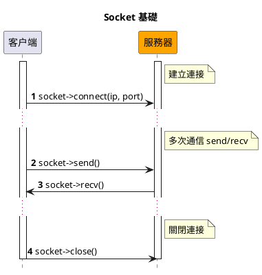
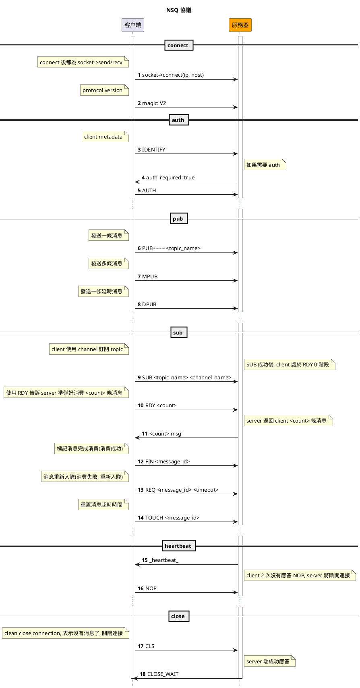

# NSQ

[NSQ](https://nsq.io) 是一個由 Go 語言編寫的開源、輕量級、高性能的實時分佈式消息中間件。

## 安裝

```bash
composer require hyperf/nsq
```

## 使用

### 配置

NSQ 組件的配置文件默認位於 `config/autoload/nsq.php` 內，如該文件不存在，可通過 `php bin/hyperf.php vendor:publish hyperf/nsq` 命令來將發佈對應的配置文件。

默認配置文件如下：

```php
<?php
return [
    'default' => [
        'host' => '127.0.0.1',
        'port' => 4150,
        'pool' => [
            'min_connections' => 1,
            'max_connections' => 10,
            'connect_timeout' => 10.0,
            'wait_timeout' => 3.0,
            'heartbeat' => -1,
            // 因為 Nsq 服務默認的閒置時間是 60s，故框架維護的最大閒置時間應小於 60s
            'max_idle_time' => 30.0,
        ],
    ],
];
```

### 創建消費者

通過 `gen:nsq-consumer` 命令可以快速的生成一個 消費者(Consumer) 對消息進行消費。

```bash
php bin/hyperf.php gen:nsq-consumer DemoConsumer
```

您也可以通過使用 `Hyperf\Nsq\Annotation\Consumer` 註解來對一個 `Hyperf/Nsq/AbstractConsumer` 抽象類的子類進行聲明，來完成一個 消費者(Consumer) 的定義，其中`Hyperf\Nsq\Annotation\Consumer` 註解和抽象類均包含以下屬性：
 
|   配置  |  類型  |  註解或抽象類默認值 |       備註       |
|:-------:|:------:|:------:|:----------------:|
|  topic  | string |   ''   |  要監聽的 topic   |
| channel | string |   ''   |  要監聽的 channel |
|   name  | string | NsqConsumer |  消費者的名稱     |
|   nums  |  int   |   1    |  消費者的進程數   |
|   pool  | string |   default   |  消費者對應的連接，對應配置文件的 key |

這些註解屬性是可選的，因為 `Hyperf/Nsq/AbstractConsumer` 抽象類中也分別定義了對應的成員屬性以及 getter 和 setter，當不對註解屬性進行定義時，會使用抽象類的屬性默認值。

```php
<?php

declare(strict_types=1);

namespace App\Nsq\Consumer;

use Hyperf\Nsq\AbstractConsumer;
use Hyperf\Nsq\Annotation\Consumer;
use Hyperf\Nsq\Message;
use Hyperf\Nsq\Result;

#[Consumer(topic: "hyperf", channel: "hyperf", name: "DemoNsqConsumer", nums: 1)]
class DemoNsqConsumer extends AbstractConsumer
{
    public function consume(Message $payload): string 
    {
        var_dump($payload->getBody());

        return Result::ACK;
    }
}
```

### 禁止消費進程自啓

默認情況下，使用了 `#[Consumer]` 註解定義後，框架會在啓動時自動創建子進程來啓動消費者，並且會在子進程異常退出後，自動重新拉起。但如果在處於開發階段進行某些調試工作時，可能會因為消費者的自動消費導致調試的不便。

在這種情況下，您可通過全局關閉和局部關閉兩種形式來控制消費進程的自啓。

#### 全局關閉

您可以在默認配置文件 `config/autoload/nsq.php` 中，將對應連接的 `enable` 選項設置為 `false`，即代表該連接下的所有消費者進程都關閉自啓功能。

#### 局部關閉

當您只需要關閉個別消費進程的自啓功能，只需要在對應的消費者中重寫父類方法 `isEnable()` 並返回 `false` 即可關閉此消費者的自啓功能；

```php
<?php

declare(strict_types=1);

namespace App\Nsq\Consumer;

use Hyperf\Nsq\AbstractConsumer;
use Hyperf\Nsq\Annotation\Consumer;
use Hyperf\Nsq\Message;
use Hyperf\Nsq\Result;
use Psr\Container\ContainerInterface;

#[Consumer(topic: "demo_topic", channel: "demo_channel", name: "DemoConsumer", nums: 1)]
class DemoConsumer extends AbstractConsumer
{
    public function __construct(ContainerInterface $container)
    {
        parent::__construct($container);
    }

    public function isEnable(): bool 
    {
        return false;
    }

    public function consume(Message $payload): string
    {
        $body = json_decode($payload->getBody(), true);
        var_dump($body);
        return Result::ACK;
    }
}
```

### 投遞消息

您可以通過調用 `Hyperf\Nsq\Nsq::publish(string $topic, $message, float $deferTime = 0.0)` 方法來向 NSQ 投遞消息, 下面是在 Command 進行消息投遞的一個示例：

```php
<?php

declare(strict_types=1);

namespace App\Command;

use Hyperf\Command\Command as HyperfCommand;
use Hyperf\Command\Annotation\Command;
use Hyperf\Nsq\Nsq;

#[Command]
class NsqCommand extends HyperfCommand
{
    protected $name = 'nsq:pub';

    public function handle()
    {
        /** @var Nsq $nsq */
        $nsq = make(Nsq::class);
        $topic = 'hyperf';
        $message = 'This is message at ' . time();
        $nsq->publish($topic, $message);

        $this->line('success', 'info');
    }
}
```

### 一次性投遞多條消息

`Hyperf\Nsq\Nsq::publish(string $topic, $message, float $deferTime = 0.0)` 方法的第二個參數除了可以傳遞一個字符串外，還可以傳遞一個字符串數組，來實現一次性向一個 Topic 投遞多條消息的功能，示例如下：

```php
<?php

declare(strict_types=1);

namespace App\Command;

use Hyperf\Command\Command as HyperfCommand;
use Hyperf\Command\Annotation\Command;
use Hyperf\Nsq\Nsq;

#[Command]
class NsqCommand extends HyperfCommand
{
    protected $name = 'nsq:pub';

    public function handle()
    {
        /** @var Nsq $nsq */
        $nsq = make(Nsq::class);
        $topic = 'hyperf';
        $messages = [
            'This is message 1 at ' . time(),
            'This is message 2 at ' . time(),
            'This is message 3 at ' . time(),
        ];
        $nsq->publish($topic, $messages);

        $this->line('success', 'info');
    }
}
```

### 投遞延遲消息

當您希望您投遞的消息在特定的時間後再去消費，也可通過對 `Hyperf\Nsq\Nsq::publish(string $topic, $message, float $deferTime = 0.0)` 方法的第三個參數傳遞對應的延遲時長，單位為秒，示例如下：

```php
<?php

declare(strict_types=1);

namespace App\Command;

use Hyperf\Command\Command as HyperfCommand;
use Hyperf\Command\Annotation\Command;
use Hyperf\Nsq\Nsq;

#[Command]
class NsqCommand extends HyperfCommand
{
    protected $name = 'nsq:pub';

    public function handle()
    {
        /** @var Nsq $nsq */
        $nsq = make(Nsq::class);
        $topic = 'hyperf';
        $message = 'This is message at ' . time();
        $deferTime = 5.0;
        $nsq->publish($topic, $message, $deferTime);

        $this->line('success', 'info');
    }
}
```

### NSQD HTTP API

> NSQD HTTP API Refer: https://nsq.io/components/nsqd.html

組件對 NSQD HTTP API 進行了封裝，您可以很方便的實現對 NSQD HTTP API 的調用。 

比如，當您需要刪除某個 `Topic` 時，可以執行以下代碼：

```php
<?php
use Hyperf\Context\ApplicationContext;
use Hyperf\Nsq\Nsqd\Topic;

$container = ApplicationContext::getContainer();

$client = $container->get(Topic::class);

$client->delete('hyperf.test');
```

- `Hyperf\Nsq\Api\Topic` 類對應 `topic` 相關的 API；
- `Hyperf\Nsq\Api\Channle` 類對應 `channel` 相關的 API；
- `Hyperf\Nsq\Api\Api` 類對應 `ping`、`stats`、`config`、`debug` 等相關的 API；

## NSQ 協議

> https://nsq.io/clients/tcp_protocol_spec.html

- Socket 基礎



- NSQ 協議流程


