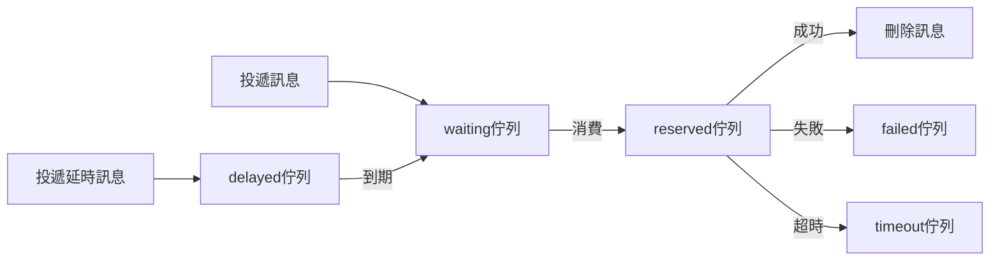

# 非同步佇列

非同步佇列區別於 `RabbitMQ` `Kafka` 等訊息佇列，它只提供一種 `非同步處理` 和 `非同步延時處理` 的能力，並 **不能** 嚴格地保證訊息的持久化和 **不支援** ACK 應答機制。

## 安裝

```bash
composer require hyperf/async-queue
```

## 配置

配置檔案位於 `config/autoload/async_queue.php`，如檔案不存在可自行建立。

> 暫時只支援 `Redis Driver` 驅動。

|       配置       |   型別    |                   預設值                    |                  備註                   |
|:----------------:|:---------:|:-------------------------------------------:|:---------------------------------------:|
|      driver      |  string   | Hyperf\AsyncQueue\Driver\RedisDriver::class |                   無                    |
|     channel      |  string   |                    queue                    |                佇列字首                 |
|    redis.pool    |  string   |                    default                  |                redis 連線池              |
|     timeout      |    int    |                      2                      |           pop 訊息的超時時間            |
|  retry_seconds   | int,array |                      5                      |           失敗後重新嘗試間隔            |
|  handle_timeout  |    int    |                     10                      |            訊息處理超時時間             |
|    processes     |    int    |                      1                      |               消費程序數                |
| concurrent.limit |    int    |                      1                      |             同時處理訊息數              |
|   max_messages   |    int    |                      0                      | 程序重啟所需最大處理的訊息數 預設不重啟 |

```php
<?php

return [
    'default' => [
        'driver' => Hyperf\AsyncQueue\Driver\RedisDriver::class,
        'redis' => [
            'pool' => 'default'
        ],
        'channel' => 'queue',
        'timeout' => 2,
        'retry_seconds' => 5,
        'handle_timeout' => 10,
        'processes' => 1,
        'concurrent' => [
            'limit' => 5,
        ],
    ],
];

```

`retry_seconds` 也可以傳入陣列，根據重試次數相應修改重試時間，例如

```php
<?php

return [
    'default' => [
        'driver' => Hyperf\AsyncQueue\Driver\RedisDriver::class,
        'channel' => 'queue',
        'retry_seconds' => [1, 5, 10, 20],
        'processes' => 1,
    ],
];

```

## 使用

### 消費訊息

元件已經提供了預設子程序，只需要將它配置到 `config/autoload/processes.php` 中即可。

```php
<?php

return [
    Hyperf\AsyncQueue\Process\ConsumerProcess::class,
];

```

當然，您也可以將以下 `Process` 新增到自己的專案中。

```php
<?php

declare(strict_types=1);

namespace App\Process;

use Hyperf\AsyncQueue\Process\ConsumerProcess;
use Hyperf\Process\Annotation\Process;

/**
 * @Process(name="async-queue")
 */
class AsyncQueueConsumer extends ConsumerProcess
{
}
```

### 生產訊息

#### 傳統方式

這種模式會把物件直接序列化然後存到 `Redis` 等佇列中，所以為了保證序列化後的體積，儘量不要將 `Container`，`Config` 等設定為成員變數。

比如以下 `Job` 的定義，是 **不可取** 的

```php
<?php

declare(strict_types=1);

namespace App\Job;

use Hyperf\AsyncQueue\Job;
use Psr\Container\ContainerInterface;

class ExampleJob extends Job
{
    public $container;

    public $params;

    public function __construct(ContainerInterface $container, $params)
    {
        $this->container = $container;
        $this->params = $params;
    }

    public function handle()
    {
        // 根據引數處理具體邏輯
        var_dump($this->params);
    }
}

$job = make(ExampleJob::class);
```

正確的 `Job` 應該是隻有需要處理的資料，其他相關資料，可以在 `handle` 方法中重新獲取，如下。

```php
<?php

declare(strict_types=1);

namespace App\Job;

use Hyperf\AsyncQueue\Job;

class ExampleJob extends Job
{
    public $params;

    public function __construct($params)
    {
        // 這裡最好是普通資料，不要使用攜帶 IO 的物件，比如 PDO 物件
        $this->params = $params;
    }

    public function handle()
    {
        // 根據引數處理具體邏輯
        // 通過具體引數獲取模型等
        var_dump($this->params);
    }
}
```

正確定義完 `Job` 後，我們需要寫一個專門投遞訊息的 `Service`，程式碼如下。

```php
<?php

declare(strict_types=1);

namespace App\Service;

use App\Job\ExampleJob;
use Hyperf\AsyncQueue\Driver\DriverFactory;
use Hyperf\AsyncQueue\Driver\DriverInterface;

class QueueService
{
    /**
     * @var DriverInterface
     */
    protected $driver;

    public function __construct(DriverFactory $driverFactory)
    {
        $this->driver = $driverFactory->get('default');
    }

    /**
     * 生產訊息.
     * @param $params 資料
     * @param int $delay 延時時間 單位秒
     */
    public function push($params, int $delay = 0): bool
    {
        // 這裡的 `ExampleJob` 會被序列化存到 Redis 中，所以內部變數最好只傳入普通資料
        // 同理，如果內部使用了註解 @Value 會把對應物件一起序列化，導致訊息體變大。
        // 所以這裡也不推薦使用 `make` 方法來建立 `Job` 物件。
        return $this->driver->push(new ExampleJob($params), $delay);
    }
}
```

投遞訊息

接下來，呼叫我們的 `QueueService` 投遞訊息即可。

```php
<?php

declare(strict_types=1);

namespace App\Controller;

use App\Service\QueueService;
use Hyperf\Di\Annotation\Inject;
use Hyperf\HttpServer\Annotation\AutoController;

/**
 * @AutoController
 */
class QueueController extends Controller
{
    /**
     * @Inject
     * @var QueueService
     */
    protected $service;

    /**
     * 傳統模式投遞訊息
     */
    public function index()
    {
        $this->service->push([
            'group@hyperf.io',
            'https://doc.hyperf.io',
            'https://www.hyperf.io',
        ]);

        return 'success';
    }
}
```

#### 註解方式

框架除了傳統方式投遞訊息，還提供了註解方式。

讓我們重寫上述 `QueueService`，直接將 `ExampleJob` 的邏輯搬到 `example` 方法中，並加上對應註解 `AsyncQueueMessage`，具體程式碼如下。

```php
<?php

declare(strict_types=1);

namespace App\Service;

use Hyperf\AsyncQueue\Annotation\AsyncQueueMessage;

class QueueService
{
    /**
     * @AsyncQueueMessage
     */
    public function example($params)
    {
        // 需要非同步執行的程式碼邏輯
        var_dump($params);
    }
}

```

投遞訊息

註解模式投遞訊息就跟平常呼叫方法一致，程式碼如下。

```php
<?php

declare(strict_types=1);

namespace App\Controller;

use App\Service\QueueService;
use Hyperf\Di\Annotation\Inject;
use Hyperf\HttpServer\Annotation\AutoController;

/**
 * @AutoController
 */
class QueueController extends Controller
{
    /**
     * @Inject
     * @var QueueService
     */
    protected $service;

    /**
     * 註解模式投遞訊息
     */
    public function example()
    {
        $this->service->example([
            'group@hyperf.io',
            'https://doc.hyperf.io',
            'https://www.hyperf.io',
        ]);

        return 'success';
    }
}
```

## 事件

|   事件名稱   |        觸發時機         |                         備註                         |
|:------------:|:-----------------------:|:----------------------------------------------------:|
| BeforeHandle |     處理訊息前觸發      |                                                      |
| AfterHandle  |     處理訊息後觸發      |                                                      |
| FailedHandle |   處理訊息失敗後觸發    |                                                      |
| RetryHandle  |   重試處理訊息前觸發    |                                                      |
| QueueLength  | 每處理 500 個訊息後觸發 | 使用者可以監聽此事件，判斷失敗或超時佇列是否有訊息積壓 |

### QueueLengthListener

框架自帶了一個記錄佇列長度的監聽器，預設不開啟，您如果需要，可以自行新增到 `listeners` 配置中。

```php
<?php

declare(strict_types=1);

return [
    Hyperf\AsyncQueue\Listener\QueueLengthListener::class
];
```

## 任務執行流轉流程

任務執行流轉流程主要包括以下幾個佇列:

|  佇列名  |                   備註                    |
|:--------:|:-----------------------------------------:|
| waiting  |              等待消費的佇列               |
| reserved |              正在消費的佇列               |
| delayed  |              延遲消費的佇列               |
|  failed  |              消費失敗的佇列               |
| timeout  | 消費超時的佇列 (雖然超時，但可能執行成功) |

佇列流轉順序如下: 



## 配置多個非同步佇列

當您需要使用多個佇列來區分消費高頻和低頻或其他種類的訊息時，可以配置多個佇列。

1. 新增配置

```php
<?php

return [
    'default' => [
        'driver' => Hyperf\AsyncQueue\Driver\RedisDriver::class,
        'channel' => '{queue}',
        'timeout' => 2,
        'retry_seconds' => 5,
        'handle_timeout' => 10,
        'processes' => 1,
        'concurrent' => [
            'limit' => 2,
        ],
    ],
    'other' => [
        'driver' => Hyperf\AsyncQueue\Driver\RedisDriver::class,
        'channel' => '{other.queue}',
        'timeout' => 2,
        'retry_seconds' => 5,
        'handle_timeout' => 10,
        'processes' => 1,
        'concurrent' => [
            'limit' => 2,
        ],
    ],
];

```

2. 新增消費程序

```php
<?php

declare(strict_types=1);

namespace App\Process;

use Hyperf\AsyncQueue\Process\ConsumerProcess;
use Hyperf\Process\Annotation\Process;

/**
 * @Process()
 */
class ConsumerProcess extends ConsumerProcess
{
    /**
     * @var string
     */
    protected $queue = 'other';
}
```

3. 呼叫

```php
use Hyperf\AsyncQueue\Driver\DriverFactory;
use Hyperf\Utils\ApplicationContext;

$driver = ApplicationContext::getContainer()->get(DriverFactory::class)->get('other');
return $driver->push(new ExampleJob());
```

## 安全關閉

非同步佇列在終止時，如果正在進行消費邏輯，可能會導致出現錯誤。框架提供了 `DriverStopHandler` ，可以讓非同步佇列程序安全關閉。

安裝訊號處理器

```
composer require hyperf/signal
```

新增配置

```php
<?php

declare(strict_types=1);

return [
    'handlers' => [
        Hyperf\AsyncQueue\Signal\DriverStopHandler::class,
    ],
    'timeout' => 5.0,
];

```
