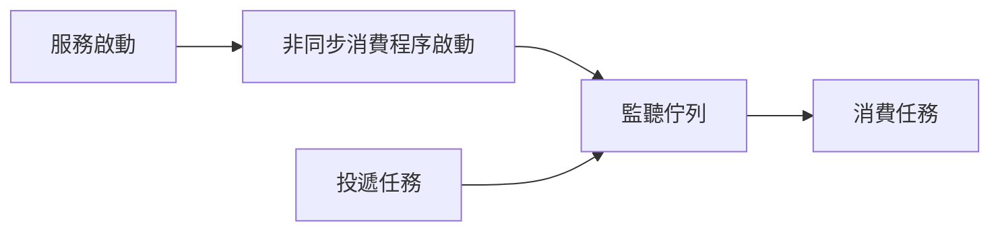
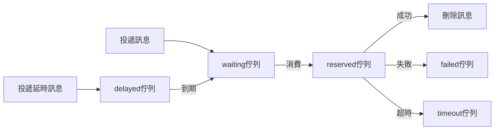

# 非同步佇列

非同步佇列區別於 `RabbitMQ` `Kafka` 等訊息佇列，它只提供一種 `非同步處理` 和 `非同步延時處理` 的能力，並 **不能** 嚴格地保證訊息的持久化和 **不支援** 完備的 ACK 應答機制。

## 安裝

```bash
composer require hyperf/async-queue
```

## 配置

配置檔案位於 `config/autoload/async_queue.php`，如該檔案不存在，可透過 `php bin/hyperf.php vendor:publish hyperf/async-queue` 命令來將釋出對應的配置檔案。

> 暫時只支援 `Redis Driver` 驅動。

|       配置       |   型別    |                   預設值                    |                  備註                   |
| :--------------: | :-------: | :-----------------------------------------: | :-------------------------------------: |
|      driver      |  string   | Hyperf\AsyncQueue\Driver\RedisDriver::class |                   無                    |
|     channel      |  string   |                    queue                    |                佇列字首                 |
|    redis.pool    |  string   |                   default                   |              redis 連線池               |
|     timeout      |    int    |                      2                      |           pop 訊息的超時時間            |
|  retry_seconds   | int,array |                      5                      |           失敗後重新嘗試間隔            |
|  handle_timeout  |    int    |                     10                      |            訊息處理超時時間             |
|    processes     |    int    |                      1                      |               消費程序數                |
| concurrent.limit |    int    |                     10                      |             同時處理訊息數              |
|   max_messages   |    int    |                      0                      | 程序重啟所需最大處理的訊息數 預設不重啟 |

```php
<?php

return [
    'default' => [
        'driver' => Hyperf\AsyncQueue\Driver\RedisDriver::class,
        'redis' => [
            'pool' => 'default'
        ],
        'channel' => 'queue',
        'timeout' => 2,
        'retry_seconds' => 5,
        'handle_timeout' => 10,
        'processes' => 1,
        'concurrent' => [
            'limit' => 10,
        ],
        'max_messages' => 0,
    ],
];

```

`retry_seconds` 也可以傳入陣列，根據重試次數相應修改重試時間，例如

```php
<?php

return [
    'default' => [
        'driver' => Hyperf\AsyncQueue\Driver\RedisDriver::class,
        'channel' => 'queue',
        'retry_seconds' => [1, 5, 10, 20],
        'processes' => 1,
    ],
];

```

## 工作原理

`ConsumerProcess` 是非同步消費程序，會根據使用者建立的 `Job` 或者使用 `#[AsyncQueueMessage]` 的程式碼塊，執行消費邏輯。
`Job` 和 `#[AsyncQueueMessage]` 都是需要投遞和執行的任務，即資料、消費邏輯都會在任務中定義。

- `Job` 類中成員變數即為待消費的資料，`handle()` 方法則為消費邏輯。
- `#[AsyncQueueMessage]` 註解的方法，建構函式傳入的資料即為待消費的資料，方法體則為消費邏輯。



## 使用

### 配置非同步消費程序

元件已經提供了預設 `非同步消費程序`，只需要將它配置到 `config/autoload/processes.php` 中即可。

```php
<?php

return [
    Hyperf\AsyncQueue\Process\ConsumerProcess::class,
];

```

當然，您也可以將以下 `Process` 新增到自己的專案中。

> 配置方式和註解方式，二選一即可。

```php
<?php

declare(strict_types=1);

namespace App\Process;

use Hyperf\AsyncQueue\Process\ConsumerProcess;
use Hyperf\Process\Annotation\Process;

#[Process(name: "async-queue")]
class AsyncQueueConsumer extends ConsumerProcess
{
}
```

### 如何使用多個配置

有的開發者會在特殊場景建立多個配置，比如某些訊息要優先處理，所以會放到更加清閒的隊列當中。例如以下配置

```php
<?php

return [
    'default' => [
        'driver' => Hyperf\AsyncQueue\Driver\RedisDriver::class,
        'redis' => [
            'pool' => 'default'
        ],
        'channel' => 'queue',
        'timeout' => 2,
        'retry_seconds' => 5,
        'handle_timeout' => 10,
        'processes' => 1,
        'concurrent' => [
            'limit' => 5,
        ],
    ],
    'fast' => [
        'driver' => Hyperf\AsyncQueue\Driver\RedisDriver::class,
        'redis' => [
            'pool' => 'default'
        ],
        'channel' => '{queue:fast}',
        'timeout' => 2,
        'retry_seconds' => 5,
        'handle_timeout' => 10,
        'processes' => 1,
        'concurrent' => [
            'limit' => 5,
        ],
    ],
];

```

但是，我們預設的 `Hyperf\AsyncQueue\Process\ConsumerProcess` 只會處理 `default` 配置，所以我們需要建立一個新的 `Process`

```php
<?php

declare(strict_types=1);

namespace App\Process;

use Hyperf\AsyncQueue\Process\ConsumerProcess;
use Hyperf\Process\Annotation\Process;

#[Process(name: "async-queue")]
class AsyncQueueConsumer extends ConsumerProcess
{
    protected string $queue = 'fast';
}
```

### 生產訊息

#### 傳統方式

這種模式會把物件直接序列化然後存到 `Redis` 等佇列中，所以為了保證序列化後的體積，儘量不要將 `Container`，`Config` 等設定為成員變數。

比如以下 `Job` 的定義，是 **不可取** 的，同理 `#[Inject]` 也是如此。

> 因為 Job 會被序列化，所以成員變數不要包含 匿名函式 等 無法被序列化 的內容，如果不清楚哪些內容無法被序列化，儘量使用註解方式。

```php
<?php

declare(strict_types=1);

namespace App\Job;

use Hyperf\AsyncQueue\Job;
use Psr\Container\ContainerInterface;

class ExampleJob extends Job
{
    public $container;

    public $params;

    public function __construct(ContainerInterface $container, $params)
    {
        $this->container = $container;
        $this->params = $params;
    }

    public function handle()
    {
        // 根據引數處理具體邏輯
        var_dump($this->params);
    }
}

$job = make(ExampleJob::class);
```

正確的 `Job` 應該是隻有需要處理的資料，其他相關資料，可以在 `handle` 方法中重新獲取，如下。

```php
<?php

declare(strict_types=1);

namespace App\Job;

use Hyperf\AsyncQueue\Job;

class ExampleJob extends Job
{
    public $params;
    
    /**
     * 任務執行失敗後的重試次數，即最大執行次數為 $maxAttempts+1 次
     */
    protected int $maxAttempts = 2;

    public function __construct($params)
    {
        // 這裡最好是普通資料，不要使用攜帶 IO 的物件，比如 PDO 物件
        $this->params = $params;
    }

    public function handle()
    {
        // 根據引數處理具體邏輯
        // 透過具體引數獲取模型等
        // 這裡的邏輯會在 ConsumerProcess 程序中執行
        var_dump($this->params);
    }
}
```

正確定義完 `Job` 後，我們需要寫一個專門投遞訊息的 `Service`，程式碼如下。

```php
<?php

declare(strict_types=1);

namespace App\Service;

use App\Job\ExampleJob;
use Hyperf\AsyncQueue\Driver\DriverFactory;
use Hyperf\AsyncQueue\Driver\DriverInterface;

class QueueService
{
    protected DriverInterface $driver;

    public function __construct(DriverFactory $driverFactory)
    {
        $this->driver = $driverFactory->get('default');
    }

    /**
     * 生產訊息.
     * @param $params 資料
     * @param int $delay 延時時間 單位秒
     */
    public function push($params, int $delay = 0): bool
    {
        // 這裡的 `ExampleJob` 會被序列化存到 Redis 中，所以內部變數最好只傳入普通資料
        // 同理，如果內部使用了註解 @Value 會把對應物件一起序列化，導致訊息體變大。
        // 所以這裡也不推薦使用 `make` 方法來建立 `Job` 物件。
        return $this->driver->push(new ExampleJob($params), $delay);
    }
}
```

投遞訊息

接下來，呼叫我們的 `QueueService` 投遞訊息即可。

```php
<?php

declare(strict_types=1);

namespace App\Controller;

use App\Service\QueueService;
use Hyperf\Di\Annotation\Inject;
use Hyperf\HttpServer\Annotation\AutoController;

#[AutoController]
class QueueController extends AbstractController
{
    #[Inject]
    protected QueueService $service;

    /**
     * 傳統模式投遞訊息
     */
    public function index()
    {
        $this->service->push([
            'group@hyperf.io',
            'https://doc.hyperf.io',
            'https://www.hyperf.io',
        ]);

        return 'success';
    }
}
```

#### 註解方式

框架除了傳統方式投遞訊息，還提供了註解方式。

> 註解方式會在非消費環境下自動投遞訊息到佇列，故，如果我們在佇列中使用註解方式時，則不會再次投遞到隊列當中，而是直接在本消費程序中執行。
> 如果仍然需要在佇列中投遞訊息，則可以在佇列中使用傳統模式投遞。

讓我們重寫上述 `QueueService`，直接將 `ExampleJob` 的邏輯搬到 `example` 方法中，並加上對應註解 `AsyncQueueMessage`，具體程式碼如下。

```php
<?php

declare(strict_types=1);

namespace App\Service;

use Hyperf\AsyncQueue\Annotation\AsyncQueueMessage;

class QueueService
{
    #[AsyncQueueMessage]
    public function example($params)
    {
        // 需要非同步執行的程式碼邏輯
        // 這裡的邏輯會在 ConsumerProcess 程序中執行
        var_dump($params);
    }
}

```

投遞訊息

註解模式投遞訊息就跟平常呼叫方法一致，程式碼如下。

```php
<?php

declare(strict_types=1);

namespace App\Controller;

use App\Service\QueueService;
use Hyperf\Di\Annotation\Inject;
use Hyperf\HttpServer\Annotation\AutoController;

#[AutoController]
class QueueController extends AbstractController
{
    #[Inject]
    protected QueueService $service;

    /**
     * 註解模式投遞訊息
     */
    public function example()
    {
        $this->service->example([
            'group@hyperf.io',
            'https://doc.hyperf.io',
            'https://www.hyperf.io',
        ]);

        return 'success';
    }
}
```

### 預設指令碼

Arguments:
  - queue_name: 佇列配置名，預設為 default

Options:
  - channel_name: 佇列名，例如失敗佇列 failed, 超時佇列 timeout

#### 展示當前佇列的訊息狀態

```shell
$ php bin/hyperf.php queue:info {queue_name}
```

#### 過載所有失敗/超時的訊息到待執行佇列

```shell
php bin/hyperf.php queue:reload {queue_name} -Q {channel_name}
```

#### 銷燬所有失敗/超時的訊息

```shell
php bin/hyperf.php queue:flush {queue_name} -Q {channel_name}
```

## 事件

|   事件名稱   |        觸發時機         |                          備註                          |
| :----------: | :---------------------: | :----------------------------------------------------: |
| BeforeHandle |     處理訊息前觸發      |                                                        |
| AfterHandle  |     處理訊息後觸發      |                                                        |
| FailedHandle |   處理訊息失敗後觸發    |                                                        |
| RetryHandle  |   重試處理訊息前觸發    |                                                        |
| QueueLength  | 每處理 500 個訊息後觸發 | 使用者可以監聽此事件，判斷失敗或超時佇列是否有訊息積壓 |

### QueueLengthListener

框架自帶了一個記錄佇列長度的監聽器，預設不開啟，您如果需要，可以自行新增到 `listeners` 配置中。

```php
<?php

declare(strict_types=1);

return [
    Hyperf\AsyncQueue\Listener\QueueLengthListener::class
];
```

### ReloadChannelListener

當訊息執行超時，或專案重啟導致訊息執行被中斷，最終都會被移動到 `timeout` 佇列中，只要您可以保證訊息執行是冪等的（同一個訊息執行一次，或執行多次，最終表現一致），
就可以開啟以下監聽器，框架會自動將 `timeout` 佇列中訊息移動到 `waiting` 佇列中，等待下次消費。

> 監聽器監聽 `QueueLength` 事件，預設執行 500 次訊息後觸發一次。

```php
<?php

declare(strict_types=1);

return [
    Hyperf\AsyncQueue\Listener\ReloadChannelListener::class
];
```

## 任務執行流轉流程

任務執行流轉流程主要包括以下幾個佇列:

|  佇列名  |                   備註                    |
| :------: | :---------------------------------------: |
| waiting  |              等待消費的佇列               |
| reserved |              正在消費的佇列               |
| delayed  |              延遲消費的佇列               |
|  failed  |              消費失敗的佇列               |
| timeout  | 消費超時的佇列 (雖然超時，但可能執行成功) |

佇列流轉順序如下: 



## 配置多個非同步佇列

當您需要使用多個佇列來區分消費高頻和低頻或其他種類的訊息時，可以配置多個佇列。

1. 新增配置

```php
<?php

return [
    'default' => [
        'driver' => Hyperf\AsyncQueue\Driver\RedisDriver::class,
        'channel' => '{queue}',
        'timeout' => 2,
        'retry_seconds' => 5,
        'handle_timeout' => 10,
        'processes' => 1,
        'concurrent' => [
            'limit' => 2,
        ],
    ],
    'other' => [
        'driver' => Hyperf\AsyncQueue\Driver\RedisDriver::class,
        'channel' => '{other.queue}',
        'timeout' => 2,
        'retry_seconds' => 5,
        'handle_timeout' => 10,
        'processes' => 1,
        'concurrent' => [
            'limit' => 2,
        ],
    ],
];

```

2. 新增消費程序

```php
<?php

declare(strict_types=1);

namespace App\Process;

use Hyperf\AsyncQueue\Process\ConsumerProcess;
use Hyperf\Process\Annotation\Process;

#[Process]
class OtherConsumerProcess extends ConsumerProcess
{
    protected string $queue = 'other';
}
```

3. 呼叫

```php
use Hyperf\AsyncQueue\Driver\DriverFactory;
use Hyperf\Context\ApplicationContext;

$driver = ApplicationContext::getContainer()->get(DriverFactory::class)->get('other');
return $driver->push(new ExampleJob());
```

## 安全關閉

非同步佇列在終止時，如果正在進行消費邏輯，可能會導致出現錯誤。框架提供了 `ProcessStopHandler` ，可以讓非同步佇列程序安全關閉。

> 當前訊號處理器並不適配於 CoroutineServer，如有需要請自行實現

安裝訊號處理器

```shell
composer require hyperf/signal
composer require hyperf/process
```

新增配置 `autoload/signal.php`

```php
<?php

declare(strict_types=1);

return [
    'handlers' => [
        Hyperf\Process\Handler\ProcessStopHandler::class,
    ],
    'timeout' => 5.0,
];

```

## 非同步驅動之間的區別

- Hyperf\AsyncQueue\Driver\RedisDriver::class

此非同步驅動會將整個 `JOB` 進行序列化，當投遞即時佇列後，會 `lpush` 到 `list` 結構中，投遞延時佇列，會 `zadd` 到 `zset` 結構中。
所以，如果 `Job` 的引數完全一致的情況，在延時佇列中就會出現後投遞的訊息 **覆蓋** 前面投遞的訊息的問題。
如果不想出現延時訊息覆蓋的情況，只需要在 `Job` 裡增加一個唯一的 `uniqid`，或者在使用 `註解` 的方法上增加一個 `uniqid` 的入參即可。
