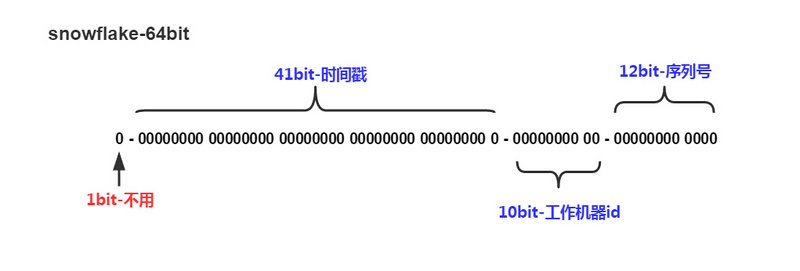

# Snowflake

## 演算法介紹

`Snowflake` 是由 Twitter 提出的一個分散式全域性唯一 ID 生成演算法，演算法生成 `ID` 的結果是一個 `64bit` 大小的長整，標準演算法下它的結構如下圖：



- `1 位`，不用。
  - 二進位制中最高位為符號位，我們生成的 `ID` 一般都是正整數，所以這個最高位固定是 0。
  
- `41 位`，用來記錄時間戳（毫秒）。
  - `41 位` 可以表示 `2^41 - 1` 個數字。
  - 也就是說 `41 位` 可以表示 `2^41 - 1` 個毫秒的值，轉化成單位年則是 `(2^41 - 1) / (1000 * 60 * 60 * 24 * 365)` 約為 `69` 年。
  
- `10 位`，用來記錄工作機器 `ID`。
  - 可以部署在 `2^10` 共 `1024` 個節點，包括 `5` 位 `DatacenterId` 和 `5` 位 `WorkerId`。
  
- `12 位`，序列號，用來記錄同毫秒內產生的不同 `id`。
  - `12 位` 可以表示的最大正整數是 `2^12 - 1` 共 `4095` 個數字，來表示同一機器同一時間截（毫秒)內產生的 `4095` 個 `ID` 序號。

`Snowflake` 可以保證：

 - 所有生成的 `ID` 按時間趨勢遞增。
 - 整個分散式系統內不會產生重複 `ID`（因為有 `DatacenterId (5 bits)` 和 `WorkerId (5 bits)` 來做區分）。
 
Hyperf 的 [hyperf/snowflake](https://github.com/hyperf/snowflake) 元件在設計上提供了很好的可擴充套件性，允許您透過簡單的擴充套件就能實現其它基於 Snowflake 的變體演算法。

## 安裝

```
composer require hyperf/snowflake
```

## 使用

框架提供了 `MetaGeneratorInterface` 和 `IdGeneratorInterface`，`MetaGeneratorInterface` 會生成 `ID` 的 `Meta` 檔案，`IdGeneratorInterface` 則會根據對應的 `Meta` 檔案生成 `分散式 ID`。

框架預設使用的 `MetaGeneratorInterface` 是基於 `Redis` 實現的 `毫秒級別生成器`。    
配置檔案位於 `config/autoload/snowflake.php`，如配置檔案不存在可透過執行 `php bin/hyperf.php vendor:publish hyperf/snowflake` 命令建立預設配置，配置檔案內容如下：

```php
<?php

declare(strict_types=1);

use Hyperf\Snowflake\MetaGenerator\RedisMilliSecondMetaGenerator;
use Hyperf\Snowflake\MetaGenerator\RedisSecondMetaGenerator;
use Hyperf\Snowflake\MetaGeneratorInterface;

return [
    'begin_second' => MetaGeneratorInterface::DEFAULT_BEGIN_SECOND,
    RedisMilliSecondMetaGenerator::class => [
        // Redis Pool
        'pool' => 'default',
        // 用於計算 WorkerId 的 Key 鍵
        'key' => RedisMilliSecondMetaGenerator::DEFAULT_REDIS_KEY
    ],
    RedisSecondMetaGenerator::class => [
        // Redis Pool
        'pool' => 'default',
        // 用於計算 WorkerId 的 Key 鍵
        'key' => RedisMilliSecondMetaGenerator::DEFAULT_REDIS_KEY
    ],
];

```

框架中使用 `Snowflake` 十分簡單，只需要從 `DI` 中取出 `IdGeneratorInterface` 物件即可。

```php
<?php
use Hyperf\Snowflake\IdGeneratorInterface;
use Hyperf\Context\ApplicationContext;

$container = ApplicationContext::getContainer();
$generator = $container->get(IdGeneratorInterface::class);

$id = $generator->generate();
```

當知道 `ID` 需要反推對應的 `Meta` 時，只需要呼叫 `degenerate` 即可。

```php
<?php
use Hyperf\Snowflake\IdGeneratorInterface;
use Hyperf\Context\ApplicationContext;

$container = ApplicationContext::getContainer();
$generator = $container->get(IdGeneratorInterface::class);

$meta = $generator->degenerate($id);
```

## 重寫 `Meta` 生成器

`分散式全域性唯一 ID` 的實現方式多種多樣，也有很多基於 `Snowflake` 演算法的變體演算法，雖然都是 `Snowflake` 演算法，但也不盡相同。比如有人可能會根據 `UserId` 生成 `Meta`，而非 `WorkerId`。接下來，讓我們實現一個簡單的 `MetaGenerator`。
簡單的來講，`UserId` 絕對會超過 `10 bit`，所以預設的 `DataCenterId` 和 `WorkerId` 肯定是裝不過來的，所以就需要對 `UserId` 取模。

```php
<?php

declare(strict_types=1);

use Hyperf\Snowflake\IdGenerator\SnowflakeIdGenerator;

class UserDefinedIdGenerator
{
    protected SnowflakeIdGenerator $idGenerator;

    public function __construct(SnowflakeIdGenerator $idGenerator)
    {
        $this->idGenerator = $idGenerator;
    }

    public function generate(int $userId)
    {
        $meta = $this->idGenerator->getMetaGenerator()->generate();

        return $this->idGenerator->generate($meta->setWorkerId($userId % 31));
    }

    public function degenerate(int $id)
    {
        return $this->idGenerator->degenerate($id);
    }
}

use Hyperf\Context\ApplicationContext;

$container = ApplicationContext::getContainer();
$generator = $container->get(UserDefinedIdGenerator::class);
$userId = 20190620;

$id = $generator->generate($userId);

```

## 在資料庫模型中應用

配置好 Snowflake 以後，我們可以讓資料庫模型直接使用雪花 id 作為主鍵。

```php
<?php
use Hyperf\Database\Model\Model;
use Hyperf\Snowflake\Concern\Snowflake;

class User extends Model {
    use Snowflake;
}
```

上述 User 模型在建立時便會預設使用 Snowflake 演算法生成主鍵。

因為 Snowflake 中會複寫 `creating` 方法，而使用者有需要自己設定 `creating` 方法時，就會出現無法生成 `ID` 的問題。這裡需要使用者按照以下方式自行處理即可

```php
<?php
use Hyperf\Database\Model\Model;
use Hyperf\Snowflake\Concern\Snowflake;

class User extends Model {
    use Snowflake {
        creating as create;
    }

    public function creating()
    {
        $this->create();
        // Do something ...
    }
}
```
